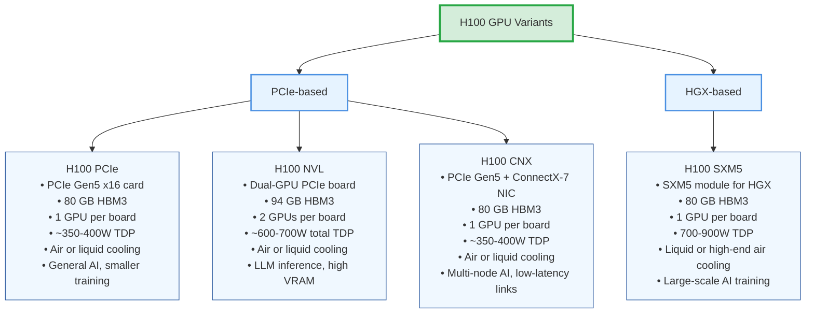

# H100 Prerequisites

This guide organizes key concepts and terms needed to understand NVIDIA’s H100 GPU lineup, focusing on architecture, variants, interconnects, and deployment context.

## Architecture Generations
NVIDIA architecture codenames map to GPU generations and their flagship datacenter models.

| Generation | Year Released | Example GPU Models | Key Innovations |
| ---------- | ------------- | ------------------ | --------------- |
| Volta | 2017 | V100 | First Tensor Cores, HBM2 memory |
| Turing | 2018 | RTX 2080, T4 | Real-time ray tracing, INT8/INT4 inference |
| Ampere | 2020 | A100, RTX 30 series | 3rd‑gen Tensor Cores, HBM2e, PCIe 4.0 |
| Hopper | 2022 | H100 | Transformer Engine (AI), HBM3, NVLink 4.0 |
| Blackwell (upcoming) | 2025 | B100 (rumored) | Faster interconnects, FP8‑optimized AI |

## H100 Variants Overview

| Variant Family | Variant | Form Factor | Memory (per GPU) | GPUs per Board | Power (TDP) | Cooling | Best For | Example Deployment |
| -------------- | ------- | ----------- | ---------------- | -------------- | ----------- | ------- | -------- | ----------------- |
| PCIe‑based | H100 PCIe | PCIe Gen5 x16 card | 80 GB HBM3 | 1 | ~350–400 W | Air or liquid | General AI, smaller training | Dell PowerEdge, Supermicro |
| PCIe‑based | H100 NVL | Dual‑GPU PCIe board | 94 GB HBM3 | 2 | ~300–350 W per GPU (~600–700 W total) | Air or liquid | LLM inference, high VRAM | NVIDIA‑certified inference servers |
| PCIe‑based | H100 CNX | PCIe Gen5 card + ConnectX‑7 NIC | 80 GB HBM3 | 1 | ~350–400 W | Air or liquid | Multi‑node AI, low‑latency links | HPC clusters, InfiniBand AI nodes |
| HGX‑based | H100 SXM5 | SXM5 module (for HGX) | 80 GB HBM3 | 1 | 700–900 W | Liquid or high‑end air | Large‑scale AI training | NVIDIA DGX H100, AWS p5 |

## Key Terms

- SXM (Server eXpress Module): High‑performance socketed GPU module for data‑center servers. The module integrates the GPU, HBM, and power delivery on a compact board and plugs into an HGX baseboard, enabling direct NVLink connectivity between GPUs.
- HGX: NVIDIA baseboard platform hosting multiple SXM GPUs and NVSwitches. Variants commonly support 4 or 8 SXM modules. Ships via OEM partners (Dell, Supermicro, Inspur, etc.) and connects to the host motherboard via high‑speed board‑to‑board links/cables.
- PCIe (Peripheral Component Interconnect Express): Standard expansion interface on motherboards used by PCIe GPUs. Compared with SXM/HGX systems, PCIe GPUs target broader server compatibility.
- NVL / NVL‑NVL: Dual‑GPU PCIe variant optimized for LLM inference with high aggregate VRAM and fast GPU↔GPU communication.
- CNX: H100 PCIe paired on the same PCB with a ConnectX‑7 NIC for low‑latency, direct GPU networking (e.g., via RDMA), reducing CPU/PCIe hops in multi‑node training.

## Memory & Interconnects

- HBM (High Bandwidth Memory): Stacked DRAM placed close to the GPU die; H100 uses HBM3.
- NVLink: High‑speed GPU↔GPU interconnect for peer‑to‑peer bandwidth and scaling.
- NVSwitch: Switch silicon enabling many‑GPU NVLink fabrics (e.g., 8‑GPU HGX full‑mesh).
- PCIe Gen5: Host CPU↔GPU interconnect standard used by PCIe variants and for host I/O.

## Server Integration Concepts

- Baseboard: Motherboard‑like PCB that hosts SXM GPUs, NVSwitches, power, and connectors.
- Node: A single server in a cluster; often contains 4–8 GPUs in HGX systems.
- Cooling: Air vs. liquid cooling; SXM/HGX frequently rely on liquid or high‑end air.
- TDP (Thermal Design Power): Thermal envelope indicating required cooling capacity.

## Performance Metrics

- Numeric formats: FP64, FP32, FP16, BF16, INT8 (precision vs. throughput tradeoffs).
- Tensor Cores: Specialized units for matrix math acceleration used in AI workloads.
- Throughput: TFLOPS/TOPS for compute performance.
- Bandwidth: GB/s for memory or interconnect transfer rates.

## Product Ecosystem & Deployment

- DGX: NVIDIA’s integrated AI systems built around HGX platforms (e.g., DGX H100).
- OEM: Server vendors (Dell, Supermicro, Inspur, etc.) building systems with NVIDIA GPUs.
- Cloud instances: Provider offerings (e.g., AWS p5, Azure ND H100) mapping to HGX configs.

