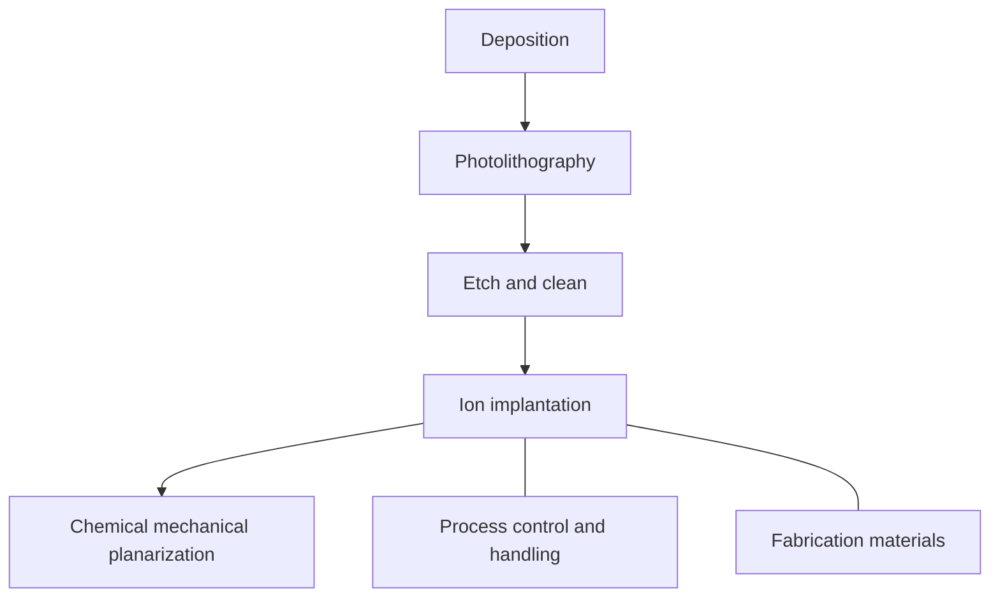

https://chipexplorer.eto.tech/?parentNode=N35&selectedNode=N35

# Supply Chain Explorer

[Documentation](https://eto.tech/tool-docs/chipexplorer/)

ETO's Supply Chain Explorer is designed to quickly orient non-experts to the essential inputs, players, and relationships involved in producing advanced computer chips. Use the Explorer to learn how these chips are made, who makes them, and the tools, materials, and processes involved in the supply chain.

**Learn more:** [Documentation](https://eto.tech/tool-docs/chipexplorer) \|Blog post: [Updated Supply Chain Explorer for Advanced Semiconductors](https://eto.tech/blog/updated-supply-chain-explorer/) \| [All Explorer blog posts](https://eto.tech/blog/?tag=Supply%20Chain%20Explorer)

Last updated on July 15, 2025.

## Design

General overview

### EDA and Core IP

Dependent processes:Chip design

Core intellectual property

Electronic design automation software

### Chip design

Input processes:EDA and Core IP

Dependent processes:Deposition

DAO chip design

Logic chip design

Memory chip design

## Fabrication

General overview

### Deposition

Input processes:Chip design, Process control and handling, Fabrication materials

Dependent processes:Photolithography

Deposition materials

Deposition tools

Deposition

Deposition materials

Deposition tools

#### Deposition

In the deposition process, specialized tools are used to deposit thin films of materials on a silicon wafer. After lithography and etching, these films become different chip layers, including for transistors, interconnects (wires), and other elements.

Image credit: Wikipedia user [polyparadigm](https://commons.wikimedia.org/wiki/File:PICT0111.JPG)

Deposition

Deposition materials

Deposition tools

#### Deposition

In the deposition process, specialized tools are used to deposit thin films of materials on a silicon wafer. After lithography and etching, these films become different chip layers, including for transistors, interconnects (wires), and other elements.

Image credit: Wikipedia user [polyparadigm](https://commons.wikimedia.org/wiki/File:PICT0111.JPG)

### Photolithography

Input processes:Deposition, Process control and handling, Fabrication materials

Dependent processes:Etch and clean

Lithography tools

Photomasks

Photoresists

Resist processing tools

### Etch and clean

Input processes:Photolithography, Process control and handling, Fabrication materials

Dependent processes:Ion implantation

Etch and clean tools

Dry etching and cleaning tools

Wet etching and cleaning tools

### Process control and handling

Dependent processes:Photolithography, Etch and clean, Chemical mechanical planarization, Ion implantation, Deposition

Process control tools

Wafer and photomask handlers

### Ion implantation

Input processes:Etch and clean, Process control and handling, Fabrication materials

Dependent processes:Chemical mechanical planarization

Ion implanters

### Fabrication materials

Dependent processes:Photolithography, Etch and clean, Chemical mechanical planarization, Ion implantation, Deposition

Electronic gases

Process-specific fabrication materials

Wafer

Crystal growing furnaces

Crystal machining tools

Wet chemicals

### Chemical mechanical planarization

Input processes:Ion implantation, Process control and handling, Fabrication materials

Dependent processes:Assembly and packaging

CMP materials

CMP tools

## Assembly, testing, and packaging (ATP)

General overview

### Assembly and packaging

Input processes:Chemical mechanical planarization

Dependent processes:Testing

Assembly tools

ATP materials

Electronic gases

Packaging materials

Fabrication tools (for advanced packaging)

Packaging tools

### Testing

Input processes:Assembly and packaging

Dependent processes:Finished logic chip

ATP materials

Electronic gases

Packaging materials

Handlers and probers

Test tools

### Finished logic chip

Input processes:Testing

