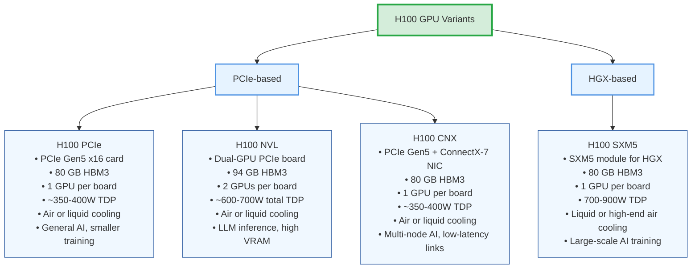

# Prerequisites

# Understanding GPUs (H100 Case Study)**
Architecture generations in this case define the GPU Model. The Hopper Architecture defines the name H100. But when we say an H100 gpu what exactly are we refering to:
So there are 2 main variants on this gpu the PCIe based and the HGX based:

Architecture generations — NVIDIA’s naming (Hopper for H100, Ampere for A100, etc.) | Generation                 | Year Released | Example GPU Models  | Key Innovations                               |
| -------------------------- | ------------- | ------------------- | --------------------------------------------- |
| **Volta**                  | 2017          | V100                | First Tensor Cores, HBM2 memory               |
| **Turing**                 | 2018          | RTX 2080, T4        | Real-time ray tracing, INT8/INT4 inference    |
| **Ampere**                 | 2020          | A100, RTX 30 series | 3rd-gen Tensor Cores, HBM2e, PCIe 4.0         |
| **Hopper**                 | 2022          | H100                | Transformer Engine (for AI), HBM3, NVLink 4.0 |
| **Blackwell** *(upcoming)* | 2025          | B100 (rumored)      | Even faster interconnects, FP8 AI support     |

| Variant Family   | Variant       | Form Factor | Memory (per GPU) | GPUs per Board | Power (TDP)      | Cooling        | Best For                        | Example Deployment               |
|------------------|--------------|-------------|------------------|----------------|------------------|----------------|----------------------------------|-----------------------------------|
| **PCIe-based**   | H100 PCIe    | PCIe Gen5 x16 card | 80 GB HBM3       | 1              | ~350–400 W       | Air or liquid  | General AI, smaller training     | Dell PowerEdge, Supermicro        |
|                  | H100 NVL     | Dual-GPU PCIe board | 94 GB HBM3       | 2              | ~300–350 W per GPU (~600–700 W total) | Air or liquid  | LLM inference, high VRAM         | NVIDIA-certified inference servers|
|                  | H100 CNX     | PCIe Gen5 card + ConnectX-7 NIC | 80 GB HBM3 | 1 | ~350–400 W | Air or liquid | Multi-node AI, low-latency links | HPC clusters, InfiniBand AI nodes |
| **HGX-based**    | H100 SXM5    | SXM5 module (for HGX) | 80 GB HBM3       | 1              | 700–900 W        | Liquid or high-end air | Large-scale AI training          | NVIDIA DGX H100, AWS p5           |

# SXM (Server eXpress Module) — socketed GPU module used in high-end servers, e.g., SXM5
    this is a high performance socketed gpu module designed for data center servers, it sits flat on a large connector on a special baseboard.
https://en.wikipedia.org/wiki/File:TSUBAME_3.0_PA075079.jpg

Ok so the SXM is a module that has
    - The gpu
    - the memory
    - power delivery on a compact board

Allows direct NVLink lanes between GPUs without going through the CPU or PCIe bus.

You plug the sxm module into a specialized gpu baseboard (called HGX board)

# HGX — NVIDIA’s server motherboard platform for multiple SXM GPUs + NVSwitches
this is like a motherboard only for gpus, this board doens't have cpu or ram just sockets or SXM slots for the GPUs and extra chips (NVSwitch) to link them
there are 2 variations
one for 4 sxms another for 8

The HGX connects to the main board using high speed board to board links and cables
The board is made by NVIDIA but shipped through OEM partners (Dell, Supermicro, Inspur, etc.).

# PCIe (Peripheral Component Interconnect Express) — standard expansion card interface

This is the slot used to connect add on cards on a normal main motherboard. These are poor people servers

# NVL / NVL-NVL — NVIDIA “NVLink” variant for inference, often dual-GPU boards
A special version of the H100 designed for large language model (LLM) inference, where you need huge memory per GPU and super-fast GPU↔GPU communication, but not necessarily the absolute max training clocks.

# CNX — GPU + network adapter on one board (H100 CNX)
Anoother variant
The CNX is basically an H100 PCIe that’s married to a network card (Mellanox ConnectX-7) on the same PCB.
    GPUs in different servers need to exchange data every few milliseconds during training.

    The slowest part is the extra hop through the CPU and PCIe bus.

    CNX skips that hop by having the network chip connected directly to GPU memory (via RDMA).

Ok so we kind of have some knowledge on some of the Prerequisites we need to understand:

Let's start with the die
https://www.reddit.com/r/nvidia/comments/18gfeb8/h100_bare_die/#lightbox

So the square on the center is the die specifically the H100 GPU Die (GH100)
The die is the small rectangular piece of silicon cut from a wafer (TSMC)

## From Wafer to Die
At FEOL (Front End of Line) the step where the wafer is just raw sillicon, we start by getting the Wafer. The only information I could find is the following: H100 uses TSMC N4 process. 
## The 300mm claim
The mm of the wafers are not quoted anywhere but since the 5nm chips are made on 300mm wafers we can infer it's the same case as the 4nm variation for the h100. Also the H100 is build on the 4N family process. TSMC manufacturers its 5nm in 12 in

## The specific substrate
The specific substrate grade and crystal growth method details are not publicly documented by the manufacturers. LLMS tend to hallucinate that the specific wafer is the prime grade 300mm Si wafers (Czochralski-grown, defect-free) but I have not found one direct quote confirming this? So going back to our questions: Where does TSMC get them? 

Down the rabbit hole I went and I found in the 2024 annual report this table
https://investor.tsmc.com/sites/ir/annual-report/2024/2024%20Annual%20Report.E.pdf
page 55

They anonymously list only five companies responsible for raw wafers, but in 2024
https://investor.tsmc.com/sites/ir/annual-report/2023/2023_Annual_Report_E.pdf page 55 
THEY DO LIST THEM!
Raw Wafers:
    FST
    GlobalWafers
    SEH
    Siltronic
    SK siltron
    SUMCO

Not only we don't know which companies supply raw wafers for TSMC in 2024, we don't even know which companies supply them the specific wafer they use for the H100.

https://www.mordorintelligence.com/industry-reports/semiconductor-silicon-wafer-market
Shin-Etsu Handotai -> SEH
Siltronic AG  -> Siltronic
SUMCO Corporation  -> SUMCO
SK Siltron Co. Ltd  -> SK siltron
Globalwafers Co. Ltd  -> GlobalWafers

This study claims these are the biggest players, we can see it almost is the same as the TSMC report from 2023 list of suppliers.
So how do we short this list?
ok hear me out:
TSMC’s Fab 18 is the main 5nm production facility
https://www.tsmc.com/english/dedicatedFoundry/technology/logic/l_5nm

