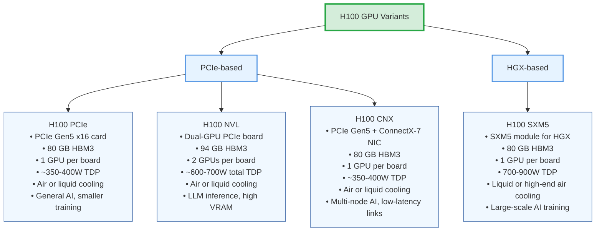

# Prerequisites (In progress)

## Understanding GPUs (H100 Case Study)

Architecture generations in this case define the GPU Model. The Hopper Architecture defines the name H100. But when we say an H100 gpu what exactly are we refering to:
So there are 2 main variants on this gpu the PCIe based and the HGX based:

## Architecture generations — NVIDIA's naming (Hopper for H100, Ampere for A100, etc.)
| Generation                 | Year Released | Example GPU Models  | Key Innovations                               |
| -------------------------- | ------------- | ------------------- | --------------------------------------------- |
| **Volta**                  | 2017          | V100                | First Tensor Cores, HBM2 memory               |
| **Turing**                 | 2018          | RTX 2080, T4        | Real-time ray tracing, INT8/INT4 inference    |
| **Ampere**                 | 2020          | A100, RTX 30 series | 3rd-gen Tensor Cores, HBM2e, PCIe 4.0         |
| **Hopper**                 | 2022          | H100                | Transformer Engine (for AI), HBM3, NVLink 4.0 |
| **Blackwell** *(upcoming)* | 2025          | B100 (rumored)      | Even faster interconnects, FP8 AI support     |

| Variant Family   | Variant       | Form Factor | Memory (per GPU) | GPUs per Board | Power (TDP)      | Cooling        | Best For                        | Example Deployment               |
|------------------|--------------|-------------|------------------|----------------|------------------|----------------|----------------------------------|-----------------------------------|
| **PCIe-based**   | H100 PCIe    | PCIe Gen5 x16 card | 80 GB HBM3       | 1              | ~350–400 W       | Air or liquid  | General AI, smaller training     | Dell PowerEdge, Supermicro        |
|                  | H100 NVL     | Dual-GPU PCIe board | 94 GB HBM3       | 2              | ~300–350 W per GPU (~600–700 W total) | Air or liquid  | LLM inference, high VRAM         | NVIDIA-certified inference servers|
|                  | H100 CNX     | PCIe Gen5 card + ConnectX-7 NIC | 80 GB HBM3 | 1 | ~350–400 W | Air or liquid | Multi-node AI, low-latency links | HPC clusters, InfiniBand AI nodes |
| **HGX-based**    | H100 SXM5    | SXM5 module (for HGX) | 80 GB HBM3       | 1              | 700–900 W        | Liquid or high-end air | Large-scale AI training          | NVIDIA DGX H100, AWS p5           |

## SXM (Server eXpress Module)

Socketed GPU module used in high-end servers, e.g., SXM5
    this is a high performance socketed gpu module designed for data center servers, it sits flat on a large connector on a special baseboard.
https://en.wikipedia.org/wiki/File:TSUBAME_3.0_PA075079.jpg

Ok so the SXM is a module that has
    - The gpu
    - the memory
    - power delivery on a compact board

Allows direct NVLink lanes between GPUs without going through the CPU or PCIe bus.

You plug the sxm module into a specialized gpu baseboard (called HGX board)

## HGX — NVIDIA's Server Motherboard Platform

NVIDIA's server motherboard platform for multiple SXM GPUs + NVSwitches
this is like a motherboard only for gpus, this board doens't have cpu or ram just sockets or SXM slots for the GPUs and extra chips (NVSwitch) to link them
there are 2 variations
one for 4 sxms another for 8

The HGX connects to the main board using high speed board to board links and cables
The board is made by NVIDIA but shipped through OEM partners (Dell, Supermicro, Inspur, etc.).

## PCIe (Peripheral Component Interconnect Express)

Standard expansion card interface

This is the slot used to connect add on cards on a normal main motherboard. These are poor people servers

## NVL / NVL-NVL — NVIDIA "NVLink" Variant

NVIDIA "NVLink" variant for inference, often dual-GPU boards
A special version of the H100 designed for large language model (LLM) inference, where you need huge memory per GPU and super-fast GPU↔GPU communication, but not necessarily the absolute max training clocks.

## CNX — GPU + Network Adapter

GPU + network adapter on one board (H100 CNX)
Anoother variant
The CNX is basically an H100 PCIe that's married to a network card (Mellanox ConnectX-7) on the same PCB.
    GPUs in different servers need to exchange data every few milliseconds during training.

    The slowest part is the extra hop through the CPU and PCIe bus.

    CNX skips that hop by having the network chip connected directly to GPU memory (via RDMA).

## Understanding the H100 Die

Ok so we kind of have some knowledge on some of the Prerequisites we need to understand:

Let's start with the die
https://www.reddit.com/r/nvidia/comments/18gfeb8/h100_bare_die/#lightbox

So the square on the center is the die specifically the H100 GPU Die (GH100)
The die is the small rectangular piece of silicon cut from a wafer (TSMC)

### From Wafer to Die
At FEOL (Front End of Line) the step where the wafer is just raw sillicon, we start by getting the Wafer. The only information I could find is the following: H100 uses TSMC N4 process. 

### The 300mm Claim
The mm of the wafers are not quoted anywhere but since the 5nm chips are made on 300mm wafers we can infer it's the same case as the 4nm variation for the h100. Also the H100 is build on the 4N family process. TSMC manufacturers its 5nm in 12 in

### The Specific Substrate
The specific substrate grade and crystal growth method details are not publicly documented by the manufacturers. LLMS tend to hallucinate that the specific wafer is the prime grade 300mm Si wafers (Czochralski-grown, defect-free) but I have not found one direct quote confirming this? So going back to our questions: Where does TSMC get them? 

## Raw Wafer Suppliers

Down the rabbit hole I went and I found in the 2024 annual report this table
https://investor.tsmc.com/sites/ir/annual-report/2024/2024%20Annual%20Report.E.pdf
page 55

They anonymously list only five companies responsible for raw wafers, but in 2024
https://investor.tsmc.com/sites/ir/annual-report/2023/2023_Annual_Report_E.pdf page 55 
THEY DO LIST THEM!
Raw Wafers:
    FST
    GlobalWafers
    SEH
    Siltronic
    SK siltron
    SUMCO

Not only we don't know which companies supply raw wafers for TSMC in 2024, we don't even know which companies supply them the specific wafer they use for the H100.

https://www.mordorintelligence.com/industry-reports/semiconductor-silicon-wafer-market
Shin-Etsu Handotai -> SEH
Siltronic AG  -> Siltronic
SUMCO Corporation  -> SUMCO
SK Siltron Co. Ltd  -> SK siltron
Globalwafers Co. Ltd  -> GlobalWafers

This study claims these are the biggest players, we can see it almost is the same as the TSMC report from 2023 list of suppliers.
So how do we short this list?
ok hear me out:
TSMC's Fab 18 is the main 5nm production facility
https://www.tsmc.com/english/dedicatedFoundry/technology/logic/l_5nm

## GPU Manufacturing Process

So quoting AJ KUORABI https://chipchatter.substack.com/p/the-real-bottleneck-in-gpu-manufacturing#footnote-1-149769846

Here are three basic parts of making a GPU1:

Silicon Wafer Production 

Producing the silicon wafers on which the chips are made. 

Die Fabrication 

Includes conducting lithography, deposition, and etching on the silicon wafers. This is to produce dies, which are the most important part of a chip and can be thought of as the brains. 

Packaging 

Takes dies from a wafer and places them within a package. This then makes a chip. In other words, packaging puts the brain into a skull and gives it a body with a nervous system and muscles to interact with the world. 

Idea #1: Trace ALL the parts necessary for an H100

So let's try to do that:

## H100 Component Analysis

### NVIDIA H100 Tensor Core GPU
#### Component Tiering:
| **Component (Tier 1)**         | **Supplier (Company)**       | **Key Facility & Location**               | **Confidence**  | **Sources** |
| ------------------------------ | ---------------------------- | ----------------------------------------- | --------------- | ----------- |
| **GH100 GPU Die** (TSMC 4N)    | TSMC (Foundry)               | Fab 18 (Tainan, Taiwan) – 5nm/4N GigaFab  | 5/5 (Confirmed) | NVIDIA/TSMC |
| **HBM3 Memory Stack (16GB)**   | SK Hynix (Memory)            | M16 DRAM Fab (Icheon, Gyeonggi, S. Korea) | 4/5 (High)      | The Elec    |
| **CoWoS Silicon Interposer**   | TSMC / UMC (Foundry assist)  | TSMC Advanced Packaging & UMC Fab (40 nm) | 3/5 (Moderate)  | The Elec    |
| **Package Substrate (FC-BGA)** | Ibiden Co., Ltd. (Substrate) | Ogaki Plant (Gifu Prefecture, Japan)      | 4/5 (High)      | Wccftech    |

### Component Tiering System
We can retroactively name all the different parts into a tiering system or a depth system where each depth would mean something like

Tier 0: Final Assembly (NVIDIA H100 SXM5 Module)
Tier 1: Core Silicon & Packaging (GPU Die, HBM3 Stacks, CoWoS Interposer, Package Substrate)
Tier 2: Board-Level Active Components (VRM/Power Stages, PMICs, MCUs, PCIe Retimers)
Tier 3: PCB & Connectors (Main Circuit Board, High-Density Connectors)
Tier 4: Mechanical & Thermal (Vapor Chamber, Heatsink, Stiffening Bracket, TIM)
Tier 5: Passives & Other (MLCCs, Inductors, Resistors, Crystals)
Tier 6: Upstream Materials & Chemicals (Wafers, Leadframes, Epoxy, ABF Film, Solder)
Tier 7: Process Consumables (Gases, Slurries, Photoresists, Solvents)
Tier 8: Raw Materials (Silicon Metal, Copper Ore, Crude Oil, Lithium Brine, etc.)

### Supply Chain Tracing
Each component could be traced like this:
▢ 300 mm prime silicon wafers – SUMCO (Yonezawa, JP), GlobalWafers (Sherman, US) - Destination TSMC Facility in Taiwan
1. Raw Quartz, Spruce Pine, NC, USA
2. Refiners: 

| Refiner               | Location      | Supplies To                       | Likely Quartz Source      |
| --------------------- | ------------- | --------------------------------- | ------------------------- |
| Tokuyama Corporation  | Japan         | SUMCO (Yonezawa, JP)              | Spruce Pine (NC) + others |
| Mitsubishi Materials  | Japan         | SUMCO                             | Spruce Pine / global HPQ  |
| Wacker Chemie         | Germany / USA | SUMCO, GlobalWafers               | Spruce Pine (via Sibelco) |
| Hemlock Semiconductor | Michigan, USA | GlobalWafers (Sherman, TX), SUMCO | Spruce Pine quartz        |
| OCI                   | South Korea   | GlobalWafers (Taiwan / US)        | Spruce Pine, others       |

▢ EUV/DUV photomasks & pellicles (Toppan, Photronics)
▢ Photoresists, developers, etchants (JSR, Fujifilm, Dow)
▢ Process metals & dielectrics (Cu, Co, W, TaN, low-k SiOC, etc.)
▢ Specialty gases (NF₃, CF₄, BCl₃, H₂, Ar)
▢ CMP slurries & pads (Cabot, DuPont)
▢ EUV scanners (ASML NXE-3600 class)

1 Logic & Memory Silicon
| Item                                        | Function                         | Key Supplier(s)                        | Note                                                           |
| ------------------------------------------- | -------------------------------- | -------------------------------------- | -------------------------------------------------------------- |
| **GH100 compute die**                       | 80 bn-transistor GPU (4 nm "4N") | **TSMC Fab 18**, Tainan, TW            | Die size \~814 mm²([NVIDIA Developer][1])                      |
| **HBM3 memory stacks (5 active + 1 spare)** | 16 GB @ >800 GB/s per stack      | **SK hynix** (Cheongju/Icheon, KR)     | Sole qualified HBM3 for H100 to date([SK hynix Newsroom -][2]) |
| Silicon interposer (CoWoS-S)                | 2.5-D bridge between GPU & HBM   | **TSMC Advanced Backend**, Zhunan (TW) | Up to 3 TB/s aggregate BW([Tom's Hardware][3])                 |

## Silicon Manufacturing Process

### Raw Materials
Raw Quarts (Silica Sand) or Silicon Dioxide:

Even though this is one of the most abundant minerals in earth, this one has to be of extremely high purity, very low trace metals
This would come from Spruce Pine, North Carolina, USA literally guys in trucks mine it from the mountains. Apparently this is the place where quartz are the purest in the world so they are responsible for 70 to 90% of the global semiconductor grade quartz? 

> So the Raw Quartz end up in Refiners:

Metallurgical-Grade Silicon
Quartz is carbothermically reduced in an electric arc furnace (at ~1500–2000 °C) with carbon to produce metallurgical-grade silicon (≈96–99 % silicon)
    
### From Sand to Polysilicon
Raw Quartz (Silica Sand)
It begins with high‑purity quartz, such as the ultra‑pure deposits from Spruce Pine, North Carolina, which supply the majority of industrial-grade silicon dioxide used for chipmaking 
Sand must be exceptionally low in impurities (e.g. iron, aluminum) to achieve wafer-grade purity 

Metallurgical-Grade Silicon
Quartz is carbothermically reduced in an electric arc furnace (at ~1500–2000 °C) with carbon to produce metallurgical-grade silicon (≈96–99 % silicon) 

Polysilicon via the Siemens Process
That silicon is further purified via the Siemens chemical-vapor-deposition process into electronic‑grade polysilicon (≥ 99.999999 % pure).

Alternatives like fluidized-bed reactor processes exist, but Siemens remains dominant 

### Growing Single‑Crystal Ingot (Czochralski Process)
Polysilicon is melted in a high‑purity quartz crucible at about 1425 °C.

A seed crystal is dipped into the molten silicon, then slowly pulled upward and rotated to grow a single-crystal cylindrical ingot (boule). This is known as the Czochralski method 
Precise control of temperature, rotation, and pull rate is essential to yield a defect‑free monocrystal 

Controlled amounts of dopants like boron or phosphorus can be added during growth to set resistivity for n‑type or p‑type silicon.

### Wafer Slicing and Polishing
Ingot Conditioning
The ingot's circumference is ground to a uniform diameter and ends trimmed to ensure crystal orientation and stability 
Wikipedia

Slicing
Using diamond-coated wire saws or inner-diameter saws, the ingot is sliced into ~1 mm thick wafers. A carbon beam is often left attached and later removed to hold discs together during slicing 

Lapping and Grinding
Wafers are ground and polished (lapping) using alumina abrasives to reach target thickness and flatness specifications and to improve parallelism 

Polishing
Chemical–mechanical polishing (CMP) removes surface damage, achieving mirror-smooth, planar wafers ready for advanced use.

### Epitaxial Layer (Optional)
For applications requiring ultra‑uniform doping or layered resistivity profiles, wafers undergo epitaxial deposition.

In a furnace (~1200 °C), gases like trichlorosilane (SiHCl₃) or silicon tetrachloride (SiCl₄) are introduced to grow a crystalline silicon film atop the wafer surface 

### Inspection, Packaging & Shipping
Finished wafers undergo stringent quality control: flatness, thickness tolerance, resistivity, defect density, micro-contamination.

Passing wafers are clean-room packed in FOUPs, then shipped—typically by air freight under climate‑controlled, vibration‑damped conditions—to fabs such as TSMC in Taiwan
        
        

