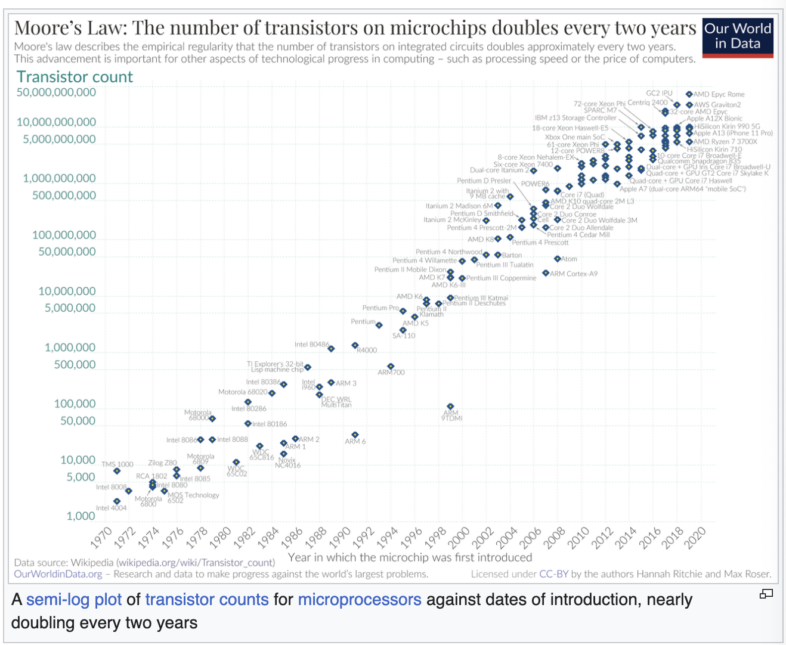
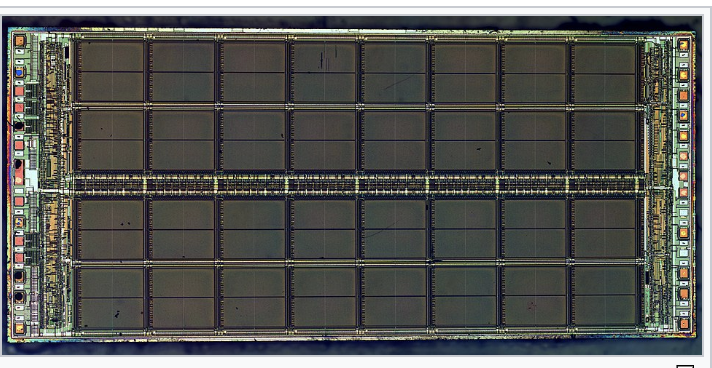
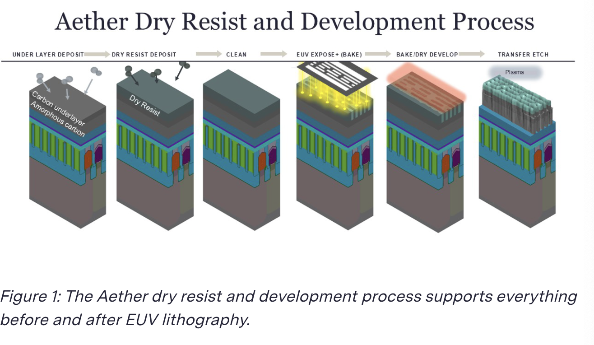
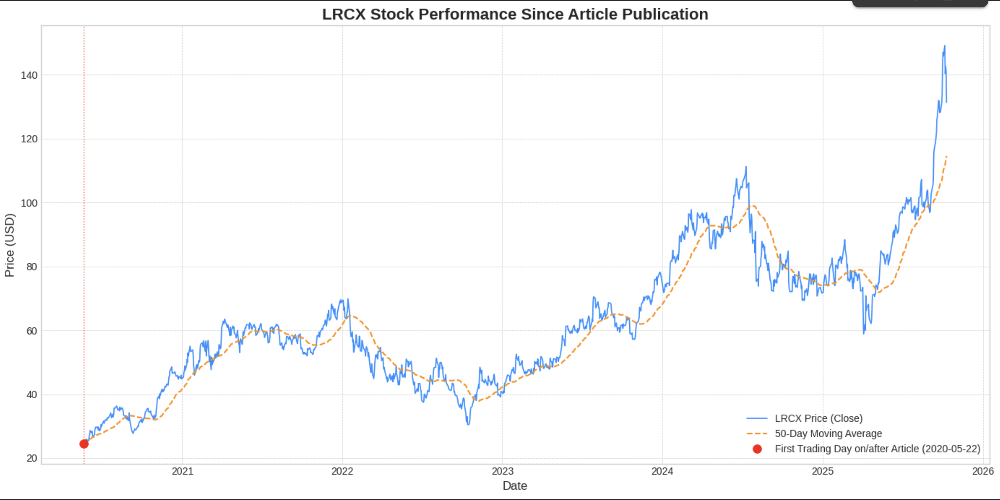

# Reading all of Semianalysis
Here are my notes / things I do not understand and my best ability to explain it

I really want a job

## 1. Moore’s Law is Dead for DRAM and that is Great for SemiCap
Read in Oct 12 2025
Dylan Patel
May 22, 2020

Moore's law:
number of transistors you can fit into a chip will 2x every two years



so in DRAM Moores law is dead?


node = generation of chip tech measured in nm
density = how many bits fit in a chip. 

economic constraint:
1. old way (moores law)
to 2x memory output you just made your transistors half the size on the same wafer
2. new way
if you can't make the chips shrink, the only way to double the memory output is to use twice as many wafers and buy twice the factory equipment

Since DRAM is not accelerating companies must use 2x the fab equipment and wafers

Ok... this happened in 2022 what has happened since?
according to chtgpt not much and the trend keeps staying truth we are just seeing alternative scaling axes being implemented

# 2. LAM Research (LRCX) Dry Deposit and Resist Could Become a Multi-Billion Dollar Business
Read in Oct 12 2025
Dylan Patel
May 22, 2020

LAM is a semiconductor processing and fabrication equipment designer and manufacturer who has announced a new dry photoresist technology in collaboration with IMEC and ASML.

Who is IMEC?
Interuniversity Microelectronics Centre is an international research & development organization, active in the fields of nanoelectronics and digital technologies with headquarters in Belgium
Lam -> Etch deposition and strip
Now that I read about it, it makes so much sense why there exists a company like this:
To advance the competition on the semi world, you present a neutral shared laboratory, companies send funds to test a technology and work together with other companies, they share the cost and risk of next gen R&D

TEL Tokyo Electron is the leader in wet deposit and develop machines
liquid photoresist is spun onto the wafer and then washed away with liquid chemicals after exposure

ASML starts EUV + TEL’s existing Wet Process = Problems at the smallest sizes (3nm and below)

Recently published by Lam


"There are far more DRAM wafers processed on leading edge dram processes than there are for leading edge logic."
Logic = CPUs and GPUs
The DRAM market is the bigger market but they have to test them on the logic ones

like the EUV transition where the first to test them out were the logic chips
So here it says the transition is still halfway and not done
I wonder how it is nowadays in 2025

3 players in the DRAM competition


2022–2023: Wider testing; SK hynix experiments and plans EUV on later nodes.
https://investors.micron.com/news-releases/news-release-details/micron-announces-shipment-1g-1-gamma-dram-pioneering-memory?utm_source=chatgpt.com
2024: SK hynix and Samsung push EUV layer counts higher; ASML throughput improves.
https://www.reuters.com/technology/sk-hynix-says-it-has-developed-6th-gen-dram-chip-that-uses-less-power-2024-08-29/?utm_source=chatgpt.com
2025: Micron ships 1γ (10-nm class) DRAM (selective EUV use); all three majors now using EUV in production DRAM. High-NA installations and customer testing begin but full DRAM migration to High-NA will follow later. 
https://www.asml.com/news/stories/2024/5-things-high-na-euv?utm_source=chatgpt.com
https://www.tomshardware.com/tech-industry/semiconductors/asml-and-sk-hynix-assemble-industry-first-commercial-high-na-euv-system-at-fab-in-south-korea?utm_source=chatgpt.com

I was just curious what happened since the publication



# 3. Mediatek Stands to Gain the Most from the New Cold War
Read in Oct 12 2025
Dylan Patel
May 22, 2020
American companies such as Lam Research and Applied Materials have virtual monopolies in certain sub segments of the semiconductor equipment field. 
What are these?

Lam in advanced node etch / metal/hard-mask etch for sub-5nm: For some of the hardest etch tasks (e.g. high aspect ratio metal etch, hard-mask, etc.) Lam is seen as the go-to. It has fewer or no close substitutes in many fabs. 

Applied in CMP: In many CMP tool segments, Applied has led with a substantial share such that alternative suppliers are much smaller. Again not completely exclusive, but enough that AMAT is difficult to displace. 

SOCs = Systems on a chip

Huawei has to choose between:
Qualcomm (U.S.) and MediaTek (Taiwan)

Huawei lost access to advanced fabrication, but it has continued to push internally and rely on domestic foundries (SMIC) to produce Kirin chips at older process nodes.

# 4. Jensen Huang’s Vision For Data Center Dominance Will Destroy The Arm Ecosystem
Read in Oct 12 2025
Dylan Patel
Aug 21, 2020

I did not knew about arm:
Arm is apparently who designs the underlying cpu architecture, its a low margin ip licensor it does not make the chips only licenses its IP to companies.
so if Nvidia bought arm everyone would go to RISC-V an open source instruction set architecture (ISA) 

jajaja found dylan's typo:
Jensen can only realize the of the vision of data center dominance
DPU  = Data Processing Unit
Offloads and accelerates all the infrastructure tasks related to data movement, networking, security, and storage.

x86 = the Instruction set architecture (ISA) used by intel and amd
the arm architecture nvidia uses for grace cpu is simpler and more power efficient

### Autos
![[Pasted image 20251012181517.png]]Intel Mobileye uses MIPS and is transitioning to x86 
Tesla and Qualcomm use Arm Cores

I liked this paragraph:
```
If Nvidia can quickly seize the worlds most important IP, the most commonly used CPU ISA and designs, they will control the destiny of mobile and data center. This is Jensen Huang’s “Trojan Horse” for a Machiavellian takeover of the future of computing.
```

# 5. Bridging the gap between business and the worlds most important industry.
Dylan Patel
Apr 05, 2021
not sure why this is still here?

# 6. Apple’s A14 Packs 134 Million Transistors/mm², but Falls Short of TSMC’s Density Claims
Dylan Patel
Apr 06, 2021
ICmasters = We help the world's most important owners of semiconductor IP optimize their portfolio ROI and monetize their patent assets

Apple’s chips have historically achieved 90%+ of the process node’s theoretical density in their processors. = they fucked up

process node = generation of tech (5nm, 3nm)
theoretical density = max number of transistors per square millimeter
processor density = actual number of transistors per square millimeter

A14 comes in at a cool 78% effective transistor density when compared to theoretical density. Despite TSMC claiming a 1.8x shrink for N5, Apple only achieves a 1.49x shrink.
![[Pasted image 20251012182329.png]]
ok how did these guys made this table??????
	SOC = system on a chip
	process node = used by tsmc to produce the chip node 12 node 10 ...
	transistor counts = total # of electronic switches (transistors) designed into the entire chip
	die size = the area of the chip 
	effective density = actual  transistors per mm (transistor count / the die size)
	Effective density scaling = factor by which the effective density increased from the previous generation
	theoretical density = max potential transistors per mm^2 the ideal max density that tsmc claims their process node can achieve
	effective vs theoretical = ratio of effective density to theoretical density

so this is the fault from the slow death of sram scaling
sram = static random access memory
fastest most expensive msost power hungry type of memory this is the cache memory l1 l2 l3 inside the cpu

Geoffrey Yeap of TSMC claims that the typical mobile SoC which consists of 60% logic, 30% SRAM, and 10% analog/IO. dylan ? grammar ?

This forces Apple and other chipmakers to make tough trade offs: 
either make the **chip bigger** (which raises costs) 
or 
reduce the amount of **cache memory** (which hurts performance).

TSMC N5 node 
did not follow the historical trend 
the 90% efficiency apple used to achieve is no longer possible because the sram cells physically resist getting smaller

okokok so in the chip industry for being considered a full generational upgrade (full shrink) we have to shrink we have to follow moores law so 2x improvement in density 
SRAM is the bottleneck

wait.... is Moores law dead also for SRAM? 
![[Pasted image 20251012184029.png]]

# 7. Qualcomm Lost the iPhone 12 mmWave Antenna Module Contract to a Chinese Company
https://www.ifixit.com/Teardown/iPhone+12+and+12+Pro+Teardown/137669?revisionid=HEAD
has revealed that there are 3 mmWave antenna modules built by USI
USI is a Shanghai based SiP design and manufacturing company. This would be their first design win in the space. Apple ditching Qualacomm on this component despite using the rest of the Qualcomm X55 5G Modem RF system is quite the shocker.

## shocker
> every US phone shipment which included 5G mmWave to date has used antennas from Qualcomm.
![[Pasted image 20251012184335.png]]

This was not a move to just add diversity to suppliers but Qualcomm fumbled..
qualcomm most advanced mmwave antenna module is the QTM525 this has been advertised as less than 8mm thick the thinnest shipping device with the x55 model is the s20 coming in at 7.8mm. the new ihone is 7.4mm 
Qualcomm’s next generation QTM535 would be thin enough, but it is part of the 2021 X60 platform. Apple’s quest for maximum thinness necessitated developing a custom mmWave antenna.

Will other mobile manufacturers begin to use their own mmWave antennas over Qualcomm’s integrated solution? 
How much of an ASP erosion will this knock on effect cause on entire 5G modem + AP sales? 

# 8. Trailing Edge is Going Gangbusters ($KLIC)
Dylan Patel
Apr 29, 2021
Read on Oct 12 2025
Kulicke And Soffa Industries Inc -> packaging for chips -> produces wirebonder machines

Even after the recent run up, it is currently trading at about 12-13x SemiAnalysis’s 2021 Projected EPS ($4.5). This is well above Wall Street consensus, but there is room for this estimate to be beaten. 

So they are going to make ashit ton of new 28nm and older nodes
Trailing edge is outgrowing leading edge semiconductors. All this additional wafer capacity needs additional packaging capacity.

SemiAnalysis is extremely positive on $KLIC to say the least. We are even more positive now than we were months ago when we first started alerting clients to this trade. 
I think I will start doing an index to see what has happened with all of these companies

![[Pasted image 20251013090550.png]]


# 9. Semi Supply Chain Cutting Expectations as Phone Sales Plummet
[Dylan Patel](https://substack.com/@semianalysis)
May 11, 2021
Read on Oct 13 2025
There are concerns of overbuild and weaker 2022 and 2023. semianalysis believes that the next years will continue to be huge growth years

Covid in india and south america is slowing phones sales

Semianalysis -> dropped by 50 M assuming covid stays under control
![[Pasted image 20251013091127.png]]
Outside Apple Mediatek is getting fucked also
Oppo, vivo, xiamoi and realme 
	reduced their component orders and shipment targets for the 2nd quarter and whole year 2021 by 10% - 30%

```
Players in the OSAT and ICs have plummeting orders for some components. People invested in the numerous Taiwanese companies at play here should lower their expectations for 2021. Not everything is peachy keen in the year 2021, for the darling semiconductor industry.
```

OSAT = Outsourced Semiconductor assembly and test
	companies specialized in 3rd party service providers in the semiconductor supply chain
basically assemblers / packagers / testing

ICs = integrated circuits
microchip or chip 
![[Pasted image 20251013091729.png]]

# 10. Nvidia is Raking in the Money, but are Earnings Inflated?
[Dylan Patel](https://substack.com/@semianalysis)
May 27, 2021
Read on Oct 13 2025

![[Pasted image 20251013091923.png]]

```
Nvidia has beat earnings expectations yet again on the backs of datacenter and gaming lines. Nvidia pulled in $5.66B in Q1 and are guiding for a mammoth $6.3B for Q2. This is $266M more than investors expected for Q1 and $890M more than they expected for Q2.
```
Wall Street Consensus ~ Consensus Estimate
Analysts payed by companies -> Average -> published on bloomberg / yahoo finance / whatever

The data center market looks healtyh but...
Q1 earning revela that the datacenter growth from q4 to q1 is not as elevated as prior years
Prior years the Q growth was 18% but for this quarter there was only 7.6%
last years Q2 growth had the covid effect on data centers

```
The OEM & Other growth looks tremendous. Nvidia obfuscated earnings here by stuffing the mining CMP series into this segment. In Q1, there was $155M of CMP mining GPUs sold.
```

OEM = Original Equipment manufacturer -> sales of gpus custom to other companies
CMP = Cryptocurrency Mining Processor
Specialized gpu for crypto

```
Even more significant is that Jensun Huang stated that CMP GPU sales in Q2 would reach $400M.
```
Jensun jaja funny typo
paltry = smaller

Jensen -> cmp gpu sales in q2 would reach 400M 

```
Of the $640M growth Nvidia is projection from Q1 to Q2, nearly 40% comes from mining GPU sales!
```
is projecton ? grammar?
Of the 640M growth Nvidia is projecting ~ 40% comes from mining gpu sales
these sales nvidia probably wont have with eth cahgning or crypto cash

hampered = impede the progress of

I like how dylan always like finishes with questions

```
Nvidia looks well positioned heading into 2022, but with competition becoming fiercer from AMD and pent up demand becoming satisfied, will this level of growth hold true? Will Datacenter continue to grow at such fantastic rates? Will the $8B of automotive sales pipeline hold true? SemiAnalysis is skeptical on some fronts, but we also will be cautious of betting against Jensun Huang!
```

![[Pasted image 20251013093827.png]]

# 11. Google New Custom Silicon Replaces 10 Million Intel CPUs | Google Argos VPU
[Dylan Patel](https://substack.com/@semianalysis)
Jun 02, 2021
Read on Oct 13 2025
Google created Argos a class of ASIC called VCU = Video Coding Unit
ASIC = Application-Specific Integrated Circuit
google replaces millions of x85 cpus and enhance their service
the vcu accelerate video workloads on youtube photos drive and stadia game streaming
Google received 500 hours of Youtube footage every minute in May 2019
google takes input video and encodes it at every resolution in h264, the most viewed videos are encoded in vp9 = complex video codec allows to become smaller but same quality
cpus struggle with encoding this format and are 5x slower
GPUs are not the solution

```
The hardware software co-design goes both ways. In addition to using an industry standard Electronic Design Automation (EDA) tool from Mentor Graphics’ called Catapult, Google also designed their own in-house tool for integration called Taffel. **Google’s ambitions for silicon independence are so broad they are developing their own EDA tools!**
```
Ok first
EDA = Electronic Design Automation = category of software that they use to design chips simulate prepare microchips for manufacturing the AutoCAD of chips 
Synopsys, Cadence, Siemens EDa ows Mentor Graphics including Catapult

In the past 
1. Hardware team designs the chip
2. Software team writes the code to run on the completed chip

now:
software algorithms directly inform the design the design of the hardware structrue
The hardware design is constantly being tested against actual software it will run
mentors's catapult -> converts c++ to low level hardware language RTL 
Google taffel is their internal tool that complements -> focuses on integration and modular composition
```
They still rely on the greater EDA industry, but to a lesser degree. Verification is upwards of 50% of costs when designing a chip, so SemiAnalysis believes the in-house tool likely targets this part of the silicon design process.
```

Verification is the process of proving that the logical and physical implementatino of chip design matches its original specs and will function under normal circumstances
This is very costl ~ 50% of the total design cost

This makes sense bc you only have one shot at getting it right one little mistake and the final blueprint tape out will be garbage

HLS = High Level Synthesis = category
	Mentor Graphics Catapul = tool inside the category

Total cost of ownership = TCO

```
It will be able to encode the AV1 format which would be completely impossible on CPUs or GPUs. Further storage and bandwidth savings will be realized. Furthermore, they are planning to start adding machine learning inference hardware onto the new silicon as well. Lastly, they will also add networking onto the add in cards themselves in order to drive efficiency and reduce communications with the host CPU.
```

```
 This will allow them to automatically generate video captions, check for violations of terms of service, and even allow video search to be enabled on YouTube and Google Photos.
```
I think all of this already has been done

```
The 10 million CPU savings are tangible now, but enabling these next generation features would be absolutely impossible without Google custom silicon. This will drive a tangible lead in video workloads over other tech companies, not just in cost, but also in capabilities. Amazon with Twitch.tv and Facebook/Instagram need to work on their own silicon for this workload or else they will be left in the dust competitively. [TikTok’s owner ByteDance is even working on their own silicon tailored to their video workloads.](https://www.bloomberg.com/opinion/articles/2021-03-17/bytedance-move-into-chips-will-find-backing-in-china-s-tech-independence-drive) Merchant silicon vendors such as Intel, Nvidia, and AMD are going to find themselves completely kicked out of the worlds largest tech companies video based workloads.
```
Even reading this makes me think I have never ever thought about this computation mammoth of Google and it make sense. Their product is so good (YouTube, google photos, drive), that you never think about this, it really feels like magic its so frictionless you do not ever have to think about what it takes to store your video encode it and decode it and the giant that Google is.

I wonder if the Google Veo was accelerated by the VPUs or if the TPUs where the star of the shows? I have to read into this more
![[Pasted image 20251013100513.png]]

# 12. Intel’s Trojan Horse into the Foundry Business | Co-packaged Silicon Photonics is Intel’s Path Forward for IDM 2.0
[Dylan Patel](https://substack.com/@semianalysis)
Jun 11, 2021
Read on October 13th 2025
IDM 2.0
combines its traditional in-house manufacturing with the use of external foundries and the launch of its own foundry services to produce chips for other companies.

So this was not a success then I think since newer Intel news

Intel wants to be the guy but he is not the guy
Their only card is the US defense industry

Intel lag 2 years behind TSMC -> until at least 2025
in bleeding edge semiconductor manufacturing process technology
I wonder what does semianalysis thinks nowadays of how many years Intel is behind TSMC in 2025

Ok so now they want to do foundry -> they are behind in technology but also hindered heavily by cost structure due to economic educational and political systems in locations where intel operates 

```
Despite this, the newly unveiled IDM 2.0 can still a potential homerun.
```
typo mr patel

RISC V risk five open source
Intel manufactures silicon photonics at the largest scale in the world
they lead in market share for -> manufacturing optical networking transceivers
also leader in lidar? 
tsmc operates in manufacturing of both optical transceivers, but is behind intel
I wonder if this is still the case to this day?

```
Whereas most other competitors use a less integrated process restoring to a custom flow with many disparate components integrated together by hand at a lower volumes,
```
at a a lower volumes?

```
Datacenter switches are continuing to scale because on-chip capabilities are still scaling. The semiconductor industry sees a path forward to a decade of innovation with hundreds of TB/s of on die and package bandwidth.
```

the bandwith bottleneck transition from electrical signs to optical signs
on chip capabilities are still scaling 
	all the chip makers are founding ways to keep up with moores law and increase the memory on a single chip 
outside the chip 
	bandwith is increasing at a slow rate
	the data traffic leaving the chip to communicate with other chips switches or servers are struggling
our only solution is to use 
silicon photonics
	create and integrate optical components directly in the same processor
		takes the electrical signal converts it to light right next to the chip
		sends the light signal to another device and converts it back to an electrical signal
So intel is lucky and these fuckers are manufacturing silicon photonics at the largest scale in the world and they lead the market share for manufacturing optical networking transceivers

I did not know who jim keller is but

![[Pasted image 20251013102637.png]]

```
Their upcoming processor will contain 16x100Gbe links. This will consume more power than the memory subsystems or compute itself. As they scale into the future, these IO links will continue to grow at a faster rate than the computational elements. Power per bit transferred will not fall too much further with electrical signaling, and networking will hog larger portions of the power budget, blocking performance gains.
```
16 x 100 gbe links

the chip needs to connect to the network or other chips using 16 separate high speed connections each capable of transferring 100 gigabits of data per second 
this is massive amount of out of package traffic

It is now easier and more power efficient to perform a complex calculation that to move the data needed for that calculation off the chip and onto the network think I/O
![[Pasted image 20251013103202.png]]

```
Nvidia has agreed this is a major problem for them as well. They are the leaders in the future of silicon, and they know they will need to switch to co-packaged silicon photonics. Nvidia is already demonstrating theoretical research for products with co-packaged silicon photonics.
```
I think this has already been done? I rememebered reading something about networks and switches on blackwell

[NVIDIA is rolling out co-packaged optics (CPO) in its next-generation network switch families to solve the data bottleneck](https://developer.nvidia.com/blog/how-industry-collaboration-fosters-nvidia-co-packaged-optics/#:~:text=The%20Quantum%2DX%20Photonics%20switch,data%20centers%20and%20AI%20infrastructures.)

So Intel just hit the jackpot and is now the market winning lead in integrating silicon photonics manufacturing
compared to Nvidia's research at 25 Gbps per laser. This means Intel's fundamental optical component is 4x faster per channel, immediately translating to higher bandwidth capacity and lower **power per bit transferred**—the core problem of the I/O Power Wall.

I wonder if this was one of the components this guy thought while betting on Intel and making millions
![[Pasted image 20251013103754.png]]
![[Pasted image 20251013103940.png]]

_**Author’s Note:** A friend asked me to write an article with what I believe is the single largest bull case for Intel. While I am cautious of believing the narrative I have espoused above, if Intel can outexecute others on photonics they will not become an eroded shell. They could even eventually find themselves as the most valuable semiconductor company again. This would be a long and low probability path._

Dylan controls the market
![[Pasted image 20251013104134.png]]

# 13. Qualcomm Hits a Homerun AI 100 - Powerful AI Inference Acceleration For the Edge
[Dylan Patel](https://substack.com/@semianalysis)
Jun 17, 2021


Qualcomm made the ASIC application specific integrated circuit a chip custom built for ai inference
so qualcomm got a super 7 contract
qualcomm will not focus on training but only inference,
TCO = total cost of ownership
Qualcomm is targeting smart cities, retail, safety, manufacturing, traffic management
for 5g infrastructure, qualcomm is targeting RAN infrastructure equipment and 5g base stations
RAN = Radio access network

many traditional RAN functions were based on fix complex code
converting these to Neural Networks they can be performed far more efficiently on a specialized ASIC like the AI 100
```
The Cloud AI 100 has a large amount of SRAM on die with 9MB per AI hrdware block.
```
typo

```
Qualcomm also supports coherent multi-card scaling. The Cloud AI 100 can communicate through PCIe switches without having to go out to the host for communications which saves on power. Many purpose-built AI SOCs for inference cannot scale up in this manner. This is especially advantageous in the DLRNs that are ballooning in size tremendously. Gigabyte demonstrated that with this platform they can deliver 125 Peta-Operations per second.
```
Coherent Multi Card Scaling
coherence means that multiple processors in this case multiple ai100 chips can ashare or acess memory and data as if they were one system
multi card scaling you can yadd multiple cards
many purpose build soc for inference can't scale up
the cloud ai 100 can communicate through pcie switches 
Trad
![[Pasted image 20251013111823.png]]
Qualcomm
![[Pasted image 20251013111838.png]]

```
Qualcomm offers an open stack with support for all major frameworks and runtimes. Qualcomm is following Nvidia’s strategy of supporting models out the box without any tweaks required. They provide an in house, open-source tools for optimization and quantization of models. This is a far departure from Nvidia who has these sorts of tools but keeps them closed and restricted to only their hardware/software solutions.
```
![[Pasted image 20251013111945.png]]

![[Pasted image 20251013112138.png]]

# 14. GlobalFoundries Is A Leading-Edge Foundry Despite Claims Otherwise
[Dylan Patel](https://substack.com/@semianalysis)
Jun 21, 2021
Global Foundries

Going again with Intel's idea, a semiconductor foundy is no longer just measure by the size of its most advanced logic node

Factors Dylan considers are also important:
	- advanced packaging integration
	- specialized materials
	- specialized processes
	- new transistor architectures (silicon on insulator fd - soi)

FD-SOI Technology (Fully Depleted Silicon On Insulator)
is an alternative transistor architecture that is valuable for low power and wireless apps
	instead of building transistor on bulk silicon or in 3d fins
	fd soi build the transistor on a thin layer of silicon on top of a buried oxide (insulator)
**22FDX** and the upcoming **12FDX** are GF's proprietary generations of this technology

 **What is GaN-on-Si?** It involves depositing a layer of **Gallium Nitride (GaN)**—a "wide-bandgap" semiconductor—onto a standard **Silicon** wafer.
```
GlobalFoundries has even 3D stacked silicon photonics chips with standard logic chips, a fete no one else in the industry has achieved.
```

```
Lightmatter, a silicon photonics AI startup firm that captivated the entire industry at the previous Hot Chips conference, and they utilize GlobalFoundries for manufacturing. GlobalFoundries foundry 90WG process for a silicon photonics computing core, they also utilize a GlobalFoundries standard 14nm foundry process for a control ASIC that also includes stacked SRAM.
```
![[Pasted image 20251013113637.png]]

They have one of the coolest websites I have seen
	insane aura

```
GlobalFoundries currently offers the most advanced silicon photonics foundry services with their 90 Wave Guide (WG) technology. This technology is actively used within datacenter interconnects, 5G remote radio heads, and telecom. Most of the volume is using 1310nm wavelength light for inside the datacenter and long range at 1550nm wavelength light. They are rapidly seeing advances in other areas such as photonic computing, ToF sensors, Lidar, and aeronautics.
```

ok so these guys have the most advanced while intel has the biggest manufacturing capacity? 
- **GlobalFoundries (The Enabler):** They provide the **most advanced and open _recipe_** (the foundry service) for any company to bake a silicon photonics chip. Their **90WG** platform's advanced status comes from its maturity, high-volume manufacturing readiness, and the fact that it's available to the whole market.
    
- **Intel (The Producer):** They have a large share of the current market volume because they were an early pioneer and produce their own products at scale. While they have advanced internal tech (like the 100 Gbps per laser capability you cited earlier), they do not license their best manufacturing process to competitors, keeping it locked inside their vertically integrated model.

GF Fotonix™ (45SPCLO)
45CLO process" is the name of a **highly advanced silicon photonics manufacturing platform** developed by **GlobalFoundries (GF)**.
- **45:** Refers to the underlying 45-nanometer (nm) feature size of the CMOS transistors.
- **S P:** Stands for **S**ilicon **P**hotonics.
- **CLO:** The core technology that integrates high-performance electronic and optical components.
The "CLO" part of the name stands for **C**MOS **L**ithography **O**ptics, or sometimes referred to as **C**MOS **L**ow-power **O**ptics.

monolithic integration: the 45clo it allows the foundry to build the electronic circuits and the photonic circuits on the same piece of silicon
Silicon on insulator SOI the process is build on an SOI wafer
Wavelength bands:
- - **O-band (≈1310 nm):** Used heavily for intra-data center and short-reach links.
- **C-band (≈1550 nm):** The main band for long-haul telecom and data center interconnects (DCI).
- **L-band (Long Wavelength):** Used to expand capacity for long-distance communication.

```
GlobalFoundries recognizes there is a completely different skillset to produce a chip using electrons vs a chip using photons. There is a complete retooling and change in development practices that must be done. They are fully embracing the change while others in the field have attention split in many directions. This singular focus is allowing GlobalFoundries to become a front runner in emerging leading-edge applications.
```
Electrons -> old way
Photons - > new way
```
GlobalFoundries is choosing to leverage their expertise in silicon rather than try to entirely shift the whole industry to more exotic materials. Silicon is an indirect band gap material and doesn’t have the same properties as indium phosphide for many photonics applications. There are many negatives for a silicon-based solution for photonics such as in lasers, modulators, and amplifiers. The benefits of using silicon far outstrip the negatives. GlobalFoundries is leveraging 300mm wafer production techniques and the scale of the silicon industry to drive integration of active and passive components onto a single wafer leading to tremendous cost advantages. GlobalFoundries at the same time is offering the ability to integrate these other materials such as Silicon Nitride (SiN) wave guides and Indium Phosphide (InP) lasers with advanced manufacturing and packaging techniques.
```

Reading this makes me feel so stupid sometimes, I wonder if dylan and the semianalysis gang has all of this on their heads or they like go and check source material everytime they write one of these:
let me try to understand it

silicon v.s exotic materials
materials like Indium Phosphide are chemically superior
Indium phosphide is a **direct band gap material** = it can convert electrical energy directly into light and vice versa, but these are expensive, hard to work with, limited to small costly facilities
so global foundry is betting on silicon even though it is an **indirect band gap** material, its difficult for silicon to generate light efficiently 
by choosing this they can use 300mm wafer production techniques to drive down cost per chip
since silicon cant do everything general foundry is using other components when needed like lasers and waveguides

```
Alongside the 45CLO process, GlobalFoundries will be bringing differentiated packaging technologies. These technologies allow them to utilize heterogenous 3D integration with classical logic processes such as the Lightmatter chip shown above. They can bond indium phosphide lasers, saving space, power, and cost versus external lasers. Lastly, they are offering a passive fiber attach process which slides individual fibers into etched v-grooves which directs them into wave guides. This allows higher fiber counts and therefore higher bandwidth densities. In addition to bandwidth density, there are also advantages in complexity of integration and cost.
```
heterogenous 3d integration
	this is the practice of stacking or combining chips made from diffferent processes or materials into a single 3d package
	it allows General Foundation to take a specialized chip and connect it directly into the photonic chip
integrated indium phospide lasers
	the company uses advanced packaging tech to physically and electrically bond the tiny InP laser die directly onto the silicon photonics chip
Passive fiber attach process
	connecting hair thin optical fibers to the microscopic waveguides requires extreme precision
	the passive fiber attach is a technique that etches precise v grooves into the silicon chip package, when a fiber is placed in the groove the geometry of the v groove itself passively aligns the fiber end with the waveguide
![[Pasted image 20251013115952.png]]
Conclusion GlobalFoundries is not focused on moores law anymore but is going all in on photons even being the leading edge foundry that beats others as tsmc intel samsung
![[Pasted image 20251013120411.png]]
# 15. Rockley Photonics Will Revolutionize Healthcare By Measuring Biomarkers Such As Glucose With Lasers In The Apple Watch
[Dylan Patel](https://substack.com/@semianalysis)
Jun 22, 2021

Rockley Photonics is a firm focused on medical technology that is going public, they are the ones responsible for the lasers on the apple watch

Other companies use LED but that is lower resolution, narrow wavelength and slower.

```
The proprietary silicon photonics based lasers and spectrographs are capable of a higher resolution and accuracy than anything else in the market, covering the entire infrared and visible light spectrums. In addition to the photonics chip, Rockley has developed an ASIC that can interpret the spectroscopy results.
```
The ASIC part is kind of cool

```
The trillion dollar tech giants that seem to shape our world and control our data seem to think this is where we are headed. On a bit of a more somber note, they would love to have access to all your data. We believe only Apple would properly keep your health data protected and only for your benefit.
```
I wonder if this is going to be implemented with the metas glasses

```
This is a huge consumer health market opportunity. We could easily foresee insurance companies fully subsidizing the cost of devices equipped with Rockley Photonics based platforms for high-risk customers, or maybe even all customers. Addressing a diabetic imbalance early on would save them tens thousands of dollars in hospital bills and pay for the subsidized or free smart watches. It is a no brainer for insurance companies to rapidly adopt this technology.
```

I worked in insurance and I don't think we ever talked about this. 

```
Rockley Photonics is in a unique position where their proprietary technology platform and the market opportunity have them ripe for huge amounts of sales. The $70M in engineering fees that Apple has already paid them without a single consumer product shipped is testament to this disruption. Consumer technology is a world of "me too". When Apple does something, everyone rushes to copy. Rockley Photonics is the single source for this technology.
```
![[Pasted image 20251013121714.png]]

What happened!?? jajajjajaja 

# 16. Morgan Stanley Just Reduced TSMC’s Value By $25B While Demonstrating A Complete Lack of Semiconductor Knowledge
[Dylan Patel](https://substack.com/@semianalysis)
Jun 23, 2021

Recently, Morgan Stanley analysts have downgraded the company’s stock in an 83-page report which caused it’s market cap to tumble by $25 billion. The main reason?

> We think TSMC can barely maintain its 50% gross margin in a semi up-cycle – let alone in a down-cycle, as we expect in 2022
> 
> Morgan Stanley

The idea is that apple, amd, nvidia and amazon are growing market shares like mad. These companies depend on TSMC, why would the single enabler suddenly start having worse gross margins

Morgan Stanley believes Moore's law is slowing down and transistor cost scaling has stopped

so cost per transistor increased when moving from the 7nm node (N7) to 5nm mode(N5)
N7 wafer cost = 9,500
N5 wafer cost = 16,000
the cost per transistor = 
$$
Cost per Transistor = \frac{Transistor}{Density Wafer Cost​}
$$
### Density Increase
$$
\frac{Density (N5)}{Density (N7)​} = \frac{134.09 MTs/mm^2}{89.97 MTs/mm^2​} = 1.49
$$
so the n5 process offered approx 1.49x more transistors pre square mm than the N7

### Cost Increase
$$
\frac{Wafer Cost (N5)}{Wafer Cost (N7)​} = \frac{$16,000}{$9,500​} = 1.68
$$
the N5 wafer cost increased by 68%

Cost per transistor
$$
\frac{Wafer Cost (N5)}{Wafer Cost (N7)​} = \frac{1.68}{1.49​} = 1.13
$$
so the cost per transistor on the 5nm node was approximately 13% higher than on the 7nm node 
so more cost per transistor more money you can milk from apple

```
The demand from TSMC clients is there, and that is with the 5nm node commanding incredibly high prices. Margins are not hurt, in fact they still have room to expand. There is only true 1 player in town for the leading edge. Qualcomm and Nvidia are trying to work with Samsung, who offers a much lower cost per transistor, but cost alone does not dictate design wins. They both still heavily utilize TSMC and are going to increase their utilization in the coming years. TSMC has pricing power.
```
I don't think Samsung is utilized in 2025 anymore but idk

long lead times = companies are waiting 7 to 12 months or more for components the production line is completely booked solid for years in advance

```
We will try not to rant about why Applied Materials belongs in the “tech innovator” group because of their innovations with new materials or their position in other process steps and equipment for manufacturing semiconductors. It is likely that Morgan Stanley simply read a bit about EUV and decided that it was the only technology driving Moore’s law while ignoring the hundreds of other process steps involved.
```
I would love to hear this rant and to try to understand the hundred of other process steps involved

> Advanced 3D packaging to dilute the value of monolithic scaling. The world is changing from monolithic integration (or conventional Moore's Law scaling) to multi-die and multi-chip systems, which is what AMD and Intel call "chiplets." That would dilute TSMC's value added in leading-edge foundry business.
> 
> Morgan Stanley

```
Morgan Stanley just dismissed 3D packaging as hurting TSMC's lead on the leading edge. This makes absolutely no sense at all. 3D packaging is a front-end technology. One cannot simply order chiplets from a foundry and choose to use low margin outsourced test and assembly firms to package these chips together. 3D packaging is primarily a way of bringing more transistors closer together. 3D does not allow trailing edge content to replace leading edge. TSMC's 3D technology dubbed SoIC is only available on 7nm and more advanced process technologies. Furthermore, even in 2D chiplet technologies such as current AMD datacenter CPUs, leading edge content isn't skimped in favor of leading edge. They are additive.
```
MS is saying that advanced 3d packaging diltes the value of monolithic scaling 
monolithic scaling = build a single massive chip by shrinking transistors 

3d packaging is front end and advanced
Advanced packaging 
	is low margin outsourced job
		tech like tsmc own SoIC system on integrated chips are highly sophisticated front end manufacturing process, involve bonding wafers together with micron level precision
		- it does not use trailing edge
		- if 3d packaging was meant to replace leading edge parts with old parts then tsmc would make the tech available on its old nodes
		- the fact that SoIC is only available on 7nm and below proves its an additive tech to enhance leading edge chips not a replacement
		- chiplets are additive: amd cpus use chiplets to connect a central memory controller with many hp cpu compute dies that are always built on the most advanced leading edge process node available

```
They certainly achieved what they wanted. Most institutional investors invested in TSMC read this piece of crap report. Some of them relied on this and sold the stock causing the valuation of TSMC to fall by $25 billion. Now these Morgan Stanley analysts are fresh on their mind during II Voting Season.
```
I wonder if this keeps happening in the semi industry
large firms control the narrative -> make investors sell -> everyone gets scared sell

# 17. Tenstorrent Wormhole Analysis - A Scale Out Architecture for Machine Learning That Could Put Nvidia On Their Back Foot
[Dylan Patel](https://substack.com/@semianalysis)
Jun 25, 2021

Jim Keller -> god

Jawbridge was a small testchip POC

Components:
- array of Tenstorrent designed 'Tensix' processing cores
- connected by the in house network on chip (NOC)
- coupled with licensed I/O blocks such as LPDDR memory controllers and PCIe roots.
- the on die cpu cores can manage the workload and run linux

![[Pasted image 20251013164851.png]]This is an extremely small chip with low power requirements, with low budget they taped the chip and valiated their impressive power/ performance claims

![[Pasted image 20251013165116.png]]

Now grayskull is the next chip - commercial product
```
has 128 Tensix cores, the all-important NOC scales up heavily, IO is much larger. This chip is 620mm^2 on the GlobalFoundries 12nm process. A testament to Tenstorrent design prowess is that they are shipping A0 silicon. This means they designed the chip correctly and found no erratum on their first tapeout. This is a fete that is very uncommon within the industry even for very seasoned teams at companies such as AMD, Apple, Intel, and Nvidia.
```
now 
### Wormhole
![[Pasted image 20251013165232.png]]
![[Pasted image 20251013165254.png]]
```
they added 16 ports with 100Gb ethernet. The ethernet ports allow many chips to be linked together to scale out for large AI networks.

each Tensix core receives a large upgrade. They now house more SRAM per core and can execute more complex math and SIMD instructions. Wormhole includes a 192 bit GDDR6 memory bus capable of 384GB/s of memory bandwidth. Despite 2x the performance in matrix operations, nearly 3x the memory bandwidth, and inclusion of 1.6Tbs of networking switching capabilities, the Wormhole chip only doubles in power to 150W.
```

```
AI training workloads are soaring in complexity. OpenAI claims that the amount of compute required to train the most powerful networks doubles every 3.5 months. Facebook recently announced their new production deep learning recommendation system is 12 trillion parameters. This exceeds the OpenAI trend. Training these networks requires not just servers, but entire racks of AI dedicated servers. The ability to scale out to massive networks with ease is a key strength of Tenstorrent’s Wormhole.
```

```
AI training workloads are soaring in complexity. OpenAI claims that the amount of compute required to train the most powerful networks doubles every 3.5 months. Facebook recently announced their new production deep learning recommendation system is 12 trillion parameters. This exceeds the OpenAI trend. Training these networks requires not just servers, but entire racks of AI dedicated servers. The ability to scale out to massive networks with ease is a key strength of Tenstorrent’s Wormhole.
```

Wormhole variations:
- add in PCIe card which can easily slot in to servers
- module
![[Pasted image 20251013165645.png]]
4U server chassis -> 32 wormhole chips
![[Pasted image 20251013165715.png]]
```
The fun does not stop there, Tenstorrent has shown off Galaxy. This is 8 Nebulas connected in an extended mesh. This rack also contains 4 AMD Epyc servers and a shared memory pool. The rack offers >3TBs of GDDR6 and 256Gb of external ethernet links. The general-purpose AMD Epyc servers and memory pool are connected to the ethernet mesh.
```

![[Pasted image 20251013165952.png]]

The other one is this rack that give half the wormhole compute but it has a larger memory pool
![[Pasted image 20251013170105.png]]

history:
1. Scaling up across CPU clusters
	1. utilize a large batch size and split it across the clusters
		1. central parameter server that aggregates the batches (not scalable)
2. gpu clusters with all reduce and higher levels of bandwidth
	1. early attempts to combine other types of parallelism 
	2. you run out of batch size, model will no longer converge 
	3. dram capacity becomes a constraint bc the entire model is getting replicated across all node
3. libraries for efficient scaling
	1. user can now specify and combine model, pipeline, and sharded data parallelism across clusters of servers
	2. user had to do split the model and layers of the network across nodes
	3. the researcher must choose what layers to map to what hardware and control the flow of the data
	4. scaling up a model you need to slice and map the model layers up across various nodes and hardware units
	5. tensor operations within one node on a layer also need to be sliced into mini tensors manyall
tenstorrent wants to create an architecture that can place, route, and execute the graphs of mini tensor operations -> researchers do not have to worry about tensor slicing

```
Tenstorrent has achieved something truly magical if their claims pan out. Their powerful Wormhole chip can scale out to many chips, servers, and racks through integrated ethernet ports without any software overhead. The compiler sees an infinite mesh of cores without any strict hierarchies. This allows model developers to not worry about graph slicing or tensor slicing in scale out training for massive machine learning models.
```


# 18. Qualcomm MWC 2021 - Network Infrastructure And Edge 5G Get Supercharged | FSM200, DU X100 Accelerator, And Range Of Features
[Dylan Patel](https://substack.com/@semianalysis)
Jun 29, 2021

```
They showed off two new hardware platforms as well has a whole host of other innovative features they are bringing to market within 5G infrastructure and edge.
```
type as?

FSM200xx = 2nd generation solution for small cells
	miniature base stations placed in high traffic areas (stadiums, mall, factories) to add capacity and fill coverage gaps
	3gpp  = 3rd generation partnership project is the org that writes the global rules for mobile networks
FSM100xx = hitting the market with full support for all features within GPP release 16

```
Qualcomm is committed to being the leader with every major 3GPP release. Their client-side modems and infrastructure hardware are hitting the most up to date feature set with every release. In addition to the infrastructure hardware, they released today, they demonstrated demos of future 3GPP Release standards.
```

```
Sidelink is also useful in other capacities. Many self-driving applications will want to utilize advanced Qualcomm modems for V2X communications. These modems can be used with communicating with the greater network as normal, but they can also communicate with other 5G devices. This data can help with creating higher resolution 3D maps as vehicles share their mapping and positioning data with each other.
```
```
Sidelink is also useful in other capacities. Many self-driving applications will want to utilize advanced Qualcomm modems for V2X communications. These modems can be used with communicating with the greater network as normal, but they can also communicate with other 5G devices. This data can help with creating higher resolution 3D maps as vehicles share their mapping and positioning data with each other.
```
I have never heard of Qualcomm before but they are really a beast, the ML approaches are so complicated that I can't believe they actually work
![[Pasted image 20251013173932.png]]

# 19. Samsung Foundry 3nm Gate All Around Process Node, 3GAE, Delayed To As Late As 2024
[Dylan Patel](https://substack.com/@semianalysis)
Jun 29, 2021

GAAFET = Gate all around FET
meant to replace FinFETs at tiny scales
	the switch completely surrounds all 4 sides of the transistors channel, hence the name gate all around, the full four sided contact gives the gate ultimate ontrol over the flow of electrons

FinFET = tiny 3d fin shaped transistor - the fin is wrapped by a gate that controls the flow of electricty

to make chipss more efficient manufacturers have used fin reduction ~ use fewer fins per transitor
started with 4 then 3 then 2
to compensate the fins they made the fins taller so there is still enough contact area between the channel (electricity flows) and the gate(which controls)
	this is getting to its limits and they have had to use exotic materials such as cobalt (co) for contacts
	silicon germanium (SiGe) for the channel

Samsung announced new architecture MBCFET for their 3GAE process
	instead of vertical fins getting taller, imagine rotating the fin 90 degrees and then stacking multiple horizontal fins on top of each other like pancakes

![[Pasted image 20251013180153.png]]

![[Pasted image 20251013180602.png]]
# 20. Cerebras Wafer Scale Hardware Crushes High Performance Computing Workloads Including Machine Learning And Beyond
[Dylan Patel](https://substack.com/@semianalysis)
Jun 30, 2021

normally chip manufacturers take a silicon waer and cut it right?
cerebras said fuck it and said what if we made the entire wafer one giant chip instead of cutting it up?
the easiest way to get more transistors is just by making more silicon
![[Pasted image 20251013184111.png]]
WSE - 2 = Wafer Scale Engine 2
**Size:** 215mm × 215mm (about 8.5 inches on each side!)
like a pencil by another pencil vs you nail
40 gb of memory directly on the chip

Cerebras challenge cooling:
20,000 Watts (20 kilowatts) 
40 times the normal power
Water cooling in a special chassis

Challenge differential thermal expansion
	when you have this chip getting huge power
		different parts of the chip heat up differently
		at 215mm even tiny expansions differences become large in absolute
	massive on chip memory and badwidth make it good for massive parallel computation with lots of data movement

```
Semiconductor manufacturing has limited die size has been limited by the reticle limit for a long time.
```
typo

The Reticle limit problem
	reticle = photographic mask used in litography
		ASML's lithography steppers can only expose and area of 33mm x 26mm ata a time that is 858 mm^2 max
		nvidias biggest chips are around 800mm^2 
Cerebras Cross Die Wires
	the WSE is not actually on chip its smaller chips (called subchips) 
	each sub ship is patterned within the reticle limit (<858 mm)
	you would cut along the scribe lines (spaces on the chips)
		cerebras pattern cross die wires in those scribe line areas
	these wire connect the sub chips
Dealing with defects
	normally like nvidia you accept that some cores are going to be defective
		disable bad cores
		sell chips with different numbers of active cores
	Cerebras : build in redundancy from the start
		add 2 extra rows of cores in each sub chip
		design a flex 2d mesh interconnect where each core connects to 
			vertical
			horizontal
			diagonal
![[Pasted image 20251013184900.png]]
architecture
	each core has specific principles:
		all memory on chip
		no waiting for slow external memory
	each core independent
	dont share resources with others
MIMD capable: multiple instructions, multiple data
colorados:
	one rectangular block of cores running one layer of a NN
		convolutions for image processing in CNNs
		matrix vector operations
		matrix multiplications
software stack
	place a few layers of a large network on one chip
	place multiple complete networks across the chip
	optimize for high utilization
	balance fabric usage

Applications 
Cancer research
Inertial Confinement Fusion (ICF)

# 21. Micron Sells 3D X-Point Lehi, Utah Fab to Texas Instruments For $1.5B
[Dylan Patel](https://substack.com/@semianalysis)
Jun 30, 2021
```
Texas Instruments is offering every Micron Lehi, Utah employee the opportunity to become an TI employee. Texas Instruments does not receive any IP or licensing agreement for X-Point. Instead they will be investing in this fab for 65-nm and 45-nm production for TI's analog and embedded processing products. This will be their 4th 300mm wafer fab. Currently TI has two 300mm fabs with their DMOS6, RFAB1 fabs. RFAB2 is under construction and will be completed soon.
```
![[Pasted image 20251013185801.png]]

Now I know why this article had 2 likes...and one was me

# 22. Graphcore Looks Like A Complete Failure In Machine Learning Training Performance
[Dylan Patel](https://substack.com/@semianalysis)
Jul 01, 2021

MLPerf is like chatbot arena but the users are the companies themselves so there is only products the companies excel at.
Graphcore only submitted 4 results
![[Pasted image 20251013190142.png]]

ok maybe all AI companies website look the same
![[Pasted image 20251013190259.png]]
![[Pasted image 20251013190307.png]]
Issues by Dylan:
	compared 16 of their TSMC fabricated 7nm 823 mm ^2 IPUs 
	vs 
	8 of Nvidias TSMC fabricated 7nm 826mm^2 A100
	comparing twice the silicon
	the graphcore system has a much smaller memory capacity
	graphcore system is slower
	graphcore specifically used 80GB A100s rather than 40GB ones which include a 1.5x premium
	graphcore used nvidias dgx systems

# 23. Nvidia’s 2021 Bubble, Eerily Similar To Other Bubbles That Came Before
[Dylan Patel](https://substack.com/@semianalysis)
Jul 06, 2021

SemiAnalysis believes a stock price correction will happen relatively soon.

![[Pasted image 20251013191911.png]]
![[Pasted image 20251013191938.png]]
I wonder if dylan thinks its overvalued now?
![[Pasted image 20251013193019.png]]


so it kind of happened too I think

![[Pasted image 20251013193241.png]]
# 24. MediaTek Officially Enters The Flagship Mobile Race With The First TSMC 4nm SOC
[Dylan Patel](https://substack.com/@semianalysis)
Jul 28, 2021

 [All of this has led to their stock more than doubling since we called attention to MediaTek last year and called their stock a buy.](https://semianalysis.com/mediatek_stands_to_gain_the_most_from_the_new_cold_war/)
 this link does not work for me?

```
MediaTek started their push into the Premium/High-End Segment with the Dimensity 1000 line and further iterated with Dimensity 1100 and 1200. They were the first to utilize TSMC’s 6nm process node for these products. These chips are generally found in phones in the $300-$600 range. These aren’t cheap by any means, but they are not flagships.
```
 SO HERE IS WHERE THEY GET THE FAMOUS YELLOW TABLES
 https://www.youtube.com/c/GoldenReviewer
 ![[Pasted image 20251014094837.png]]
so
Mediatek
	TSMC 4nm 
Qualcomm
	Samsung 4nm 5g sub 6ghz 
		this is between TSMC 6nm and TSMC 5nm

```
Other specs include a CPU layout containing an X2, 3 A710, and 4 A510 cores. This would be identical to the CPU configuration that Qualcomm and Samsung will use next year, but it will be shipped on a superior process node. MediaTek is known for cheapening out on caches, but this is [reportedly](https://weibo.com/7493941214/KqIQ5qp16) 
```

No way these guys are reading Weibo for alpha

![[Pasted image 20251014095150.png]]
```
The Android smartphone SOC world is finally getting exciting again, with MediaTek’s meteoric rise, Samsung’s deal with AMD, and Qualcomm planning to integrate Nuvia CPU cores built by a team of mostly former Apple engineers!
```
# Intel Grossly Exaggerates Foundry “Wins” With Qualcomm And Amazon, There Are No Deals For Manufacturing Chips
[Dylan Patel](https://substack.com/@semianalysis)
Jul 29, 2021
![[Pasted image 20251014100756.png]]
Packaging customer is not a big win?
	Amazon will not be manufacturing chips at Intel
	I thought this was the move Intel was trying to do in: 
	[Intel’s Trojan Horse into the Foundry Business | Co-packaged Silicon Photonics is Intel’s Path Forward for IDM 2.0](https://newsletter.semianalysis.com/p/intels-trojan-horse-into-the-foundry)
	We believe this win is specifically related to networking and silicon photonics.
	This is the point in the above article

```
While it is a nice win, packaging for specific datacenter infrastructure hardware is not anywhere close to as important as manufacturing chips or selling merchant silicon directly to Amazon.
(https://substackcdn.com/image/fetch/$s_!OsHl!,f_auto,q_auto:good,fl_progressive:steep/https%3A%2F%2Fbucketeer-e05bbc84-baa3-437e-9518-adb32be77984.s3.amazonaws.com%2Fpublic%2Fimages%2Fa381e8f9-8f65-4fa6-a51b-8870f185ffff_960x543.png)
```
now I get it

So basically Qualcomm is just talking with Intel and Intel called them a customer.

```
Qualcomm on the other hand gets to use this as a negotiation point with their existing foundries. It is no secret that Qualcomm has heavily utilized Samsung and TSMC while playing them off each other.
```
Pressures TSMC to work harder and Samsung to undercut wafer pricing

# Power Integrations, $POWI, A Premier ESG Play Semiconductor Exposure To Electric Vehicles, Green Energy, And Power Efficiency Regulations
[Dylan Patel](https://substack.com/@semianalysis)
Aug 02, 2021
Why are all the titles so fucking long jajaj

Power Integrations 
	Silicon Carbide (SiC)
	Gallium Nitride (GaN)

```
but [we offer financial models, projections, and further technological competitive information for those who would like to engage further.](https://semianalysis.com/contact/)
```
broken link

```
SemiAnalysis sources indicate that this is Samsung or Apple. While Power Integrations has very strong inroads with Xiaomi, Oppo, and other Chinese handset OEMs, they already ship higher power solutions there.
```

Another critical thing is batteries and power solutions, but again nobody ever thinks about that is like magic.

```
Offering a solution with new semiconductors is much more viable and long term sustainable business model than offering a chip without direct engineering for the end user product market.
```
![[Pasted image 20251014101557.png]]
Serget is saying Power Integrations is trading at a Price to Sales ratio of 9x - 10x, which is quite high for a company growing revenue at only 15%

the stock price has run up too much relative to the company's current growth rate. Even if it's a great company investors might be overpaying. High P/S multiples require very high growth rates or exceptional profit margins

Dylan
	Do not focus on todays 15% growth look where they are heading, they are positioned in multiple high growth megatrends

![[Pasted image 20251014101959.png]]
I am just curious how are the companies positioned today

# Fears for Chinese Semiconductor Capital Equipment and Chemical Supply Chain Are Overblown | Cautionary Tale On Trusting Industry Analysts
[Dylan Patel](https://substack.com/@semianalysis)
Aug 03, 2021

Money has been pouring into semiconductos in China like crazy

```
IP and fabless firms are doing fine despite some overvalued firms, there are a handful of successful firms who have carved out a niche. Foundries, equipment, and chemical suppliers have boomed disproportionately. There have been a few high-profile failures in the foundry space such as HSMC, but the equipment and chemical space have not seen this happen yet. The firms here have been bid up to the moon erroneously.
```

```
This is a cautionary tale. We at SemiAnalysis pride ourselves on being very close to the nitty gritty details but have fallen prey to this as well. Company statements and market research only go so far. The ultimate tool for discovery is talking to technology experts and channel checks. [The second-best tool is talking to us, because we do that work.](https://semianalysis.com/contact/)
```

I have been thinking of this idea
Each company in the world can be overly simplified into a game right?
Lets say hedge funds game is to 
	buy low and sell high
So what is Semianalysis game?
	at first I thought it was portfolio management in semiconductors
		so right people could be at peace where there money was
		in an efficient market the rules are basically that investors or in this case
		Dylan
		decides where to put his money on the public info he finds in any communication the money publishes their information lets say Quarter Earning Report, marketing, etc..
	but then as Dylan I think has discovered at this phase of the Semianalysis role, companies lie all the time
		so as an investor you can't even trust sometimes the information the companies give you such as the whole Intel scandal
	and I think the game that semianalysis enters came from this article
	specifically this part

```
Recently on a [social media forum](https://hk.news.yahoo.com/%E4%B8%AD%E8%8A%AF%E5%9C%8B%E9%9A%9B%E5%B0%88%E5%AE%B6%E8%AA%AA%E7%9C%9F%E8%A9%B1%EF%BC%9F%E5%85%A7%E5%9C%B0%E5%85%89%E5%88%BB%E8%86%A0%E3%80%8C%E6%B2%92%E4%B8%80%E5%AE%B6%E8%83%BD%E7%9C%8B%E7%9A%84%E3%80%8D-062406455.html), Yang, a photoresist expert and department head of SMIC got into a battle with one of the leading China chip analysts, Chen Hang, the chief analyst of Founder Securities Electronics. Analysts tend to believe company hype too much and miss the actual technology usage and trends.

The battle started with Chen Hang talking up Chinese photoresist, but Yang quickly put him down by correctly stating it is unusable. Given he is the subject matter expert, we are going to side with him. It got pretty heated with statements such as “How old are you?”, “You know too little", and "You go and ask all the domestic lithography workers, I dare not say that" being thrown around.

This is a cautionary tale. We at SemiAnalysis pride ourselves on being very close to the nitty gritty details but have fallen prey to this as well. Company statements and market research only go so far. The ultimate tool for discovery is talking to technology experts and channel checks. [The second-best tool is talking to us, because we do that work.](https://semianalysis.com/contact/)
```

So Semianalysis game is to connect Dylan's or the companies relationships in the industry and investors

You are not paying Semianalysis for models or projections which I am sure they do because let's be honest you want some sort of piece of paper that will give you the peace of mind why you invested in this or invested in that. Sometimes the piece of paper is not even for you, it's for all the people that will question why did you follow this companies advice? 

Clients are paying for Dylan's connections, to the tacit knowledge he probably knows. And in a sector such as semiconductors I think that is the most invaluable asset a company can have

# Tesla AI Day Supercomputer Chip Teaser | Is This The First Deployment Of TSMC InFO_SoW?
[Dylan Patel](https://substack.com/@semianalysis)
Aug 04, 2021
![[Pasted image 20251014104329.png]]

```
Tesla just built what could be considered by some, the world’s 3rd largest supercomputer. That was built [with Nvidia GPUs using Super Micro Systems.](https://www.servethehome.com/tesla-supercomputer-with-nvidia-a100-80gb-and-perhaps-supermicro-shown/)
```
![[Pasted image 20251014104429.png]]
Karpathy cameo!!!!!!!!!!!!!!!!!!

![[Pasted image 20251014104607.png]]
Thank you Uchicago!
![[Pasted image 20251014111056.png]]
![[Pasted image 20251014111400.png]]
# Kulicke & Soffa Industries, $KLIC, Crushes Earnings But Continues To Sandbag, $6 EPS '21, $6.75 EPS '22
[Dylan Patel](https://substack.com/@semianalysis)
Aug 05, 2021

```
Nodes that are manufactured on 28nm or larger process technologies has gone from 200,000 new WPM (wafers per month) in 2023 up to 270,000 WPM. This combined with the massive capex growth in 2022 and 2023 from ASE, Amkor, and up and coming Chinese OSAT, bodes very well for wire bonder demand.
```
```
What more is there to say besides there is a secular within a cyclical. Many of the biggest mega trends we see, especially with IoT, Edge, 5G, and Automotive silicon content, rely on large amounts of trailing edge silicon. These are packaged by majority, with KLIC wire bonders.
```
I remember these guys made the machines 
![[Pasted image 20251014112437.png]]

# Tesla Dojo - Unique Packaging and Chip Design Allow An Order Magnitude Advantage Over Competing AI Hardware
[Dylan Patel](https://substack.com/@semianalysis)
Aug 20, 2021

Tesla retrains and improves their NN
They evaluate any code change to see if there is an improvement

Tesla's solution -> distributed compute architecture
	smaller units working together
Mesh network / fabric -> the computing units are arragned in a grid pattern 

building blocks:
functional unit: basic computing module that gets repeated 354 times across the chip
SCRAM scratchpad (1.25 MB) fast temp memory right next to each processor
	quick for calculations
superscalar cpu cores -> processor that can execute multiple instructions in a single clock cycle
SIMD -> single instruction, multiple data
	one instruction processes multiple pieces of data at once
matrix multiply units
	specialized hardware for the math operations AI needs most

TFLOP -> trillions of floating point operations per second
- **FP32** (32-bit floating point) - Standard precision, more accurate but slower
- **BF16** (16-bit brain float) - Half precision, faster but less precise, good for AI
- **CFP8** (8-bit configurable floating point) - Tesla's custom format, even more compact

**Bandwidth (512GB/s)** - How much data can flow through per second, like water through a pipe.

```
Tesla achieves an effective transistor density of 77.5 million transistors per mm^2. This is higher than every other high-performance chip, and only beaten by mobile chips and the Apple M1.
```


```
Rolling it all up, cost equivalent versus Nvidia GPU, Tesla claims they can achieve 4x the performance, 1.3x higher performance per watt, and 5x smaller footprint. Tesla has a TCO advantage that is nearly an order magnitude better than an Nvidia AI solution. If their claims are true, Tesla has 1 upped everyone in the AI hardware and software field. I'm skeptical, but this is also a hardware geek's wet dream. SemiAnalysis is trying to calm down and tell ourselves to wait and see when it is actually deployed in production.
```
I mean this could not end up good, why would XAI nowadays use the Nvidia GPUs if this custom chip turned out to be good. Maybe inference vs training
![[Pasted image 20251014145052.png]]
# The Tesla Dojo Chip Is Impressive, But There Are Some Major Technical Issues
[Dylan Patel](https://substack.com/@semianalysis)
Aug 25, 2021

uh oh

exotic packaging
```
In order to get this massive IO out of the chip, Tesla has to rely on very exotic packaging. Their chip packaging is ludicrously expensive, but it is the only way to get 8TB/s of IO out of such a small package. Normal LGA style packaging that a desktop or server CPU would utilize would not have anywhere near enough pins.
```

Each of those 354 functional units has only 1.25 MB of fast SRAM. Developers must explicitely orchestrate data movement
optimize for the architecture you can't just take a standard pytorch model and run it. you need to restructure your NN to fit the chips transposes gathers broadcasts
how is this economically valuable, tesla is just making 3,000 chips 

What happens when they need next-gen hardware in 3-5 years? Another $300M investment?

# The Semiconductor Heist Of The Century | Arm China Has Gone Completely Rogue, Operating As An Independent Company With Inhouse IP/R&D
[Dylan Patel](https://substack.com/@semianalysis)
Aug 27, 2021

```
Before we get to the event they held and the significance of it, let’s do a recap. In 2020, Arm and a handful of the investors agreed to oust Allen Wu, the CEO of Arm China. He was ousted for using his position as the CEO of Arm to attract investments in his own firm, Alphatecture. Examples such as the following and more can be found [here](https://www.ft.com/content/dc55d4c9-1065-4db0-98a4-f7f0c1de563b).

> Mr Wu had offered discounts to Arm China customers in exchange for their investment in Alphatecturea
```
So in china you have a company seal which is a stamp which authorizes the person in possession to bind a company and its representatives with rights and obligations.

```
Despite formally being fired, Allen Wu has remained in power. He ousted executives that were loyal to Arm. He has even hired security paid for by Arm China that reports to him. This security has kept Arm out of the Arm China offices. Allen Wu has aggressively taken over the firm and is operating it how he sees fit. One interesting tidbit is that Allen Wu sued Arm China in order to declare his dismissal illegal. He essentially sued himself as he represented both sides in that specific court case.
```
so arm got snatched the 2nd largest market, since arm cannot license to any firm in China

```
Update 8/31/21: Emphasizing that IP has not been stolen or stopped according to Arm, SemiAnalysis maintains that a heist has occurred regarding control of the Arm China entity.
```
# A Chip Off The Old Block? New RISC-V Startup Garners Many Senior CPU Architects From Apple, Google, Marvell, Qualcomm, Intel, and AMD
[Dylan Patel](https://substack.com/@semianalysis)
Aug 28, 2021

I think I am going to skip this one since they have the more updated version 
# Rivos Inc | A Chip Off The Old Block? New RISC-V Startup Garners Many Senior CPU Architects From Apple, Google, Marvell, Qualcomm, Intel, and AMD

[Dylan Patel](https://substack.com/@semianalysis)

Aug 30, 2021
this was the only article I found who had 0 likes, well now it has 1

Rivos Inc
	Nuvia - Qualcomms roadmap
	Arm based cpu firm whose leadership was ex apple 

Lets see the dream team:
Brian Campbell
![[Pasted image 20251014152440.png]]

SiByte -> acquired by broadcome became the principal engineer
PA Semi was acquired by Apple
Director of Hardware Technologies
![[Pasted image 20251014152632.png]]
![[Pasted image 20251014152818.png]]
![[Pasted image 20251014152915.png]]![[Pasted image 20251014153059.png]]
# NXP Semiconductor (NXPI) CFO Sells Nearly 70% Of His Shares As Samsung Acquisition Rumored To Fall Apart
[Dylan Patel](https://substack.com/@semianalysis)
Aug 31, 2021

rumor is that nxp is going to be acquired by samsung

```
The CFO of NXP, Kelly Peter sold 142,311 of his 203,749 shares. This is a shocking amount of stock and far more than any previous sale by insiders in recent recorded history. Selling 69.85% of your shares all at once right after rumors of a Samsung acquisition falling apart is not a good look.
```

so the cfo is selling 68% of his stock, but in 2025 the acquisition has not been done so no sell?


# No, The iPhone 13 Does Not Have Satellite Internet | Band n53 & Globalstar (GSAT) Explained
[Dylan Patel](https://substack.com/@semianalysis)
Sep 02, 2021

Ming Chi Kuo -> Apple supply chain analyst
ok hold up like how does these guys know who is like the best apple analyst

n53 band
	just because a modem and even rf front end support the band
		does not mean they can broadcast in this frequency. transmitting the signal to the phone and having the phone's antennas pick it up is difficult
	or you could have a higher hain antenna, 

```
Globalstar’s launches of satellites was in 2010 to 2013. Their network was completed and has a 15-year design life. This means they are not designed to last beyond 2025 to 2028. There is a possibility they will last longer of course, but Globalstar has no plans to launch more satellites. Furthermore, these current satellites are not capable of much.
```

# Advanced Packaging The Size Of Your Monitor | Applied Materials, $AMAT, Modifies Panel PVD Tool For 60x60cm Fan Outs To Usher In A New Age Of Mega Packages
[Dylan Patel](https://substack.com/@semianalysis)
Sep 12, 2021

physical vapor deposition tool
	acquisition of tango systems

Applied Materials made big machine that builds chip packages the size 2ft of a large pizza box

normal chip packaging is like buildin lego sets one at a tiem
instead of making one expensive chip package at a time, manufacturers can make dozens at once in a giant panel


PVD = physical vapor deposition tool - acquired from Tango Systems for panel level packaging 
it can create routing between dies
low resistance contacts: minimizes electrical losses at connection points

The tool supports cutting edge heterogeneous integration architectures:
	EMIB (Embedded Multi die Interconnect Bridge) Intel's silicon bridge technology for die to die communication
	LSI (Local Silicon Interconnect) TSMC's equivalent high density interconnect solution
	Compatible with both organic and glass interposers - provide flexibility in substrate aterials based on electrical, thermal and mechanical requirements

# Will The China Real Estate Meltdown End The Semiconductor Shortage?
[Dylan Patel](https://substack.com/@semianalysis)
Sep 13, 2021

So China has put various measure to prevent real estate speculation?
	halting PE
	investment restrictinos on property activities such as gifting
	increasing IR 
	holding local gov accountable for using the property sector as stimulus or rapid rising costs

![[Pasted image 20251014162232.png]]

```
As long as book to bill rations remain above one, it’s party time for the supply chain, but the stocks will move well before those changes. Some firms will have stock price corrections this year, others will be poised for multi-year growth and can still increase from current prices. SemiAnalysis is helping our clients to navigate these choppy waters, but we advise public investors to be careful and do research or else you will be swallowed by the waves and eaten by sharks.
```
# Apple CPU Gains Grind To A Halt And The Future Looks Dim As The Impact From The CPU Engineer Exodus To Nuvia And Rivos Starts To Bleed In
[Dylan Patel](https://substack.com/@semianalysis)
Sep 14, 2021

![[Pasted image 20251014163803.png]]

Jajaja this table has appeared a shit ton I love it

```
We believe Apple had to delay the next generation CPU core due to all the personnel turnover Apple has been experiencing. Instead of a new CPU core, they are using a modified version of last year’s core. One of these modifications is related to the CPU core’s MMU. This work was being done for the upcoming colloquially named “M1X” generation of Mac chips.
```
I can't believe the amount of backlash dylan got for this? Why is Apple always a sensitive subject for substack readers?

# Kulicke & Soffa Industries, $KLIC, Continued Outperformance Of Wire Bonders And Emerging Supplier in Mini-LED, Micro-LED, And Battery Manufacturing
[Dylan Patel](https://substack.com/@semianalysis)
Sep 27, 2021

```
The main criticism of KNS is that their core business is the production of wire bonders. Wire bonding is the old way of packaging and it has an ~80% market share of total packaging, but it is losing ground to flip chip and advanced packaging. Despite the criticism, there is much more to this company and stock than meets the eye.
```
so KNS tools basically keeps growing since fabs need their tools for wire bonders
	we no longer live in a world where leading edge receives the majority of new investment and trailing edge gets hand me down fabs
	trailing edge wafer counts are growing faster than leading edge
death of moore's law cost scaling
	costs for design and production are simply much lower on the trailing edge
KNS 
	over 1,900 customers
	top 10 keep changing

```
They have a roadmap for the next generation which will increase throughput to over 10,000 mini-LED per second and improve the accuracy of the placement as well. It gets them into an additional process step and could bring about cost effective advanced micro-LED panels. micro-LED has long been hailed as the holy grail of all display technology, and we are hopeful this will finally make it cost effective for some applications. SemiAnalysis believes this will be a $300M+ business unit within the next couple years through maintaining majority market share and moving beyond placement.
```
So we already know what happened with the stock what happened?
**The prediction vs reality:**

- **Predicted**: $6.10 EPS (2021), $7.00 EPS (2022-2023)
- **Actual**: $6.14 (2021), $7.45 (2022), then **CRASHED** in 2023-2024

### **What Went Catastrophically Wrong (2023-2024)**

**The Revenue Cliff:**

- FY2022: $1,503.6M revenue
- FY2023: $742.5M revenue (**-51% YoY collapse**)
- FY2024: $706.2M revenue (continued weakness) [Kulicke and Soffa Industries, Inc. (KLIC) Income Statement - Yahoo Finance](https://finance.yahoo.com/quote/KLIC/financials/)

**EPS Performance:**

- Earnings declined at 22.2% annually over recent years
- Company currently has 2.5% ROE and 3.1% net margins [Kulicke and Soffa Industries (NasdaqGS:KLIC) - Earnings & Revenue Performance - Simply Wall St](https://simplywall.st/stocks/us/semiconductors/nasdaq-klic/kulicke-and-soffa-industries/past)

# The Impending Chinese NAND Apocalypse – YMTC 128 Layer NAND Is The First Semiconductor Where China Is Technologically Competitive
[Dylan Patel](https://substack.com/@semianalysis)
Sep 28, 2021


non volatile flash memory used in ssd
![[Pasted image 20251014172928.png]]

```
We believe YMTC will have 50% to 100% higher output than many in the industry are projecting. NAND fabs have large lead times and are massive capital expenditures. All this means the supply from other fabs cannot react instantly. As the Chinese NAND enters the marketplace, the market will not be prepared to deal with the fall out.
```

Lam research makes the most semiconductor capital equipment for NAND
China is more revenue now than korea for this 
![[Pasted image 20251014173346.png]]
# Memory Oligopoly Woes - Micron Says They Will Not Increase Wafer Output In DRAM Or NAND For The Foreseeable Future
[Dylan Patel](https://substack.com/@semianalysis)
Sep 29, 2021

Fewer companies making memory chips means less competition, which gives the remaining players more pricing power. 

when a company wants to make more chips they have 2 options:
	add more wafers
		build more fabs or run harder the current ones
	tech transitions shrink the transistors so you fit more memory cells on the wafer

micron is saying they are doing neither for wafer additions, so all their growth has to come from tech

sub 20nm Moore's law started breaking
	they switched to vague names like 1X nm (somewhere between 10 - 20nm) then 1Y nm (still in that range but smaller)

# Aehr Multi-Wafer Level Burn-in Test for Silicon Carbide and Silicon Photonics Applications
[Dylan Patel](https://substack.com/@semianalysis)
Sep 29, 2021

Checking semiconductors:
	During
	After
metrology:
	KLA Tencor, Nova Measuring, Onto, Camtek
	measure the ersult sand issues after each step
form factor, micronics japan, techoprobe
	probe cards which make physical contact with wafers to test them after the wafer manufacturing process is completed
Advantest and Teredyne 
	sutomated test equipment test chips after the wafer is diced
Cohu
	operates primarily in the handling of these devices but is also involved in testing
Aehr
	tset at the wafer level
ON 
	first hallmark customer in SiC
Wafer Paks are considered a consumable
	consumable  = products that are used up and have reocurring revenuse rather tha nlarge 1 time payments like tools

```
We can't be certain Aehr gets these wins, but it is certainly a company to keep an eye on. The largest SiC players haven’t committed yet, but if they do, the sky is the limit. Wafer level burn-in is too expensive for most mass volume semiconductors, but compound semiconductors and photonics flip that paradigm on its head.
```

# Apple A15 Die Shot and Annotation - IP Block Area Analysis
[Dylan Patel](https://substack.com/@semianalysis)
Sep 30, 2021


Die Shot 
![[Pasted image 20251015132622.png]]
```
Apple is using N5P and not the N4 process like some speculated.
```
Die area = the actual physical size of the computer chip
IP blocks = independent functional components of the chip
Share level cache = multiple processor cores can access this memory pool together

NPU = neural processing unit = specialized processor designed for AI and ML it has 16 cores 

IPC = Instruction per cycle, this measure how many computational instructions a processor can complete in one clock cycle

MMU = Memory Management Unit
this component handles how the processor accesses and manages memory, organizing virtual memory into physical locations.

L1 cache = the smallest fastest cache memory sitting closest to the processor core

some changes in the l1 speeds as it seems to be able to make 1 cycle accessses to cache lines, as long as they are in the same page

Cache lines = fixed size blocks of data that move between cache levels, 1 cycle access = retrieving data in just one clock cycle - very fast 

l2 cache = 2nd fastest level of cache, larger but slower than l1, from 8mb to 12 mb

little core, blizzard = efficiency cores = smaller power efficient processor cores designed for bh tasks and lower intensity

SOCs = system o chip

```
Among them is doubling the FP32 ALUs which was in the M1 GPU core.
```
FP32 = 32 bit floating point numbers (decimals)
ALU =. Arithmetic Logic Units

AMD infinity cache = instead of increasing memory bandwidth (speed at which data flows from memory to the processor) -> they are improving the cache hierarchy to keep data local and accessible

system cache = largest shared cache (l3 cache)

# China Has Built The World’s Most Expensive Silicon Carbide Fab, But Numbers Don’t Add Up
[Dylan Patel](https://substack.com/@semianalysis)
Sep 30, 2021

China has thrown money into semiconductors
	HSMC was a disaster
Now they want to leapfrog the competition in compound semiconductors

```
The largest such project is Hunan Sanan Semiconductor fab. It aims to be a fully integrated SiC wafer fab from boule growth and slicing all the way to power devices, packaging, and testing. This facility has an eye popping $2.5B price tag for phase 1 and 2 with a total output of 30,000 6” wafers per month. Sanan Optoelectronics, the parent company, has stated the phase 1 was built in less than a year and can already produce 6” SiC wafers.
```

```
The tool chain and process is very custom in silicon carbide and western companies have issues even perfecting one let alone all of them at once. Furthermore, their production numbers are nonsensical given the $2.5B cost of the project. Is this another case where government initiatives, subsidies, and unrealistic targets end up in lighting money on fire?
```

# GlobalFoundries $GFS IPO – Mubadala Lost Over $22.4B, Now They Are Hoping Public Markets Bail Them Out
[Dylan Patel](https://substack.com/@semianalysis)
Oct 06, 2021

Mubadala
	assisted AMD in divesting their manufacturing assets
GlobalFoundries
	utilization rate = % of a factory's production capacity that is actually being used
	GlobalFoundries was only using 84% of its manufacturing capacity around 15% of equipment and facilities sat idle
	TSMC and UMC operated above 95% 
utilization rates are super important
	since there are high number of fixed costs 
	clean rooms, process R&D, semi capital equipment

![[Pasted image 20251015135515.png]]
Majority of productio nof wafer volume is in Singapore

```
In 2019, 2020, and the first half of 2021, GlobalFoundries received $698M of government grants related to the construction, operation of fabs alongside employment and R&D. This is an eye-popping number. It looks even worse when you consider GlobalFoundries financials.
```

```
IBM paid GlobalFoundries $1.5B to take over their chip making unit. This deal intended to be a long-term partnership where GlobalFoundries manufactured leading edge Power and Z series chips for IBM. IBM got to unload their manufacturing assets (read liabilities) and a lot of expensive obligations. Of course, GlobalFoundries dropped out of the leading-edge race, so IBM sued. IBM wants their $1.5B payment back on top of $1B of damages. This suit may have grounds, but it also may have gone a step too far with IBM claiming fraud.
```

Each wafer that GlobalFoundries is cheaper year by year
AMD is declining year by year
Qualcomm rapidly rising
	Feature Rich CMOS
	FDX fully depleted silicon on insulator technologies 
	SiGe BiCMOS and GaN on Si
	FinFET
	Silicon Photonics
Mubadala -> 22.4B on GlobalFoundries 

```
Edit: Mubala only offloaded a tiny portion of the company, as expected. One big new detail revealed is that they will go from 84% utilization rates to fully booked for 2022 and 2023. That will do very interesting things for their margins, GlobalFoundries will finally be financially stable due to the operating margin expansion.
```

# ASML’s EUV Tools Have A Throughput Problem, But Lyncean Has The Answer By Scaling EUV Light Source Power An Order Of Magnitude
[Dylan Patel](https://substack.com/@semianalysis)
Oct 12, 2021
![[Pasted image 20251015140924.png]]
ASML current machines will not support the new Node of TSMC, lyncean is firing a laser into a synchrotron
![[Pasted image 20251015141058.png]]

# TSMC 3nm Wafer Shipments Pushed Into Q1 2023, 2.5 Years After N5 | TSMC 2nm, Samsung 2nm, And Intel 20A Battle It Out In 2025
[Dylan Patel](https://substack.com/@semianalysis)
Oct 14, 2021

Node 3 is now shipping in q1 2023
this is too late for the new iphone

TMSC N3 will have about 30 to 35 EUV exposures per wafer, 
```
TSMC N3 will have about 30-35 EUV exposures per wafer. A TSMC fab with 10 $150M EUV machines running N3 wafers would only be capable of ~15,000 wafers per month at current power output and uptime rates. Lithography is but one step in the magical process of manufacturing chips, and other steps also explode in complexity. As such the cycle time for N3 has increased from about 3 months on N5 to much higher.
```
In high volume manufacturing there is a stage known as risk production = starts a year before high volume manufacturinga

```
TSMC minced no words when talking about per wafer costs. SemiAnalysis often shocked people years ago when we discussed N7 wafers being roughly $10,000 each. N5 is even more eye popping at around $16,500, meaning the cost per transistor is up significantly. We are now hearing that N3 is above $20,000.
```

```
A bit of rambling on the background, but the point here is that TSMC usually goes normal node (N7 / N5) to a P node (N7P / N5P) a year later, then finally a nodelet that brings some improvements to density (N6 / N4). N3 seems to buck this trend somewhat.
```
# Qualcomm RFFE Business Continues Relentless Pace With ultraBAW Filters | >$8B Segment By 2025
[Dylan Patel](https://substack.com/@semianalysis)
Oct 20, 2021

Qualcomm v.s MediaTek

RFFE = Radio Frequency Front End
the entire system that handles wireless signals

RF filters 
	5G is very complex due to all the variety of frequencies used for communication. The overlap of various bands and sources of interference makes accurately and effectively maintaining signal integrity difficult. 

```
Qualcomm’s overarching goal is not to offer components for smartphone OEMs, IoT, Automotive, etc to build radio solutions. The real end goal is to offer pre-qualified, pre-approved vertical RF solutions from the modem to antenna. This extends beyond client side. They want to offer this [vertical solution for small cells with leadership products such as FSM200xx](https://semianalysis.com/qualcomm-mwc-2021-network-infrastructure-and-edge-5g-get-supercharged-fsm200-du-x100-accelerator-and-range-of-features/). In general, Qualcomm will continue to gobble up SAM in RFFE. SemiAnalysis believes Qualcomm will move well above 20% share in RFFE in a few years. The RFFE will help stem the upcoming share losses on the application processor side and allow for meaningful earnings growth even as smartphone volumes stagnate.
```
![[Pasted image 20251015144014.png]]
# Intel Betting The Farm – Shrinking Business, Margins Down For Few Years, But Aggressively Investing $40B-$43B A Year And More With Subsidies
[Dylan Patel](https://substack.com/@semianalysis)
Oct 22, 2021
Pat Gelsinger, Intel CEO
5 nodes in 4 years
```
Foundry is a core tenet of this strategy. They have already started making revenue from packaging services which indicates this deal is older than Gelsinger’s tenure. They indicate that 22nm FFL, now called Intel 16nm, will be the first major foundry process node. Intel believes long term that they can make similar margins to TSMC in their foundry business which seems like an optimistic reading.
```
they are spending everything in 
manufacturing
design
catching up in R&D

# Lam Research, Tokyo Electron, JSR Battle It Out In The $5B+ EUV Photoresist, Coater, and Developer Market - CAR vs MOR vs Dry Resist
[Dylan Patel](https://substack.com/@semianalysis)
Nov 18, 2021
∙ Paid

I just reached to the first paid article holy.........

to change to EUC
	mask production
	pellicles 
	deposition
	etchers
	hard masks
	photoresist
while euv is dominated by asml
	multi billion dollar battle for adjacent steps in the manufacturing - photoresist
Tokyo Electron 100% shar eof EUV photoresist coaters and developers

photoresist market
	75% market share
		JSR
		Tokyo Ohka Kogyo
		ship the majority of checmically amplified photoresist specialized for EUV
these markets are under attack by Lam Research

![[Pasted image 20251015145153.png]]


### Litography patterning process
1. Cleaning the wafer:
	1. ensure there are no foreign bodies such as tiny molecules of dust or leftover chemicals
2. single patterning with wet photoresist
	1. the cleaned wafer is put into a Tokyo Electron coater and developer
		1. the tool deposits chemically amplified resist (CAR) on top of the wafer
		2. the CAR is suspended in a liquid solution and the wafer is spun extremely fast to coat the wafer
		3. this removes the liquid and leaves a thin layer of photoresist
	2. prebake:
		1. dry up the last bit of liquid and in some cases chemically prep the photoresist for the upcoming reaction
	3. wafer foes to ASML photolitography tool
		1. shines light through a mask and unto the photoresist where it causes a chemical reaction
		2. the wafer is shuffled back into the Tokyo Electron coater / developer tool
		3. the developer washes away photoresist
		4. if this photoresist is positive
			1. photoresist that was exposed will react and become solvent so it can be washed away
			2. if its negative -> photoresist that was exposed reacts to no longer be solvent and the unexposed photoresist is washed away

photoresist process has worked good for decades.
line edge roughness, sensitivity resolution and throughput
EUV lithography bombards the wafer with an extremely short wavelength of light relative to DUV
the shorter wavelength extreme ultra violet light comes at the cost of being much more difficult to generate

EUV has a throughput problem
	1/14th the # of photos hit the wafer relative to DUV at the same dosage, dosages in EUV must be increased which in turn reduces throughput by increasing exposure time

this causes wafer output to be limited heavily and costs to increase

you can use more machines and crack up source power
but they cost 150M a piece
the EUV photoresist solution 

```
In addition to having less photons expose the photoresist, the EUV photoresist also absorbs less of them. The photoresist solution is an incredibly precise mixture of photo-acid generators, adhesion promoters, and stability agents. Getting it wrong is a costly mistake. [In 2019, TSMC’s Fab 14B had an issue with their photoresist, and it hit TSMC in the pocketbook for $550M.](https://www.anandtech.com/show/13975/tsmcs-fab-14b-photoresist-material-incident-550-million-in-lost-revenue)
```

for this problem enters dry resist and Lam Research

Tokyo Electron still has innovation with another solvent rinse that can scale to 24nm 

```
Tokyo Electron and JSR claim that they have a new post exposure bake process for metal oxide resist that would help increase sensitivity of photoresist. This means fabs can substantially decrease the dosage required from the EUV machine and thereby increasing throughput. Tokyo Electron claims a 38% reduction in dosage, vs the 50% reduction that Lam Research claims for dry resist. Tokyo Electron also claims the new post exposure bake allows extremely uniform resist thickness and low metal contamination. If these claims pan out, then this can extend the wet photoresist lifetime.
```
# Amazon Graviton 3 Uses Chiplets & Advanced Packaging To Commoditize High Performance CPUs | The First PCIe 5.0 And DDR5 Server CPU
[Dylan Patel](https://substack.com/@semianalysis)
Dec 02, 2021
∙ Paid

Amazon bought Annapurna Labs in 2015
Graviton3 and a custom SSD controller

AWS Nitro
	custom hypervisor
	security chip
	Nitro networking cards
AWS management stack
	software that AWS runs to monitor, control, and coordinate the servers
for each individual machine cpu cores have to be set aside to run the management software

traditional:
	each physical server would have its own storage (hard drives / SSDs physically)
overprovisioning:
	installing more storage than typical 
virtual allocation:
	making storage appear to be local to a computer even when its not

ssd controller
	brain
nand
	actual flash memory chips inside SSD
SSD OEMs 
	original equipment manufacturers
traditional
	amazon would buy ssds from these copanies paying for both the NAND chips and the controller
AWS they designed their own custom SSD controller, instead of buying complete SSDs from samsung or intel
now the buy raw NAND chips and pair the with their own controllers

```
Graviton3 should be making Intel and AMD executive’s quiver. In fact, all merchant silicon vendors should be terrified because Microsoft, Facebook, Google, and the major Chinese players want to replicate this vertical integration across networking, CPU, SSD, AI inference, and AI training. This basket of hyperscale firms are growing much faster than rest of the market, and they are swallowing up computing dollars spent like veracious beasts. Tech monopolies are going vertical, and there doesn't seem to be much being done to stop this long term tsunami.
```
# Advanced Packaging Part 1 – Pad Limited Designs, Breakdown Of Economic Semiconductor Scaling, Heterogeneous Compute, and Chiplets
[Dylan Patel](https://substack.com/@semianalysis)
Dec 15, 2021
∙ Paid

Moore's law
TSMC has grown transistor density at 2x per year
Real chips increased about 2x every 3 years

Input and output(IO) of data on a chip is the lifeblood.
While transistor density has 2x every 2 years 
IO has increased 2x each 4 years
this delta in transistor density vs io data rates has diverged

trad flip chip packaging is on the order of 150 micron to 200 bump pitch
each unit of IO is 150 to 200 microns apart on the bottom side of a die

TSMC N7 bump pitch down to 130 micron and Intels 10nm bump pitch down to 100 micron

advancements = fine pitch flip chip
packaging tech of 2000 is the same as 2021

pad limited design
old designs to new process nodes
	design itself could shrink but IO needs will hold back how much the chip size can shrink = pad limited

so how does one increase the IO count?
	finding ways for making chips larger
	more area -> more space for IO

infinity cache
	large pools of on die SRAM to store the most comptationally relevant data in the processor and therefore reduce memory bandwidth requirements
GDDR6 bus zie from 384 bits to 256 bits 

another 
	adding various application specific circuits to improve chip efficiency
heterogeneous design
	silicon for each workload
	instead of everything in cpus

semiconductor unit economics are not improving, in fact, to scale transistors smaller tehy are even getting worse

so cost per transistor is increasing
demand for compute is increasing more than ever
solution
	chiplets
amd design 3 chips
	cpu core chiplet
	2 io dies
or advanced packaging

tool vendors call all flip chip packaging -advanced packagin but its not true

all packaging with bump size smaller than 100 micron as advanced

the most common class of advanced packaging is called fan out


```
Within advanced packaging, there is 2.5D and 3D packaging. 2.5D involves silicon packaged on top of other silicon, but the lower silicon die is dedicated to routing and has no active transistors. This is generally done at 55-micron to 50-micron pitches, so ~16x higher bump density. The most common and highest volume use case is Nvidia datacenter GPUs with TSMC CoWoS (chip on wafer on substrate). TSMC will package active chips on top of a wafer that only has interconnects and micro-bumps. This stack of chips is then packaged using traditional methods onto a substrate.
```

# TSMC Wants To Make Intel Dependent On External Manufacturing - Wafer Supply Agreement Insights For AMD, Apple, Broadcom, Intel, MediaTek, Nvidia, and Qualcomm
[Dylan Patel](https://substack.com/@semianalysis)
Dec 22, 2021
∙ Paid
![[Pasted image 20251015155912.png]]

TSMC and Intel are trying to get a deal
TSMC is everyones foundry

TSMC loves apple
Apple is the largest customer on the most advanced node
Apple does not do prepayment

Days of inventory
	10 days to 83 days to N5 wafer

then its AMD and MediaTek
	exclusive on the leading edge and they do not deal with having to prepay large amounts for capacity

Qualcomm and Nvidia
	they play with TSMC and Samsung
Nvidia is the highest volume 2.5D advanced packaging customer at TSMC

Qualcomm SOCs at Samsung
2020 line to Samsung

Qualcomm switched nodes halfway

Broadcom -> multiple foundries
	primary foundry
slowest growing 

Intel
	is buying up capacity to stiff AMD
	Bob Swan very large deals
	TSMC wants to convert the Intel internal design and product teams to choose TSMC nodes
	Intel has stopped selling old tools into the market preserving older node capacity they can't transition

# 2022 Semiconductor Outlook (and Webinar) - Transistor Radio Podcast Launch
[Dylan Patel](https://substack.com/@semianalysis)
Jan 03, 2022

I love Transistor Radio, it's so bad it's good

# Advanced Packaging Part 2 - Review Of Options/Use From Intel, TSMC, Samsung, AMD, ASE, Sony, Micron, SKHynix, YMTC, Tesla, and Nvidia
[Dylan Patel](https://substack.com/@semianalysis)
Jan 06, 2022
∙ Paid

![[Pasted image 20251015162030.png]]

Flip chip
	after wire bonding
	a pcb substrate or another wafer will have landing pads
	chip is placed on top with the bumps contacting the landing pads
	sent to reflow oven heats up the assembly reflows the bumps to bond the 2 
	flux is cleaned underfill is deposited in between
	fluxless = type of flip chip packaging

```
only TSMC, Samsung, Intel, Amkor, and ASE are involved with very high volumes of logic advanced packaging utilizing flip chip technologies. 3 of these firms are also manufacturing the complete silicon wafers while the other two are outsourced assembly and test (OSAT).
```
TSMC
	substrate material, size, RDL, stacking
	1. Common
		1. organic laminate
		2. clad with copper
		3. wiring is built up around the core on both sides
			1. ajinomoto build up films (ABF)
		4. these layers carrying signals are build dry film lamination and aptterning co2 lasers or uv lasers
	2. InFO = Integrated fan outs
		1. rather than using standard abf films
		2. uses process more tied
		3. will lithographically define the redistribution layers using Tokyo Electron coater/developers
		4. Veeco lithography tools
		5. Applied Materials Cu deposition tools
		6. Redistribution layers are smaller and denser than what most OSATs can produce and can accomodate
		7. fan out wafer level packaging 
		8. Apple mac chips
	3. standard package will have the core substrate followed by 2 to 5 levels of redistribution layers (RDL) on each side
1. TSMCs InFO SoIS takes this conecpt
	1. it offers up to 14 redistribution layers (RDL) enables very complex routing between dies
2. TSMCs InFO -SOW (system on wafer)
	1. allows for the fanout the size of an entire wafer that packs dozen of chips
3. InFO LSI (local silicon interconnect)
	1. is like InFO-R but with a piece of silicon beneath multiple dies
	2. passive interconnect multiple dies evolve to active 
4. Intel embedded multi die interconnect bridge
	1. traditional organic substrate cavity
	2. emib placement and build up also be done by trad organic substrate suppliers
	3. Intel saves money only utilizing silicon bridges where needed
5. CoWoS - R
6. CoWoS - L
7. CoWoS - S (Silicon Interposer)
	1. taking a known good die, flip chip packaging it onto a passive wafer which has wires patterend in it
![[Pasted image 20251015164325.png]]

```
Back to the technology, CoWoS-S has gone through an evolution over the years. The main marque is the interposer area becoming larger. Because the CoWoS platform uses Silicon manufacturing techniques, it abides by a principal called reticle limit. The maximum size a chip can be printed with 193nm ArF lithography tool is 33mm by 26mm (858mm2). A silicon interposer is also lithographically defined for its main purpose, very dense wires connecting chips that sit atop it. Nvidia’s chips have long since approached the reticle limit themselves, yet still need to connect to on package high bandwidth memory.
```

# TSMC Throws Down a $40B-$44B Gauntlet, Far Surpassing Intel And Samsung
[Dylan Patel](https://substack.com/@semianalysis)
Jan 13, 2022
∙ Paid
2021 TSMC 
	25B to 28B
	30B total spend
2022
	30B to 35B
	40B to 44B

6.7B prepayments 6 months

```
TSMC derives more than half their revenue from 7nm and 5nm technologies, areas that only 2 other players can even dream of ever competing in. In addition, both Intel and Samsung have had major stumbling blocks and worse node performance, power, and density in comparison. Of the gargantuan $40B to $44B capital expenditures being planned for 2022, 70% to 80% will be allocated for 7nm, 5nm, 3nm, or 2nm. 10% will be spent for masks and [advanced packaging such as CoWoS, SoIC, and InFO.](https://semianalysis.substack.com/p/advanced-packaging-part-2-review) The last 10% to 20% will be spent for specialty and legacy technologies, with CMOS image sensors and RF being two standouts.
```
![[Pasted image 20251016095415.png]]

```
This point is that wafer fabrication equipment spend intensity on lithography tools stops increasing after 3nm nodes. More spending will go to other tool vendors especially in deposition, etch, metrology/inspection, and advanced packaging related tools/testers.
```
# Advanced Packaging Part 3 – Intel’s Curious Bet on Thermocompression Bonding, ASM Pacific, Kulicke and Soffa, and Besi TCB Tool Landscape
[Dylan Patel](https://substack.com/@semianalysis)
Jan 18, 2022
∙ Paid

### Thermocompression bonding (TCB)
### 3 major tool players
	ASM Pacific
	Kulicke and Soffa
	Besi
TCB
used in all sorts of HBM memory

most of intels packaging tech use TCB
tech as a driver of their packaging needs

![[Pasted image 20251016100020.png]]

Drawbacks of flip chip packaging
	standard flip chip 
		starts deposition a flux or non conductive paste
		die placement tool accurately places chips on a substrate interposer or carrier
		This is done in batches
		many packages can heave their dies placed al at once
		set of placed dies then go off to a reflow oven or cont reflow belt furnace
		dozens, hundres, thousands of packages are put in an oven
	fast but major drawbacks
		related to the coefficient of thermal expansion CTE
		entire package which consists of many different materials
		gets heaten in an oven causes theses materials to expand at different rates
		baking a pie
			center and the edges do not bake at the same rate
		as the chip and substrate expand anc olol 
		the delta in CTE can cause warpage
		dies are placed and then soldered later
		solder balls may not be making perfect contact with every copper pad causing chip gap variation
![[Pasted image 20251016100628.png]]

Failure rates for AMD's Fiji based GPUs were quite high as the process did not result in perfect bonds and eventually thermal cycling ended up in product

TSMC and ASE have learned how to do interposer based packaging
![[Pasted image 20251016100751.png]]

Enter
#### Thermocompression bonding

Rather than placing dies and shipping the entire assembly off to a reflow oven in batches 
	a singular tool will place individual dies, apply pressure, and heat them up to reflow the solder balls
	TCB solves a few major concers with standard flip chip
	Heat is applied from the top of the chip
	so only the chip and C4 solder connections heat up

TCB enables better electrical properties at the same IO pitch. TCB allows IO pitches to scale to smaller sizes
TCB enables the packaging of thinner dies and packages
The latter is the reason HBM uses TCB 
Huawei experimented with TCB for the mobile chip market

But this gets expensive 
really quick
```
An advanced TCB tool places on the order of 500 to 1,000 die an hour and costs ~$1.25M. An advanced flip chip die placement tool on the other hand places 3,000 to 10,000 die per hour and costs ~450k. These numbers vary widely depending on the tradeoff of accuracy versus throughput and various features that can come with the tool, but its obvious standard flip chip is much higher throughput. Reflow ovens or furnaces are very cheap and can handle the output of many die placement tools, so that cost isn’t worth worrying about.
```

Intel owns 300 TCB tools and Malaysia packaging facility will double that tool count

The 300 tools far outpace Intel's advanced packaging uses

```
SemiAnalysis spoke with an Intel packaging engineer off the record, and the rationale was quite interesting. Given Intel’s heavy share in high power and high margin applications, the yield loss and reliability concerns far outweigh the miniscule, amortized cost of the tool per unit packaged.
```

translated to:

It's smarter for us to spend a lot of money on the best tools to build our most expensive chips. The cost of one of these powerful chips failing is far, far greater than the tiny extra cost of using the best equipment


TSMC do uses TCB but only for HBM

```
TCB has also been adopted in HBM applications as well. HBM dies need to be extremely thin. The image above is only memory 4 stacks, but as the industry scaled to 8 stacks and beyond, it has become mandatory for Samsung, SKHynix, and Micron to use TCB. In SKHynix’s upcoming 12 stack HBM3, the demands of die thinness have become so extreme, [each die is thinned to 30-microns](https://news.skhynix.com/sk-hynix-announces-development-of-hbm3-dram/). The bump pitch is similarly, incredibly dense. The only way to enable HBM stack is with TCB technologies currently, but the industry looks forward to potentially using more exotic forms of packaging such as hybrid bonding.
```
PoP = package on package

# Semiconductor Roundup - 1/27/2022

### Intel, Teradyne, Lam Research, Wolfspeed, Texas Instruments, UMC, Xilinx, Samsung, MediaTek
[Dylan Patel](https://substack.com/@semianalysis)
Jan 27, 2022
∙ Paid

Teradyne
getting fucked since Apple is not releasing a new iphone cause the lack of node advancement

Lam Research
terrible quarter
	issue supply chains
WFE = wafer fab equipment
china rev went from 37% to 26% 
Lam Research expands in Ohio and Intel too
price under 550 instant buy
3d NAND
![[Pasted image 20251016103119.png]]
Dylan is 292% up since the release of this article

opex = operating expenses
capex = capital expenditure
	$ spent on a company on major physical assets like machines buildings equipment
so we are at 192 layers
now they have squeezed everything from their machines
	now they need to buy more

Wolfspeed
margins creeped up RF + 150mm substrate business is doing well with 100$ million of unmet demand

Texas Instruments
```
TI did great as usual, and the content growth story keeps chugging. Industrial are up 40% year over year, automotive was up high single digits, personal electronics was down upper single digits, communications equipment was up 25%, and enterprise systems was up 50%.
```

```
TI also has started to build inventory. Their inventory is way below the level it used to run at pre-shortages but going from 112 days to 116 days is something to note. Especially given that TI has put the pedal to the metal on capital expenditures. TI is building out multiple 300mm wafer fabs. Investors may not like the capex spend much, but thankfully TI is thinking a bit longer term.
```

UMC 
100% fab utilization

Intel
Q1 2022 49% gross margin guidance 
lowest since last global financial crisis
even as avg price is increasing
	cuplrit
		10nm ramp of Alder Lake desktop, mobile, and Ice Lake server
		manufacturing costs o 10nm are still very high

Intel claimed their 10nm manufacturing costs were down 30% year over year
blaming low margins on expenses to start of the Intel 4 node

Samsung
```
Samsung spent the most on semiconductor capex in 2021 to the tune of $36B. Most of this is for memory, not logic.
```
MediaTek
```
In addition to smartphone, the MediaTek WiFi business is killing it with WiFi 6 and 6E. The power and IC angle is really growing nicely too. They are starting to rack up wins in industrial and auto which is quite interesting. I imagine these are PMICs, not actual high-power ICs. Smart Edge unit encompasses everything from IOT to custom ASIC business to the aforementioned WiFi. I really like this unit, and it should eclipse smartphone in the next few years.
```

# Semiconductor Roundup - 1/28/2022
### STM, KLAC, MKSI, Ampere Computing, Apple, Tesla, Silicon Motion, MACOM
[Dylan Patel](https://substack.com/@semianalysis)
Jan 28, 2022
∙ Paid

Tesla:
minor builds at component suppliers and auto OEMs but nothing even close to the old levels of inventory let alone the mandates to have 1 yr

Cars don't stop being chip limited in 2023

Apple 
Everything did great except ipads
	nothing new

KLA
	Its normal to have supply chain issues
	Metrology

Metrology = precise ruler precise measurement
measure and inspect the chips 

The features on a modern chip are incredibly small. We're talking about sizes between 3 and 10 nanometers.

- A sheet of paper is about 100,000 nanometers thick.
    
- A human hair is about 80,000 nanometers wide.
    
- A single virus is about 100 nanometers.
    

Chipmakers are building electrical circuits **20,000 times smaller than the width of a human hair.** You cannot build something that small if you can't precisely measure it. It's physically impossible to "eyeball it."

```
 This unit grew 50% year over year organically, but with an acquisition, it grew 90% inorganically. I like MKSI, but I would simply caution do not go to crazy trying to understand every single segment, subsegment, and competitive/pricing dynamics within them. Trust me, you never will. It’s a deep dark rabbit hole.
```

Silicon Motion Technology
```
The wafer supply story is quite interesting. Silicon Motion is actually receiving less supply in Q1 sequentially, but in the 2nd half, they will receive a solid uptick. The firm pretty firmly says their bottleneck to growth is wafer supply, and this isn’t just short term, but the next 3 to 5 years. Wow. Talk about a long, protracted, tight market. Later on in the call, the founder/CEO backpeddled to say they can keep the trajectory if they can keep execution going, recruit talent in R&D, and get sufficient wafer supply.
```

STMicroelectronics
```
STM preannounced revenue already, so much of the financial release was a foregone conclusion. Their Apple business did really well. As did the automotive and industrial. The TI read through we mentioned yesterday was good on industrial, but not good on personal computing/communications. We could repeat a lot of what was said already, but its already pretty clear.
```

# Is Intel Shipping Tools Out Of US Fabs So They Can Abuse CHIPS Act Subsidies?
[Dylan Patel](https://substack.com/@semianalysis)
Jan 29, 2022
∙ Paid

Tokyo Electron from lithography tools
Ireland Fab 34

so a tool was shipped to Fab 34
the tool came from Intel's oregon facility
the tool is a clean track lithius pro z from Tokyo Electron
intel is taking delivery of 2 more of these exact tools in the US before the ireland tool is running EUV wafers
intel is disassembling a tool in Oregon shipping it to Ireland

Dylan asked for a comment to Intel
```
It is correct that we are shipping some prior-generation tools from Oregon to Ireland. These tools were previously used for technology development, which we do in Oregon. They are now being transitioned into high volume manufacturing in Ireland, while current generation tools are installed in Oregon for a new technology development cycle. This is a completely normal part of our process to extend the useful life of tools, and something we have done for many years. In fact, we also ship tools back to the US, and among our fabs worldwide.
```
Intel -> philosophy and manufacturing principal called Copy Exact

```
We don’t entirely agree with Intel’s comment on application process and disbursement mechanisms. While the funding isn’t set in stone, it’s pretty well defined in the House and Senate versions of the CHIPS Act. Remember, part of the CHIPS Act has already passed in past, but the money was never allocated. The commerce department is ready to start doling out cash for projects immediately when congress allocates the money. Intel and the government have had some pretty extensive interactions and even press conferences.
```

# Semiconductor Roundup – 2/1/2022
### AMD, NXP, Google, KLIC, Cirrus Logic, Entegris, SK Hynix, Lasertec, Rohm, Fabrinet
[Dylan Patel](https://substack.com/@semianalysis)
Feb 02, 2022
∙ Paid

Google
https://www.youtube.com/watch?v=OFr74zI1LBM

NXP Semiconductors
bullish

Kulicke and Soffa Industries
1. China
2. order terms are not recognizable
3. wire bond temporary saturation

Cirrus Logic
Apple suppliers

Entegris
crush on earnings

AMD 
amd

SKHynix
gain share in NAND market share

Lasertec
levered bet on EUV
![[Pasted image 20251016114251.png]]

Rohm
```
Rohm, if their management and culture had the stomach for it, could raise $1B+ and have an end to end platform from materials to modules that would trounce any of the traditional power semiconductor players such as Infineon, On, or STM. A boy can dream right?
```

# Semiconductor Roundup – 2/10/2022
### GlobalFoundries, Sumco, GlobalWafers, Power Integrations, FormFactor, Texas Instruments, Ichor, Ford, Kulicke and Soffa Industries, TSMC, Amazon, Skyworks, Qorvo, Qualcomm, Murata, Rambus, and Renesas
[Dylan Patel](https://substack.com/@semianalysis)
Feb 10, 2022
∙ Paid

**TSMC January** **Results**
god

**Amazon**
god

GlobalFoundries
4.5B capex
2/3 their 2021 rev on 2022 capex
	funded by prepayments
```
GlobalFoundries secured many long-term contracts with prepayments. Along side these terms, they also expect for ASPs to rise 10% year over year in 2022 versus 2021. The industry is structurally higher cost due to changes like these being inked in for the long term across many parts of the supply chain.

> In addition, we established ourselves as the industry leader in silicon photonics. Our monolithic and hybrid solution garnered over $500 million in new design wins in the year. And silicon photonics revenue almost tripled in 2021 and we expect it to more than double again in 2022.

While most of this expansion is not related to silicon photonics, it is one area that we like to keep informing people about.
```

Ford
```
Did the auto company that fared the worst from shortages just pivot the hardest towards semiconductors? Some of it is empty signaling because of how poorly Ford has been doing under current shortages, but some of it is also a culture shift at the firm.

Did you guys notice the Ford and GlobalFoundries deal is non-binding?

In other words, completely PR!
```

Kulicke and Soffa Industries
```
The point is they have heavy bonders for cylindrical and prismatic battery cells as well as a new laser system for automotive. We believe the customer for this new system is LG. Tesla by the way, has been a top 10 customer for KLIC as well. They are getting wins at CATL, Panasonic, and BYD aswell.
```
Form Factor
Typical quarter

Texas Instruments
```
The one thing we wanted to point out was that the movement in the stock because of the capital management day was braindead. Here is a company who is saying we are going to invest in ourselves to keep growing, and we will continue to return most of our cash to shareholders via dividend and buyback, and the stock goes down. The reason it went down was squarely this slide, which is ridiculous. Investing in growth is good. Internal manufacturing is a margins booster as long as you are utilized and given how analog works, they will be utilized.
```
Power Integrations
```
15% YoY growth combined with inventory growth is a bit scary. It is somewhat understandable though because they sold down a ton of inventory in Q4 2020. Still, not exactly confidence inspiring. The guide is for 4% YoY growth, so expect that inventory to continue to build to the target level of 125 days. This guide has some China impact in it, but we aren’t making excuses for POWI.
```
Sumco and GlobalWafers
completely booked for 4 years

# Intel Is Throwing The Kitchen Sink, But Is The Turn Around Plan Reasonable?
### Deep Dive On Tower Semiconductor Fabs And IP, Intel Culture Shift, Future Product And Roadmap Competitiveness By Business Unit
[Dylan Patel](https://substack.com/@semianalysis)
Feb 18, 2022
∙ Paid

Intel's investor day
```
A real example of this is with Intel’s 10nm node. One (of many) problems with Intel’s 10nm was related to their use of cobalt within vias and interconnects. To cut a long and technical story short, the seed deposition and annealing was not ready yet. This would cause massive issues. Applied Materials had told Intel it wasn’t fully ready for the limelight, yet Intel continued to push ahead despite the warnings. Of course we know how the story goes, it took years and years before the yield properly yielded and was able to ramp. Dr. Randhir Thakur who used to be a general manager of the semiconductor business at Applied Materials is now a leader of Intel’s foundry services and supply chain. There is a much deeper respect for Intel’s suppliers.
```
ASML and Intel are finally friends

OKR framework to track goals and outcomes
	keeps people responsible
	invented by Andy Grove

```
Intel 20A is where the real test is. Intel has to deliver huge changes such as RibbonFET and PowerVia, two features that are not in volume production yet anywhere in the industry. To achieve this goal, they have introduced a new modular design architecture. They are dubbing it Tick-Tock. It appears the major front end transistor pitch scaling comes with the tick node and the tock involves optimization and further enhancements to that base.
```

Foundry
	old model of ramping a major node, then transferring most the tools to the next node was not efficient

Intel is getting Cisco

```
This is by far the most promising business unit within Intel and the most likely to hit and exceed its revenue targets. It has by far the best competitive outlook on hardware, the most advanced use of external foundries and internal foundries where applicable including TSMC N7 for DPUs (IPUs) and Intel 4 for custom networking ASICs, and the most well-maintained software suites which rearchitect how networks are managed.. Intel’s network and edge has also most closely worked with customers for co-developed hardware platforms. Fixed function hardware is being replaced to a software programable model while also maintaining fixed function hardware where it makes sense. The network and edge group is on top of the AI Inference revolution with OpenVino.
```

law of economics - it may be too expensive to bring data to cloud
physics = workload may not have time (latency) to bring data to the cloud for your workload
land - regulatory or security reasons may prevent data from going to the cloud

```
Tam is growing at 12%, but Intel expects network and edge to grow at mid-teens. They will gain share and be a huge winner on the edge. Nick McKeown is a rockstar who has had many successful companies in products in this industry. His most recent effort that was purchased by Intel, Barefoot, is ahead of its time by offering programable switches and being the first switch with co-packaged optics. We expect Intel to start eating networking switch share rapidly in the >100Tbps switch era. Pat Gelsinger seems to indicate he had to woo him to lead the group, and it’s a blessing for Intel that they have him.
```

# The Transformation of Veeco

### Semiconductor Capital Equipment For EUV Masks, GaN Power and RF, Advanced Packaging, Gate All Around Laser Annealing, MicroLED, And Hard Drives
[Dylan Patel](https://substack.com/@semianalysis)
Feb 20, 2022
∙ Paid
ion beam deposition and etch tools -> hard drives
LED business lower margins due to high competition

2018 exited the commodity led

Aledia 
	startup in the space microled

![[Pasted image 20251016124918.png]]

# I, Semiconductor – The Regionalization Of Semiconductors Due To Global Supply Chain Instability
### Western fabs and semiconductor capital equipment spending to go bonkers
[Dylan Patel](https://substack.com/@semianalysis)
Feb 24, 2022
∙ Paid

I, Semiconductor:
	silicon boules
		large silicon crystal
		sliced ad cleaned into wafers with special
		SK Siltron, Siltronic, Global Wafers, Sumco, and Shin Etsu
		specialty technologies
		silicon on insulator by French Soitec
		Silicon carbide american Wolfspeed
	lithography
		ASML
		Japanese monopoly in litography
		Tokyo Electron has over 97% share in photoresist coaters and developers
		100% share on EUV photoresist coaters and developers
		Japan
		Shin Etsu, JSR, Tokyo Ohka Kogyo
			advanced ArF and EUV photoresist
		ASML is useless without complementary Japanese tools and chemicals
	deposition, etc, lithography
		america
		Applied Materials, Lam Research, KLA
	risk = fabs
		90% of DRAM and NAND
			Japan, SK, Taiwan, China, Singapore
		all chips made on nodes 
			Taiwan, SK
		4/5 largest foundries
			Taiwan, SK, China
			GlobalFoundries is US
				largest manufacturing facility in Singapore
			Micron
				80% Taiwan and Singapore
	cut up and package
		OSAT (Outsourced Assembly and test)
			> 90% in East Asia
			> 60% chip packaging volume in China
	tools
		manufactured in East Asia
			Klicke and Soffa, Besi, ASMPacific, SET
			Disco is Japan

Top 10 foundries
TSMC, Samsung, GlobalFoundries, UMC, SMIC, Tower Semiconductor, Powerchip, VIS, Hua Hong Semi, and DB HiTek
have their largest manufacturing locations in Asia

3D NAND manufacturers
Samsung, SK Hynix, Western Digital, Kioxia, Micron, YMTC have high volume in East Asia (Micron has 80% more than East Asia)
same as DRAM


```
If (that’s a big if) Taiwan was invaded, more than likely there is some destruction at TSMC and UMC. At the very least, there will be a disruption. Western governments and Japan would presumably ban all tool exports to China and captured Taiwan. In this doomsday scenario, there would be a large amount of money being thrown at firms who manufacture semiconductors outside of China and Taiwan. Taiwan and [China](https://semianalysis.substack.com/p/fears-for-chinese-semiconductor-capital) have little to no progress in the way of semiconductor capital equipment manufacturing.
```

Intel, Samsung, GlobalFoundries, Texas Instruments, STMicroelectronics, Micron, NXP and Infineon would be the survivors

gigafab = 100,000 wafer per month
capital intensity of a fab (revenue vs spending on building the fab)

# Nvidia Hacked - A National Security Disaster
[Dylan Patel](https://substack.com/@semianalysis)
Mar 02, 2022

Lapsus$
```
The contents of this hack that have already been released have major implications, but the threatened release on Friday would be a national security disaster.
```
LHR = Lite Hash Rate
halved the rate at which popular crypto etc were mined 
they did this for their gaming gpus for them to be less attractice to crypto miners
DLSS, Ansel, Nvidia documentation, and NVIDIA AI libraries such as NV Torch and NV Caffe
all Nvidias GPU architectural config files for next gen GPUs Hopper and Lovelace

the west will not touch it since its illegal and unethical
chinese will devour it
```
We have no evidence of ransomware being deployed on the NVIDIA environment or that this is related to the Russia-Ukraine conflict.
```
# Graphcore Announces World’s First 3D Wafer On Wafer Hybrid Bond Processor
### Bow, Good Computer, and Wafer on Wafer Hybrid Bonding Analysis
[Dylan Patel](https://substack.com/@semianalysis)
Mar 03, 2022
∙ Paid

Bow
3D wafer on wafer SoIC
US department of energy
Cirrascale
GCore Labs

```
The full software compatibility from the last generation is one of the strongest points about the Bow chip. Because the architecture is identical outside of software changes and the 3D stacking change, which is not exposed to the user, everything will transfer over perfectly. There are still some questions about the software ecosystem, especially relative to a competitor such as Nvidia.
```
![[Pasted image 20251016134052.png]]
# GlobalFoundries Fotonix, The Leading Silicon Photonics Foundry For Co-packaged Optics And Processing
### Wins At Nvidia, Broadcom, Marvell, Cisco, Macom, Ayar Labs, Lightmatter, PsiQuantum, Ranovus, And Xanadu
[Dylan Patel](https://substack.com/@semianalysis)
Mar 08, 2022
∙ Paid

electron based to photon based IO
Nvidia acquired Mellanox
OptiGOT
```
GlobalFoundries is championing the ability to do 500Gbps per fiber as their technical superiority over other players. For reference, the most advanced datacenter 800G transceivers typically do 8x100Gbps fibers. GlobalFoundries is positioning themselves as the leader by being able to deliver 1.6 to 3.2Tbps optical chiplets. For reference, an Nvidia A100 GPU delivers 4.8Tbps of NVLink IO. If Nvidia doubles this rate as expected with their next generation Hopper GPU architecture, then it would need as many as 6 optical tiles. If GlobalFoundries research into 500Gbps fibers is realized to production, then they would only need 4 fibers coming out of each GPU, which could potentially be achieved with a single optical tile. While Hopper will be able to get away without co-packaged optical tiles, the generation after that will surely integrate this sort of technology.
```

FinFET -> new type of transistor
# As Moore’s Law Slows, Apple Is Forced To Use Cheaper Chipsets In Non-Pro iPhones
### Terrifying Implications For The Semiconductor Industry
[Dylan Patel](https://substack.com/@semianalysis)
Mar 14, 2022
∙ Paid
TSMC Node 3 has been delayed
Apple will have 3 generations on the same generation of process density 
they are using node 4 which only adds 5% density and is on the same family 

```
In addition, Apple will need to increase memory bandwidth for their SOC. They have been able to stay on LPDDR4x for 5 generations [by increasing on die cache sizes and improving utilization.](https://semianalysis.substack.com/p/apple-a15-die-shot-and-annotation) With the A16, the step up to LPDDR5 brings a large cost increase. Due to the way the 3 major DRAM companies have slowly increased output, cost per bit of DRAM has not really fallen. Memory prices are a major drag on computing
```

The iphone 13 ships with 4gb of lpddr4x moving to 6gb of lpddr5 and to the larger a16 chipset would be cost prohibitive
# Short Report: Nvidia Supplier Cut Out Of Next Generation Hopper GPUs - Nvidia Represents Up To 55% of Revenue
[Dylan Patel](https://substack.com/@semianalysis)
Mar 23, 2022
∙ Paid

jajajja bad timing

# How Nvidia’s Empire Could Be Eroded - Intel Network And Edge Has The Playbook
[Dylan Patel](https://substack.com/@semianalysis)
Apr 06, 2022

Dr. Sachin Katti CTO
Matthew Formica
From zero to 50% in base stations

network
	radio access network
		sending and receiving data from the end user
	core network
		packet processing and traffic related to the network
Dr. Katti
	OpenRAN
	FlexRAN
want to create the Sapphire Rapids EE

```
Intel’s involvement in the creation of the OpenRAN standard is in stark contrast to what Nvidia tends to go for which is a closed solution built on their hardware and software. Intel embraced an open method so that other hardware providers such as Marvell and Qualcomm can get involved. At the same time, Intel has utilized their incredibly flexible CPU hardware with the right amount of integrated purpose-built hardware to achieve amazing programmability, performance, and power. Their software teams have built a stellar compilation and task scheduling framework inside the open source FlexRAN software solution. The co-development of more specialized hardware with open and easy to use software frameworks has allowed Intel to go from a non-player to majority market share holder.
```

# Tenstorrent Blackhole, Grendel, And Buda - A Scale Out Architecture For Sparsity, Conditional Execution, And Dynamic Routing
[Dylan Patel](https://substack.com/@semianalysis)
Apr 12, 2022
Jim Keller
![[Pasted image 20251016155832.png]]

the main limiting factor is tons of matrix multiplies
models have evolved to take advantage of gpu hardware
	I-> GPUs have evolved to accelerate those models
feedback loop has been created in which model architecture is developing towards a (potential) local maxima that works best on the architecture type ofa gpu

large matrices and high batch sizes have seen as the hammer 
to solve every scaling issue 
to allow model sizes to continue to scale

Graphcore
	architecture that works excellent on grouped convolutions
	train at really low batch sizes as well as with smaller matrix sizes without murdering their utilization rates
	
that does not matter
	most models under research or used in production
	use a different model architecture with larger matrices and batch sizes
change is coming to NN
	models will become more conditional with some mixture of the current paradigm
	programmatic functionality
	sorting embedded which requires more heterogeneous compute
	beyond matrix multiplies
also believe
	models will evolve to have more runtime conditional routing
	the result of a portion of the model will change
	which subsequent layer the model will be fed to
these models with + conditional routing -> be good for gpu
	execute layers sequentially in time
	easily change the layer ordering
	loop
	conditionals
issues with gpus
	solved by increasing batch sizes
want to add more SRAM
	Nvidia GPUs do not generally have huge SRAM pools

conditional routing 
	nascent in its research

A future where a single very large, highly effective, incredibly computationally expensive NN is built

The model would be in a datacenter
	edge, cameras, sensors would have a segment of the NN that does some preprocessing and interfaces with the rest of this model

eyes have neurons
	the brain is the central hub

```
With regards to model sizes, Tenstorrent came out very strongly against the trend of model size growth. They believe that a neural network size cannot grow again like GPT3, which was 1,000x larger than GPT2, due to the costs of a single training run being on the order of $10’s of millions of dollars. We believe these cost estimates are too large as even a much larger model like DeepMind’s Chinchilla likely cost around $10 million.
```
![[Pasted image 20251016161423.png]]

Larger models have more efficient sampling than smaller models
	more efficient sampling than smaller models
		transfer learning

# Nvidia Ada Lovelace Leaked Specifications, Die Sizes, Architecture, Cost, And Performance Analysis
[Dylan Patel](https://substack.com/@semianalysis)
Apr 15, 2022

What happened with Locuza?
AD102
	70% more cuda core counts
AD103

![[Pasted image 20251016203353.png]]
128 bit bus
	8gb memory

cache size for this GPU
```
The data posted on twitter from the leaked files does not specify the cache size for this GPU. The prior GPUs assumed the same 16MB per 64-bit memory controller / frame buffer partition (FBP). With AD107 this wouldn’t make much sense because the GPC count and bus width remained identical and TPC per GPU only fell to 4. If the L2 cache stayed the same, then die size would only fall from ~203.21mm2 to ~184.28mm2. This tiny decrease would not be enough to separate the two GPUs in the stack.
```
FBP = Frame buffer partition

![[Pasted image 20251016203558.png]]

AMD is very good on packaging and cache
# Samsung Electronics Cultural Issues Are Causing Disasters In Samsung Foundry, LSI, And Even DRAM Memory!
[Dylan Patel](https://substack.com/@semianalysis)
Apr 17, 2022
holy 62 likes

They do not produce a top 3 mobile SOC anymore
Game Optimizing Service
	throttled most applications except for common benchmarks
	class action lawsuit
keep heat and power consumption
samsung exynos 2200
	abysmal yields
agreement between the execs ship the newest node possible 
```
As a short explanation, catastrophic yield losses are when a transistor, via, or section of metal layer does not function at all. Parametric yield losses are when these function, but the question is whether it hits your targets for performance, power, voltage, etc. With parametric yields on Exynos 2200 so low, the chip’s targets had to be adjusted down. In fact, [rumors point](http://www.thelec.kr/news/articleView.html?idxno=16234) to Samsung cutting the clocks on the GPU from a planned [1.69GHz to 1.49GHz and eventually to 1.29GHz](https://n.news.naver.com/article/014/0004774178).
```
Samsung lying about yields

DRAM Micron, SK Hynix, Samsung

4 year tenured engineer
	angry with management

# Ayar Labs | Co-packaged Optics Revolution | The Most Promising Hardware Startup With Wins At HPE And Nvidia?
[Dylan Patel](https://substack.com/@semianalysis)
Apr 30, 2022

Last year
	design win 5000 units for a custom AI machine
130M
instead of VC funding
	investment from partners
		GlobalFoundries, Intel, Lockheed Martin, AM, Dowing
		Nvidia, HPE
solving IO

in short movement use I/O
 ![[Pasted image 20251017093516.png]]

Instead of one rack being on group of 
	memory
	cpu
	network
	accelerator
have a bunch of these stacked in one rack

```
The current generation TeraPHY is a tiny 75mm2 die which is capable of 2Tbps of IO. The typical 0.2Tbps optical transceiver is a total of ~150mm2. Ayar Labs is using far less silicon than the equivalent IO speeds in pluggable optical transceivers, and this isn’t even accounting for area saved on processor SerDes. We should note that the Ayar Labs figure does not include the external laser, which we will discuss later in this article. The 2Tbps TeraPhy runs through 8 single mode fibers. Many pluggable optical transceivers use multi-mode fibers, so that is a tradeoff. Each single mode fiber utilized by Ayar Labs carries 8 channels of 32Gbps NRZ. This is also more efficient than the more complex PAM4 encoding scheme. NRZ is also lower latency due to the lack of required FEC.
```

lasers are the most likely portions of optics to fail
There is already an open standard called CW-WDM MSA for external lasers. It is already supported by 49 companies and Macom, Sivers Photonics, and Lumentum currently have 3rd party lasers available.

# Marvell Acquires Tanzanite Silicon To Enable Composable Server Architectures Using CXL Based Memory Expansion And Pooling
[Dylan Patel](https://substack.com/@semianalysis)
May 13, 2022
∙ Paid

```
Marvell has acquired Cavium, an Arm CPU and SOC specialist, Avera Semi, the storied IBM and GlobalFoundries custom ASIC unit, Inphi, a leader SerDes, TIAs, and DSPs, and Innovium, an up-and-coming scrappy fighter in the ethernet switch market.
```
Marvell stop shop for custom datacenter silicon solutions for the broader server market and cloud hyperscale

CLX
standard protocol for cache coherency and memory pooling
workloads are not static
	DRAM, NAND, networking shifts based on workloads
	one size fits all model does not work
	cloud providers with dozens if not hundreds of different instance types

server with cpus
	cpu
		intel amd
	compatible motherboard
		memory
		storage
		networking
	done?
no
	workload is going to greatly differ on the amount memory bandwitdth
some few cores but massive memory
others
tons of bandwidth and many cores

composable server architectures comes in 
	hardware dedicated to every workload in the cloud can be customized exactly for its exact needs
		DRAM is the most expensive component

in any capital intense business utilization rates are the most important factor
	semi
		running anything besides nearly maxed out is very bad
	dram
		same thing in the server world
		cloud service providers do not have many levers to influence utilization of DRAM
		each cpu hast its dram memory 
future vision of composable server architectures
	cpu
	memory
	storage
		partially disaggregated is going to happen
		multiple revision of the CXL
tanzanite
	SLIC = smart logic interface connector
		independent scaling
		sharing of memory and compute with low latency within servers
		rack scale memory pooling across CXL
![[Pasted image 20251017100027.png]]

ASIC 
	connects to other chips via CXL 
	connects to standard DDR DIMMs

Tanzanite is going for 32 lanes
# Turning The Titanic – How Intel Is Using Software Acquisitions And Increased Accountability To Attempt To Save The Sinking Ship
[Dylan Patel](https://substack.com/@semianalysis)
May 18, 2022
```
Intel has already began quietly acquiring software companies. In just the last year, they have acquired Ananki, Granulate, Linutronix, Screenovate Technologies, and RemoteMyApp.
```
```
Intel has 20,000 software engineers, more than any other purely semiconductor company out there. This is an immense amount of spending on software, and the incentives need to be aligned. Teams need to have their own budgets and demonstratable targets. By injecting SAAS business models where it makes sense, these software teams can have their own profit and losses. They can have demonstrable performance targets rather getting lost in the sea of larger organizations. On the other hand, silicon and product teams can continue to house software teams where it makes sense, and the software is meant to sell more chips directly.
```
ties financial incentives and promotions to extractions against objectives and key results

client computing group do an intra-company revenue transfer of 700M in 2021 and scaling up to 1b in 2026

raja koduri

# Meteor Lake Die Shot and Architecture Analysis – Why Is Intel 4 Only A 40% Area Reduction Versus Intel 7?
[Dylan Patel](https://substack.com/@semianalysis)
May 26, 2022
∙ Paid


Intel's Meteor Lake
	Intel 4 process node
Vision
	current and upcoming product
	pat gelsinger he would acquire more SAAS companies
	photos of various intel products

silicon wafers
alder lake desktop cputs
sapphire rapids datacenter cpu
meteor lake compute tiles
Intel 20A
Intel 18A
![[Pasted image 20251017111951.png]]


```
In total, we believe this is 54mm2 of 14nm and ~40mm2 of uncore Intel 7 silicon will be consolidated to the SOC die. . There will be some redundant area on the chipset, but given Intel likely enhances some of these IP blocks. All of this IP would fits nicely within the measured ~94.9mm2 of the SOC tile even if it is on a somewhat older node. Intel could use a 14nm or 16nm class node here again, but there have been some rumors that they may utilize a TSMC N6 node for this tile. The latter would make sense if the SOC tile has a low power Atom based island for connected standby, media complex, and VPU as some rumors have indicated. If these IP blocks are present on the SOC tiles, it would likely mean Meteor Lake has new power states and sleep states that could potentially dramatically save power. Edit 6/3/2022: We can confirm it is using the TSMC N6 process node.
```

# Is Ampere Computing’s Cloud Native Marketing Fluff? – Siryn Ampere One 5nm Architecture, Cost Analysis, and IPO Analysis
[Dylan Patel](https://substack.com/@semianalysis)
Jun 01, 2022
∙ Paid

Ampere Altra
Altra Max 
	vs
		Intel Ice Lake
		AMD Milan

Cloud Native
AMD and Intel must target their cpus for a range of workloads
	various flavors of enterprise and cloud

future of computing
	microservices, containerization and serverless execution models

higher core counts
	smaller cores vs intel and AMD
	behind in single threaded performance -> floating point performance
	running only 1 thread per core
	intel and amd 2 threads per core SMT = simultaneous multithreading
	Each core has larger private l2 cache
	shard l3 cache is tiny
	maintaining clock speeds certain level rather than oportunistically boosting
intel amd
	vary their core clock speed based on how many cores or threads are in use
this is being copied by intel and amd


smaller simpler cores and the lack of tech such as smt and boost clocks reduce the design and validation timelines

80 core ampere altra die
574mm^2 
while the 128 core Altra MAx 
650mm^2

this is much less silicon

die harvesting
	defective dies can still be sold by cutting down core counts or other capabilities
	what nvidia does with its gpus

# Packaging Developments From ECTC 2022
### TSMC CoWoS-R+, TSMC 4th Generation SoIC, Intel Collective Die To Wafer Hybrid Bonding, AMD V-Cache, Sony's Leading 1-Micron Pitch Hybrid Bonding, MediaTek Networking SoC, and Co-Packaged Optics
[Dylan Patel](https://substack.com/@semianalysis)
Jun 08, 2022
∙ Paid

```
The highlights that we will discuss include TSMC’s CoWoS-R+, TSMC’s 4th Generation SoIC (3-micron pitch Hybrid Bonding), Intel and CEA-LETI Self Aligning Collective Die to Wafer Hybrid Bonding, Samsung’s research on monolithic vs MCM vs 2.5D vs 3D including Hybrid Bonding, SK Hynix Wafer-on-Wafer Hybrid Bonding which will be commercialized in DRAM, ASE’s Co-Packaged Optics Advanced Packaging, Cisco Co-Packaged Optics, Xperi Die Handling For Ultra-thin Dies, Tokyo Electron Wafer-on-Wafer Hybrid Bonding Wafer Handling, Sony 1-micron Hybrid Bond, AMD V-Cache Hybrid Bonding on Zen 3, and MediaTek InFO-oS Networking SOC Reliability.
```

TSMC CoWoS-R+
organic substrate with RDL layers

HBM increase memory bandwidth to reasonable level for AI
IPD to combat this
hybrid bonding tech achieve 100,000 bond pads per mm2

# Apple M2 Die Shot and Architecture Analysis – Big Cost Increase And A15 Based IP
[Dylan Patel](https://substack.com/@semianalysis)
Jun 09, 2022
I don't have any comments I just read the whole thing and discovered I need togo back to the basics in a lot of stuff since I can follow along but I can't engage with the content
# Why America Will Lose Semiconductors
### Tangible bi-partisan solutions for solving a national security crisis.
[Dylan Patel](https://substack.com/@semianalysis)
Jun 13, 2022

Equipment:
lam research, applied materials, kla
ASML
critical engineering for the euv source and euv collector san diego

Software to make the chips:
	EDA
		Cadenc
		Synopsys
		Mentor Graphics

Texas Instruments and Intel
	leading market shares in their respective fields

Designers
Qualcomm
Broadcomm
Nvidia
AMD

startups in silicon valley created and defined
are no longer what it used to be


offering permanent option for a 100% deduction of chip manufactiring equipment, tools and other capital expenditures in the 1st year of purchase

```
China has gone as far as [offering tax holiday for up to 10 years](https://www.scmp.com/tech/policy/article/3127632/china-semiconductor-beijing-waive-taxes-imported-materials-parts-until) to domestic semiconductor companies. While such a drastic measure is unrealistic in the US, it should serve to underscore the criticality of policy changes needed when our biggest geopolitical rival is willing to take such a measure.
```

```
Broadcom is an example of the broken US tax policy incentivizing the wrong behavior for the semiconductor industry. Although Broadcom has been a stellar stock to invest in and they still lead in some areas of technology, their innovation strategy has been very negative for the industry as a whole. Broadcom generally keeps a very tight lid on all expenses, including R&D growth. Meanwhile, they have increased prices for chips and software where they enjoy a near monopoly status. Lastly, they use these profits they generate to acquire more innovative leading companies with products and technologies that they can apply this formula to. The policy is colloquially known by those in the semiconductor industry and investors as the “Hock Tan Flywheel,” named after their CEO who engineered this strategy. We won’t even get into that time where they [moved their headquarters to Singapore](https://www.sandiegouniontribune.com/business/technology/sd-fi-headquarters-broadcom-20180405-story.html#:~:text=Broadcom%20has%20completed%20the%20relocation,Jose%20and%20incorporated%20in%20Delaware.) for a number of years for tax optimization, but it was also a result of poor US policy.
```
```
This can be achieved by implementing an optional 100% bonus depreciation for chip manufacturing equipment, tools to make wafer fabrication equipment, and other associated capital expenditures related to the design or production of semiconductors in the year of purchase. Congress must also implement a permanent tax credit for these groups of investments to match that of other east Asian countries.
```
# AMD – To Infinity And Beyond

[Dylan Patel](https://substack.com/@semianalysis)
Jun 17, 2022
∙ Paid


Data center is the big and obvious one
56% CAGR
AMD TAM in 2020
CPU dominance
	others to plug in their custom IP
area per core  is huge advantage over intel 
AMD optimizes around larger L2 caches and smaller L3s
AMD optimizes around larger share d L3 caches
TAM
	break out Cloud vs Enterprise vs HPC


Fabrics
critical piece of tech that wins or loses them deals
Leading industry platform for chiplets
add third party IP as well as cutomer IP to that chiplet

**AMD's high-speed interconnect technology**, which they call **"fabric"** in the semiconductor and chiplet architecture sense, not textile material.

Based on the information you provided, the "fabric" for AMD semiconductors refers to their proprietary high-speed interconnect technology:

### **Infinity Fabric**

**Infinity Fabric (IF)** is AMD's foundational interconnect technology that serves as the communication backbone for their most advanced products.

It is the critical technology that enables:

1. **Chiplet Architecture:** It allows AMD to connect different types of silicon "chiplets" (like CPU cores, GPU cores, I/O controllers, and specialized IP) on a single package. This is a crucial element for custom silicon, cost-efficiency, and design flexibility.
    
2. **Product Integration:** It quickly and efficiently integrates all of AMD's existing intellectual property (IP)—such as CPU, GPU, and FPGA (from Xilinx)—to create heterogeneous and best-of-breed products for specific markets.
    
3. **Die-to-Die and System Communication:** It handles the high-speed data transfer between the various components _within_ a processor package (die-to-die) and _between_ processors or other devices in a server or computer system (system-level communication).

Datacenter gpu and ai 
amd gpus exist only to serve governments hpcs
AMD has 5,000 software engineers
AMD uses twice the silicon  and 8 stacks of HBM active vs nvidias 5 stacks of hbm
AMD is going to start installing both gpu and cpus into the same package

DPUs and IPUs
	clouds use a lot of compute on infra
		DPUs aim to solve that problem

# Die Size And Reticle Conundrum – Cost Model With Lithography Scanner Throughput
### Smaller Chiplets Isn't Always Better
[Dylan Patel](https://substack.com/@semianalysis)
Jun 18, 2022
favorite so far!
capex by tool type for various logic and memory process nodes

the evolution of lithography spending vs deposition vs etch
	impact on the relative performance of companies such as...

the single most important aspect has been cost per exposure per DUV or EUV later and the number of them

conventional wisdom is that bigger dies cost exponentially more
larger die sizes increase costs bc defects are more likely to affect that larger die

this is the driving force of the chiplet revolution

# Can You Trust Semiconductor Capital Equipment Firms? Supply Chain Or Technology…
### Includes Tracking Sheet With 106 Active Projects In Supply Chain
[Dylan Patel](https://substack.com/@semianalysis)
Jun 26, 2022
∙ Paid
Fabs are not the end all be all futuristic guys in the industry
2018
	right before semiconductor buildouts and capex slowed
		all equipment companies were extremely bullish on future growth
	orders slowed and stocks like Applied Materials and Lam Research went down > 40%
	some of these are already down >40%
	the market is betting these firms have no visibilty on their orders just like in 2018

ASML
	they have consistently overstated the capex share of litograhpy relative to other types of tools
	they have >95% share in litography steppers
	front end lithography tools at 22% share of total front end wafer fabrication equipment sales

most current and future capex projects are logic or DRAM not 3D NANA 

# Die Size And Reticle Conundrum – Cost Model With Lithography Scanner Throughput
### Smaller Chiplets Isn't Always Better
Dylan Patel](https://substack.com/@semianalysis)
Jun 18, 2022
![[Pasted image 20251018112729.png]]

# Can You Trust Semiconductor Capital Equipment Firms? Supply Chain Or Technology…
### Includes Tracking Sheet With 106 Active Projects In Supply Chain
[Dylan Patel](https://substack.com/@semianalysis)
Jun 26, 2022
∙ Paid

ASML, KLA, Tokyo Electron

Applied Materials and Lam Research stock went down > 40%
ASML
95% share in lithography steppers
	fron end lithography tools at 22% share of total front end wafer fabrication equipment sales
	Most current and future capex projects are logic or DRAM
	not 3D NAND

claim 20mj/cm2
in reality fabs use 60mj/cm2

KLA
annual reduction in cost per transistor was 22% from 2004 to 2010
this cost decrease paused from 20nm to 10nm 

in 2017
	apple released the A11 SoC with the TSMC N10
in 2022
	Apple released A15 with the N5P node
	if KLAs claims were true we would see cost per wafer line up as below
![[Pasted image 20251018113629.png]]
that would imply that the wafer cost for apple would be well below 10,000 on N5P
everyone and their mom like to estimate wafer costs but we can agree n5p is well above the figures kla


# Qualcomm RFFE Update – $8B By 2025, 2023 iPhone Modem, WiFi 7 and Filter Socket Competition With Broadcom, $3B Automotive RF TAM
### 2023 iPhone Modem, WiFi 7 and Filter Socket Competition With Broadcom
[Dylan Patel](https://substack.com/@semianalysis)
Jun 27, 2022
∙ Paid

mmWave
full gambit of IP including mmWave antennas, antenna tuners, envelope trackers, SAW and BAW filters, power amplifiers, low noise amplifiers, and switches


```
While this has been a highly successful tactic in Android phones, it is an even stronger moat in Automotive. The capability shines for Qualcomm because they can provide vertical front end modules tested and verified to automotive standards, a feat no other front-end module provider can achieve. Qualcomm also claims their WiFi modules will be class leading in efficiency and even work with other firm’s basebands, but would be most optimized for their own.
```
8B of RFFE revenue in 2025

# Nvidia In The Hot Seat?
### Intel Habana, Graphcore, Google TPU, and Nvidia A100 Compared In AI Training
[Dylan Patel](https://substack.com/@semianalysis)
Jun 29, 2022
![[Pasted image 20251018115129.png]]

single most important factor in AI is software
8x performance increase in 3.5 years
only through 1 hardware iteration and 1 process node shrink during this period

most of gains can be attributed to software not hardware
software is the great differentiator

Intel Habana Gaudi2
![[Pasted image 20251018115515.png]]
both Nvidias A100 and Intel's Habana Gaudi2 have a reticle limit TSMC 7nm die with 6 stacks of HBM (nvidia disbables 1 for yield)
gaudi is 600W vs Nvidias 400W
it does not require extra Infiniband NICs and NVSwitch to connect gpus
habana beat graphcore in resnet 50 by single digits and bert by 2x digits

they use out of the box software with minimal optimizations for submissions

Google TPU
4th iteration of AI hardware architecture
Nvidia is on their 3rd architecture
Google use a 2:1 ratio of tpus to chpus 
there are some systems with a 4:1 ratio
nvidia uses 4:1 or 8:1 ratio

Graphcore Bow
only submitted for 2 model types in the closed division
Bow IPU wafer on wafer hybrid bonded processor
same chip but wafer on wafer 
they deliver better performance than nvidia in the models graphcore showed
PaddlePaddle is an open sourced training framework focused on distributed traning

Nvidia A100
all the mlperf include the 2 yera old a100 but the h100 is already sampling and shipping later
they were the only vendor who submitted all 8 benchmarks
2 year old
won 4/8
6/8 per chip basis

the important metric for training is TCO = Total cost of ownership
gpus are more flexible
the most flexible hardware 
in datacenter utilization rates
nvidia is the only company whose hardware 
data prep
training
inference
other companies are just focusing on either one

# CXL Enables Microsoft Azure To Cut Server Capital Expenditures By Hundreds Of Millions Of Dollars
[Dylan Patel](https://substack.com/@semianalysis)
Jul 07, 2022

CXL = Compute Express Link
standard protocol for cache coherency across chips, memory expansion, and memory pooling
Datacenters are expensive
Microsoft stated that up to 50% of their server costs is from DRAM alone
50% of all VMs never touch 50% of their rented memory
platform level memory stranding
memory stranding occurs when a servers cores are fully rented to VMs but unrented memory remains
with cores exhausted the remaining memory is unrentable on its own and thus stranded
up to 25% of DRAM may become stranded at any moment

solution
	memory pooling
	multiple servers can share a portion of memory and it can be dynamically allocate it to various servers
	instead of configuring servers they can be provisioned with closer to avg DRAM to core ratios and the excess DRAM requirements of customers can be tackled with this memory pool
CXL protocol

```
Microsoft outlined 3 major functional challenges with regards to memory pooling in a public cloud environment. The customer workloads cannot be modified, including the guest OS. The system of pooling memory must also be compatible with virtualization acceleration techniques such as direct I/O device assignment to VMs and SR-IOV. The pooling must also be available with commodity hardware.
```
the first generation can achieve 9 to 10% reduction in overral DRAM
hundreds of millions of dollars in cost savings 

# ACM Research, China’s Most Successful Semiconductor Capital Equipment Provider, Wins At SK Hynix and Intel
### Intel Buying Chinese Developed and Manufactured Tool Despite Alternative Suppliers And US Subsidies
[Dylan Patel](https://substack.com/@semianalysis)
Jul 18, 2022

The cleaning wafer market seems simple
dozens of cleaning steps involved in the wafer
3d nand holes can be less than 1/20th thickness of a human hair
ACM Research 
	Japan's screen
	Tokyo Electron 
	Lam Research
corporate hq in california
SAPS single wafer cleaning tools
from batch wafer cleaning tools to single wafer cleaning tools

megasonic acoustic vibrations through the fluid bath to produce bubble oscillations  which assisted with cleaning defects
space alternate phase shift (SAPS) 

# Lam Research Is Outsourcing More Than 1/3 Of Their Manufacturing To Malaysia
[Dylan Patel](https://substack.com/@semianalysis)
Jul 18, 2022

```
The opening of the facility in Batu Kawan Penang, Malaysia late last year almost single-handedly grew Lam Research’s total manufacturing square footage by nearly 50%! As such, Lam Research has been shy to state how large this facility is relative to their other facilities.
```
# DISCO Corporation, The World Leader In Semiconductor Capital Equipment For Cutting, Grinding, Polishing
### Unique and differentiated company culture for an exceptional semicap firm
[Dylan Patel](https://substack.com/@semianalysis)
Jul 19, 2022
∙ Paid

Cutting, grinding, and polishing
internal virtual currency called 
Will
```
Workers receive a base salary and a bonus which is determined based on how much Will they earned for completing tasks. Groups pay each other to complete tasks. Sales teams pay factory workers to produce goods, who in turn pay engineers to design products. Once a sale is made, it generates a certain amount of Will that trickles through to everyone in the supply chain, including human resources and IT support staff.
```
DISCO everything has a price
conference rooms, office desks and pcs to a spot for your wet umbrella
inefficient behavior 
unnecessary inventory or working late

ingots are grown and cut then grinded down
backside of a wafer is grinded down before the wafer is diced, wafer gets dived and chips are packaged 

# China’s SMIC Is Shipping 7nm Foundry ASICs
### The Most Advanced Foundry In The World After TSMC And Samsung
[Dylan Patel](https://substack.com/@semianalysis)
Jul 20, 2022


```
We say quietly as this didn’t come directly from SMIC, but rather the reverse engineering and teardown firm [TechInsights](https://www.techinsights.com/) who purchased the chip on the open market and sent it to their labs. SMIC likely has not discussed this publicly on earnings reports as they are afraid of blowback. To be abundantly clear, China’s SMIC is shipping a foundry process with commercially available chips in the open market which are more advanced than any American or European company. While the US has high hopes for Intel to be the savior, there are no Intel 7 class foundry chips commercially available for purchase currently and they still have to build out their foundry operations. The most advanced American or European foundry produced chips are based on GlobalFoundries 12nm.
```
US department of commerce was supposed to be restricting export licenses for more advanced than 14nm
while smc can't develop beyond 7nm without EUV
MinerVA has been in production since July 2021

# The Dark Side Of The Semiconductor Design Renaissance – Fixed Costs Soaring Due To Photomask Sets, Verification, and Validation
[Dylan Patel](https://substack.com/@semianalysis)
Jul 24, 2022
semiconductor design renaissance
own silicon stratefy more vertically integrated
specialization strategy
	fixed costs are exploding
	volumes are driven down for these designs
	economies of scale

leading edge of semiconductors involve using more than 60 unique layers of lithography and accompanying steps
each of these 60 layers need a unique photomask
the collection of all the masks is called a mask set
the photomask sets convert the design from a chip architect to physical features
a mask set -> group of stencils which contains the design of a chip
every unique chip requires its own design mask set
the cost of a mask set
for 90nm to 45nm 
	mask set cost on 
	the order of hundreds of thousands of dollars
28nm
	1M
3nm
	40M

Cost per transistor continues to fall even at 5nm and 3nm
	this is relegated to those who have large wafer volume

```
We have worked with multiple chip startups who have created leading edge chips on TSMC 7nm $50M to $75M. This cost includes their entire range of software, design, and tape out costs. These costs will vary wildly depending on the type of chip made.
```
largest individual cost is 
design validation and verification

this is Intel's biggest problem
	Ice Lake
	server chip
		Dec 2018
	product launch 
		April 2021
	volume ramp
		q3q4 of 2021
	likely taped in their chip (aggregating IP to start making mask sets)
		early 2018
	after tape in
	tape out the first wafers run through a fab using the newly created mask set
	intel finished these wafers and packaged the chips to start testing in late 2018
	this was the first spin, but 
	ice lake required many new spins to become fully functional
	sapphire rapids 
	faces similar issues
Meta and Microsoft 
	these killed their chip

# Lynceus: Inline, Real-time, AI Based Process Control Monitoring That Can Reduce Inspection & Metrology Capex
### Lowers inspection and metrology spend with higher yields, demonstrated in high volume fabs
[Dylan Patel](https://substack.com/@semianalysis)
Jul 28, 2022

inhouse and external software across their fabs
automated and integrated yield loss detection

![[Pasted image 20251018132602.png]]

# Intel Cuts Fab Buildout by $4B To Pay Billions In Dividends
### First Net Loss In Over 30 Years, Cutting Fab Buildouts, But “Committed To Growing The Dividend”
[Dylan Patel](https://substack.com/@semianalysis)
Jul 28, 2022

```
In the face of Intel’s first net loss in over 30 years, Intel’s executives have decided their shareholders short term pocketbooks are more important than the company

> Finally, we paid dividends of $1.5 billion, a 5% increase year-over-year, and remain committed to growing the dividend over time.
> 
> David Zinsner, Intel CFO, 7/28/2022 at Intel’s Q2 2022 Earnings Call

We wouldn’t mind the action of continuing to pay dividends and growing them over time if it that didn’t affect their [new fab buildouts and turn-around plan](https://semianalysis.substack.com/p/intel-is-throwing-the-kitchen-sink).

> We are also lowering core expenses in calendar year '22
> 
> Pat Gelsinger, Intel CEO, 7/28/2022 at Intel’s Q2 2022 Earnings Call

This lowering of core expenses is directly tied to building less fabs.

> CapEx, we're revising down our forecast to $23 billion, $4 billion less than our previous guidance
> 
> David Zinsner, Intel CFO, 7/28/2022 at Intel’s Q2 2022 Earnings Call
```
# Meet NETINT: The Startup Selling Datacenter VPUs To ByteDance, Baidu, Tencent, Alibaba, And More
### Video encoding ASICs are critical to ad-tech, cloud gaming, video conferencing, and VDI
[Dylan Patel](https://substack.com/@semianalysis)
Aug 04, 2022
∙ Paid

```
Video streaming related content is exploding in popularity with it compromising over [80% all internet traffic](https://www.fiercevideo.com/video/video-will-account-for-82-all-internet-traffic-by-2022-cisco-says). In the old days, studios created content, processed, encoded, and distributed content in a few formats. The number of viewers per encoded video was relatively high because viewers had a limited number of TV channels to watch on demand. These studios could heavily optimize their processing of the content for maximum visual fidelity given the method of delivery whether cable or DVD.
```
north south bandwidth -> encoding solution gets 5% smaller files for the same quality

ads cna come in different resolutions, sizes and bitrates 
```
One example of the configurability is that a NETINT customer has been able to program the ASIC to preferentially encoding certain parts of the scene to higher quality and the other parts to power quality to maximize the end quality of a stream while minimizing file sizes. The built in AI processing allows backgrounds to be removed, filtering, identifying key areas or people to pay attention to. These techniques have allowed customer to reduced encoding cost by as much as 5x.
```
![[Pasted image 20251018134643.png]]

# The History And Timeline Of Flash Memory
[Dylan Patel](https://substack.com/@semianalysis)
Aug 05, 2022
No notes tbh

# 2022 NAND – Process Technology Comparison, China's YMTC Shipping Densest NAND, Chips 4 Alliance, Long-term Financial Outlook
[Dylan Patel](https://substack.com/@semianalysis)
Aug 12, 2022
∙ Paid


NANA business
Micron, SK HYnix and YMTC ahead of the competition
new generation of NAND
	Xtacking 3.0
	industry's densest 1tb TLC NAND
	Xtacking 3.0 is the densest commercial 1Tb TLC NAND at 15.2Gbit/mm2
	> than 230 layers
building their own innovative and unique
24b subsidies, process tools from Lam Research, licenses of tech from Adeia


Kioxia and Western Digital
Zettabyte of NANA

There are 4 main vectors to scaling:
vertical, lateral, architecture, logical
PLC charge trap memory on their roadmap

Samsung
128 layer tech
the most critical process step in 3d nand is the high aspect ratio etch through many layers of NAND and subsequent deposition steps
Everyone uses Lam Research
> 120 layers at once

Micron
leader in the memory industry
the worst cost structures in 3D NANd tothe best cost structure in 3D NAND
from lowest density to most costly to fab per bit

# GlobalFoundries Stuffing Customers With High Inventory – Underweight $GFS
### We are bearish on GlobalFoundries.
[Dylan Patel](https://substack.com/@semianalysis)
Aug 12, 2022
∙ Paid
stuffing their customers with inventory
long term commitments are not as rosy as they proclaim
why te geopolitical valuation argument holds very little water
nooooooooooo it's paid

# CXL Deep Dive – Future of Composable Server Architecture and Heterogeneous Compute, Products From 20 Firms, Overview of 3.0 Standard
### Future CXL Products From 20 Firms Reviewed
[Dylan Patel](https://substack.com/@semianalysis)
Aug 17, 2022
∙ Paid

CXL = Compute Express Link
	every major semiconductor and datacenter company has joined the standard

```
One of the best semiconductor investors we know once said that accurately understanding and framing the impact of CXL on the datacenter will be the most important source of alpha within semis, and we agree.
```

past
	datacenter chips
		building better cpu cores with faster memory
	servers from a decade ago look the same as today
	scale out and cloud computing
	the fastest core is not the priority
		how cost effective one can deliver the total compute performance
		hook it all together
specialized ASICs can provide more tha 10x the performance with fewer transistors
the fixed costs of designing chips are soaring
far more cost-effective to design chips for classes of computation and connect them

> the datacenter is the new unit of computing

connecting chips within a server has typically been done with PCI Express
	drawback is that this standard lacked:
		cache coherency
		memory coherency

if you think about servers like post offices
	letters are coming in asynchronously
	often days after new information has made the letter containing the original information obsolete
	coherency helps manage and equalize this

PIC Express
	overhead for communicating between devices was relatively high from a performance and software perspective
connecting multiple servers means using Ethernet or InfiniBand
	these methods share all the same issues 
IBM and Nvidia
	NVLink
AMD
	Infinity Fabric

AMDs Genoa and Intel's Sapphire Rapids will support CXL 1.1 in the late 2022 2023
	CXL.io
	CXL.cache
	CXL.memory

real kicker will be memory
core counts have frown since 2012 but the memory bandwidth per core has not increased
this tren will continue in the future
Microsoft -> 50% of the total server costs are from DRAM

CXL2.0 -> memory pooling and switching are supported

![[Pasted image 20251020102150.png]]
recommendation system
	the same model data is duplicated across many servers
		users requests come in and inference operations are run
		the same model data is duplicated across many servers
		if CXL 3.0 memory sharing existed
		large AI model could live in a few central memory devices with many other devices accessing it
# Beyond Advanced Packaging: Lightmatter Passage Chiplets Co-Packaged On Optical Interposer
### But will products utilize this in volume?
[Dylan Patel](https://substack.com/@semianalysis)
Aug 22, 2022

processor that used photonics for compute
	not successful due to the rigidity of the software and compute structure

Envise -> 2nd generation
Passage
	break the constraints of advanced packaging and IO
industry moved to using chiplets to put together larger packages to continue to meet computing demands

the bandwidth is still limited with the most advanced forms of packaging
	instead of putting silicon on top of silicon
	passage connects to 48 customer chips on an optical interposer
	globalfoundries fotonix 45CLO process tech
	connect many chips at very high bandwidth and performance
	the optical interposer breaks bandwidth limitations by providing 768 Terabits per second between each tile and the possibility to scale to multiple interposers at 128 Terabits per second
standard co packaged optics like Intel and Ayar Labs are targetin g have an order magnitude lower scale than the optical interposer solution 

# Austria’s Silent Monopolies On Advanced Semiconductor Manufacturing – EV Group and IMS Nanofabrication
### All advanced logic, DRAM, NAND, and CMOS image sensor fabrication is dependent on Austria
Dylan Patel](https://substack.com/@semianalysis)
Aug 24, 2022

Austria
Austria's EV Group
IMS Nanofabrication
every advanced logic, DRAM, NAND, and image sensor fabrication company relies on products from these two firms
Austria's market share is 82% in wafer bonding and over 95% of production multibeam mask writers 

IMS Nanofabrication
	Intel
		multi beam direct writing programable electron beam system
		this product and derivates is required for all process nodes beyond 7nm
		EUV lithography is seen as the biggest bottleneck for advanced
		but photomasks are 
		IMS nanofabrication multi beam mask writers can be considered the stencil drawer
	multi beam mask writers are more precise and accurate than euv lithography tools 
	they are slow, only creating the mask set
98% of production EUV masks have been fabricated using IMS Nanofabrication
Each individual chip design comes with aset of masks
	cost $50 million on a 3nm class node
		not only for new designs
		after a while masks begin to have defects over time
![[Pasted image 20251020104557.png]]

EV Group
private firm based in Austria
	supplier of semiconductor manufacturing equipment for mask alignment, nanoimprint lithography, photoresist racks, wafer cleaning, inspection and metrology
	the market that they dominate 
		wafer bonding
		82% market share in this type of tool
			next is Tokyo Electron only having 17% market share
		most CMOS image sensors fabricated by Sony, Samsung, Omnivision utilize their technology for backside illuminated CMOS image sensors or hybdir bonded image sensors. Nearly every smartphone, 
		wafer bonding 
			on chip interconnects have become the major limiting factor for scaling to future process nodes
			the solution is backside power delivery networks
```
In the future, all midrange and high-end CMOS image sensors, all NAND flash memory, all DRAM memory, and all advanced process technology beyond 7nm will rely heavily on wafer-on-wafer bonding technologies from Austria’s EV Group and multi-beam mask writers from Austria’s IMS Nanofabrication.
```

# Astera Labs Is First To CXL Memory Pooling Silicon – Beating Marvell, Rambus, Microchip, and Montage Technologies
### Astera Labs Leo has a feature and time-to-market advantage.
[Dylan Patel](https://substack.com/@semianalysis)
Aug 30, 2022

```
Astera Labs is coming to market sooner [with CXL based memory pooling]. Their success, so far, is as the only high-volume smart retimer for PCIe 5.0/CXL. We believe they have taped out their CXL memory accelerator, codenamed Leo. Astera Labs should be able to ship it early next year. We believe they will have the highest volume CXL memory accelerator for 2023.

> [Marvell Acquires Tanzanite Silicon To Enable Composable Server Architectures Using CXL Based Memory Expansion And Pooling](https://semianalysis.substack.com/p/marvell-acquires-tanzanite-silicon?s=w)
```
Astera labs have announced they have sampled their Leo expansion and pooling chips to various customers
Astera -> 3rd generation
astera labs leo can dunamically resize the pools without restarting the host cpu
![[Pasted image 20251020105750.png]]
# How Onto Innovation Is Gaining Market Share From KLA - $ONTO $KLA
### Gate All Around, 3D NAND, and 3D DRAM Metrology And Inspection
[Dylan Patel](https://substack.com/@semianalysis)
Sep 06, 2022

Onto innovation
	inspection
	metrology tools
Onto has been selected by TSMC, Samsung, Intel for critical metrology and inspection within next generation processess 

standalone OCD and thin fil metrology and inspection

Atlas V product line
superior metrology and inspection tool through better software and modeling with their AI Diffract and SpectraProbe

```
This is something KLA’s spectral ellipsometry tools cannot do well due to their lack of advanced 3D modeling software. Even if they catch up on software, Onto’s tools are generally cheaper due to their less expensive service contracts. Furthermore, this advantage of incumbent hardware/software cannot be understated. Based on our sources, they are already the POR provider for this type of tool for all 3 leading-edge fabs. This becomes a sizable moat as TSMC, Samsung, and Intel can build their tools for characterization on top of the base layer from Onto. Replacing that base layer it would require revalidation and retesting the new offering with all existing uses, applications, and processes. This is a horribly expensive task and frankly a waste of engineering effort given how much more important engineering the next process node is.
```
it accelerates their learning time by achieving a higher sampling frequency and allowing them to iterate + quickly on tweaking process recipes

Also used fomr 3D DRAM architectures
Samsung

# Is mmWave Adoption Stagnating? Qualcomm’s $6B Opportunity Update, $QCOM EPS Estimates
### iPhone 14, Jio, Samsung, and Meta Updates
[Dylan Patel](https://substack.com/@semianalysis)
Sep 07, 2022
∙ Paid


Qualcomm
leader in mmWave tech
mmWave phones have been relegated to only the US market
Meta's in house SoC development

# Is mmWave Adoption Stagnating? Qualcomm’s $6B Opportunity Update, $QCOM EPS Estimates
### iPhone 14, Jio, Samsung, and Meta Updates
[Dylan Patel](https://substack.com/@semianalysis)
Sep 07, 2022
∙ Paid
This guy got hired :)
![[Pasted image 20251020112401.png]]

only the US Iphone model has the mmWave
Renesas has some interesting mmWave front end products that could start to gain some share with MediaTek's entrance into mmWave basebands
Jio - India
25 B in 5g and mmWave

```
Jio acquired a significant chunk of the 700MHz spectrum recently, but they have also chosen to embrace mmWave with open arms where spectrum is plentiful and cheap. They are going to install 5G in 1,000 cities in India. This includes using mmWave small cells to offer orders of magnitude more network capacity with a target of 100 million [fixed wireless internet](https://onlytech.com/jio-airfiber-home-gateway-unveiled-at-reliance-agm-can-it-replace-wired-home-broadband/) home connections.
```

# Meta Discusses AI Hardware and Co-packaged Optics
### Nvidia Is Playing A Different Ball Game
[Dylan Patel](https://substack.com/@semianalysis)
Sep 14, 2022
![[Pasted image 20251020113324.png]]
she is now on Nvidia
Alexis Black Bjorlin

FLOPS are growing faster than we can get data in and out of a chip every generation
a large training cluster would be 64 Megawatts
the largest public supercomputers in the world are currently 20 Megawatts to 30 Megawatts
networking is consuming too much power
the world must move to HPC optimized fabric switches with co packaged optics
Nvidia is playing another game

Nvidia has built its own custom fabric that connects between many nodes
the purpose of this network is for memory sharing, sharding models across many ndoes

# SiFive Powers Google TPU, NASA, Tenstorrent, Renesas, Microchip, And More
### RISC-V Is The Standard For non-user-facing functions.
[Dylan Patel](https://substack.com/@semianalysis)
Sep 16, 2022

IP IoT AI chips
RISC-V for its lack of software ecosystem 
RISC-V is becoming the standard
A15 more than a dozen Arm based CPU cores
these cores are converting to RISC-V

The core high performance despite being in order.
full RISC=V
CPU performant enought ot run as an applications processor in automotive applications or hypervisor in datacenter applicatoins

SiFive can offer something Arm can't -> flexibility
Google already uses 3rd party ASIC design services with Broadcom for the TPU and VCU

# Ada Lovelace GPUs Shows How Desperate Nvidia Is - AMD RDNA 3 Cost Comparison
### Nvidia's first cost disadvantage versus AMD in a decade
[Dylan Patel](https://substack.com/@semianalysis)
Sep 23, 2022

```
“A 12-inch wafer is a lot more expensive today,” he replied, citing rising chip making costs. “Moore’s Law is dead … It’s completely over.” The executive added the expectations of twice the performance for similar cost was “a thing of the past” for the industry.

Jensen Huang via [Barrons](https://www.barrons.com/articles/nvidia-graphic-card-prices-moores-law-51663778838?mod=hp_DAY_Theme_1_1)
```
BOM = bill of materials
normally nvidia would stratify different gpus dies in different tiers

AMD is getting the new RDNA 3 architecture
AMD saves a lot on die costs by forgoing AI and ray tracing fixed function accelerators

# Semiconductor Fab Buildout Delays – 2023 to 2025 Wafer Fabrication Equipment Outlook
### 2023 Below $70B WFE?
[Dylan Patel](https://substack.com/@semianalysis)
Oct 03, 2022
∙ Paid

```
The lion in the room is, of course, memory. Micron, Samsung, SK Hynix, Kioxia, and Western Digital.

> We made significant reductions to CapEx and now expect fiscal 2023 CapEx to be around $8 billion, down more than 30% year-over-year. WFE CapEx will decline nearly 50% year-over-year, and reflects a much slower ramp of our 1-beta DRAM and 232-layer NAND versus prior expectations.
> 
> Sanjay Mehrotra, Micron CEO
```
Suppliers have received cancellation orders from Intel
Intel must work with its working capital to the implosion of the PC business and major share losses in servers
short-term
original buildout plans
TSMC -> slowing their buildout due to an overcapacity of 7nm wafers in Q1 next year
the 3nm node is also having very slow uptake

Samsung is cutting buildouts
	not only to memory, major slowdown in mobile, share losses in foundry and system LSI

# Amazon Web Services Infrastructure Inefficiencies Cause Cuts To Twitch Driving Creators To Google’s YouTube
### Hyperscalers have different hardware software advantages
[Dylan Patel](https://substack.com/@semianalysis)
Oct 05, 2022

slashing payouts to creatos from 70/30 to 50/50
	capping the stream quality in SK
	costs as the limiting factor
Youtube pays 70/30 and bitrates up to 4k

streamers upload video -> twitch -> video gets transcoded into a variety of formats

Amazon dynamically choses transcode options based on its infra capacity and viewership of the stream
largest streamers will have their stream transcoded to many varying quality options while low view only have a single quality

variety of CPUs, GPUs, FPGAs for transcoding nad AI inference for terms of service

Google and Youtube have very different infa
they transcode all videos that they receive into many formats no matter what size the creator is
Google has a custom-designed transcoding chip
it allows them to reduce cpu footprint by the millions

# China and USA Are Officially At Economic War – Technology Restriction Overview
### New regulations will impact global trade by hundreds of billions of dollars annually.
[Dylan Patel](https://substack.com/@semianalysis)
Oct 08, 2022


new export controls for advanced computing, semi manufacturing and the general semi supply chain

adding 31 companies to the unverified list

Huawei
	breaking sanctions and cooperating with Iran
	Huawei's market share in telecommunications equipment
unverified list is a pre cursor bc it is for persons and companies the US can't verify as having broken the rules
biggest name
	Yangtze Memory Technologies
	Beijing Naura Magneto electric

```
With this final rule, BIS also clarifies the activities and criteria that may lead to the addition of an entity to the Entity List, including a sustained lack of cooperation by the host government (e.g., the government of the country in which an end-use check is to be conducted) that effectively prevents BIS from determining compliance with the EAR.
```
Bc the Chinese gov does not allow US auditors public or gov this gives the ability to crush any comapny

```
Furthermore, NAND equipment is banned for processes with 128-layers or more, and DRAM equipment is banned for 18nm half-pitch. On the DRAM side of things, this presumably means China is stuck at 2016 technology.
```

SK Hynix DRAM and NAND fabs and Samsung's NAND fabs in China will still be able to operate

# Is Arm Desperate? Qualcomm Claps Back At Arm’s Potentially Frivolous Lawsuit
### Licensing Details Revealed
[Dylan Patel](https://substack.com/@semianalysis)
Oct 09, 2022

Qualcomm got sued by Arm
Arm is an IP licensing fir
forced to IPO sue one of your largest partners
best lawyers in the industry

TLA
	tech licensing agreement
		off the shelf
		better royalties
ALA
	architecture licensing agreement
		custom core

Qualcomm is going to pay ALA not TLA 

```
Arm’s main argument boils down to a few areas. That Qualcomm is infringing on Arm by continuing the development of its custom core. Qualcomm is making the point that the core architecture is owned by them and the only thing Arm owns is the ability to say who is implementing the Arm ISA and what fees they paid.
```
# 2023 Datacenter Outlook – AMD and Intel Revenue, ASP, and Units – Genoa Ramp Details
### AMD 35% revenue share?
[Dylan Patel](https://substack.com/@semianalysis)
Oct 17, 2022
∙ Paid
OCP summit 

amazon and microsoft have adjusted the useful life of server all the way up to 6 years
a deployed server's cost is 10x power cost

# How China’s Biren Is Attempting To Evade US Sanctions
### The regulations are like swiss cheese, but these holes will be patched up
[Dylan Patel](https://substack.com/@semianalysis)
Oct 24, 2022
Biren
Biren has the most advanced architecture and chip in production

Biren is a bigger threat to Nvidia's AI training hardware dominance than the US firms

multi chip module design that utilizes the TSMC N7 process node and TSMC CoWoS-S packaging while there is no fab in China capable of fabricating the AI chip yet

```
This immediately rules out the BR100 which packages 2 of these dies for a total performance and IO level of 2048 TOPS of INT8, 896GB/s of die-to-die interconnect, 512GB/s of BLink, and 128GB/s of CXL 2.0. The specs are at an assumed 1GHz clock for the compute elements, but these clocks can easily change, which highlights a major flaw in the regulation.
```
They have changed the specs of its products
the world's most powerful supercomputer Frontier uses AMD's MI250X which does not utilize TSMC's packaging tech

# Caliptra – First Open-Source Silicon Going Into All Datacenter Chips
### Every chip from Microsoft, Google, AMD, and Nvidia
[Dylan Patel](https://substack.com/@semianalysis)
Oct 25, 2022

Caliptra was announced by Microsoft, Google, AMD, Nvidia

Root of trust
	block of IP that creates a chain of trust during the boot procedure
		firmware loaded by the bootloader is signed and trusted
		if the firmware is trusted then it will continue to load other software such as the OS
		protect against supply chain level attacks such as unauthorized chips in servers

# Q3 Semiconductor Roundup – $TXN $WOLF $ANET $NVDA $TER $UMC $GFS $HXSCL $INTC $STX $VECO $TPRO $ENTG $ASML $LRCX $AMAT $KLA $BESIY $SSNLF $ONTO
### Earnings Reviews And Previews
[Dylan Patel](https://substack.com/@semianalysis)
Oct 27, 2022
∙ Paid

No notes

Teradyne is the leading automated test equipment firm
UNC is the leading trailing edge fab in Taiwan

# Arm Changes Business Model – OEM Partners Must Directly License From Arm
### No More External GPU, NPU, or ISP’s Allowed In Arm-Based SOCs
[Dylan Patel](https://substack.com/@semianalysis)
Oct 27, 2022

Arm is no longer going to license their CPUs to semiconductor companies
under TLA
only license to the device makers
Samsung deal with AMD for GPU or
Mediatek with Imagination GPU is no longer allowed after 2024
Nvidia has a 20 year Arm license secured

Is Arm angry Qualcomm got the regulators to block the Nvidia acquisition

# The Future Of Packaging Gets Blurry – Fanouts, ABF, Organic Interposers, Embedded Bridges – Advanced Packaging Part 4
### Advanced Packaging Part 4
[Dylan Patel](https://substack.com/@semianalysis)
Nov 01, 2022
blurring lines of 2.1D 2.3D and 2.5D advanced packaging

4 main groups of advanced packages
3D = Active silicon stacked on active silicon
	AMD 3D VCache utilizing TSMC SoIC CoW
2.4D = Active silicon stacked on passive silicon
	Nvidia AI GPUs with HBM memory utilizing TSMC's SoWoS-S
Fanout RDL = Laminate with epoxy mold compounds
	TSMC InFO utilized in Apple/s A series
Build up ABF substrate ( copper core clad with Ajinomoto build up fil layers and RDL layers)
	Intel and AMD datacenter chips
in most cases of advanced packaging a build up ABF substrate is still utilized
	hybrid substrates

![[Pasted image 20251022095324.png]]
# The Future Of Military Sensing And Communications Systems – Co-Packaged Optics Enable Converged RF Phased Arrays
### Lockheed Martin NGAD enabled by Ayar Labs
[Dylan Patel](https://substack.com/@semianalysis)
Nov 02, 2022
Ayar Labs and Lockheed Martin published a fascinating paper regarding radio frequency converged phased array antennas utilizing silicon photonics for communications
![[Pasted image 20251022100313.png]]
F22 Raptor or F35 Lightning
arrays of sophisticated sensors for targeting tracking communications and more
	infrared sensors
the electro optical infra red system will be completely separate from another RF sensing or communications system
the RF subsystems are a big part of that
	a few major classes of sensors could be optimized for RF gain, noise, and other attributes instead of being tuned for the exact use case
The RF processing algorithms could be updated on a faster cadence to introduce new sensing and communications capabilities based on the data coming in and being sent out of the RF elements

MIMO -> multiple inputs and multiple outputs for a transmit and receive device
the benefits for the total data throughput are huge
5G small cells have in the range of 64 transmit and 64 receive pairs

RF sensing applications
	detect targets that want to hide from the infrared systems
![[Pasted image 20251022101310.png]]

when we go from the first image to the second
the IO requirements are massively higher with the next generation architecture

optical IO
lower electromagnetic interference (EMI)
Electrical copper-based interconnects must deal with interference from higher radiation levels, the earth's magnetic field or combatants' countermeasures

# Q3 Semiconductor Roundup – $ENTG $AMD $CRUS $MPWR $POWI $ON $AMKR $ASX $GFS $QCOM $QRVO $SWKS $MKSI $ICHR $COHR $MXL $KLA $NVMI $ONTO
### Smartphones and RFFE expectations bottoming, but there's reasons to get bullish here
[Dylan Patel](https://substack.com/@semianalysis)
Nov 03, 2022
∙ Paid

AMDs reaffirmance of datacenter and embeedded meant that investors did not quite care about the client driven losses

# AMD Genoa Detailed – Architecture Makes Xeon Look Like A Dinosaur
### Twice the CPU without twice the power
[Dylan Patel](https://substack.com/@semianalysis)
Nov 10, 2022
∙ Paid

Genoa -> general purpose and mainstream

Begamo -> cloud native workloads the IO die and platform are shared with Genoa

Genoa X -> technical computational fluid dynamics, EDA, other workloads with more cache

Siena -> Telco and Edge

AMD's next generation is Turin

AMDs genoa is ~2x the performance of Milan with only a modest power consumption increase
gains are larger in float point
There are no major surprises with the specs 96 cores 12 channels of DDR5 and 160 PCIe Gen 5 lanes 
Mike Clark
N6 process node rather than N5 like the cpu chiplet

# Arm’s Nuclear Option – Qualcomm Must Cancel Next-Generation Products If Arm Succeeds
### Arm denies allegations of changing its business model
[Dylan Patel](https://substack.com/@semianalysis)
Nov 16, 2022
∙ Paid
Arm is defending against Qualcomm's counterclaims
Arm is threatening the termination of Qualcomm's architecture license agreement for breach of contract

Arm has demanded Qualcomm dsetroy only the nuvia derived work, including phoenix core
IPs such as branch predictor, FPU, our of order engine, micro op decoder
are wholly the property of qualcomm/nuvia or Arm has the rights to these pieces of IP
terminating the Qualcomm ALA would kill this custom core effort at Qualcomm
Arm qualcomm's 2.b acquisition of Cambridge silicon radio
arm claims qualcomm received written consent as they were obligated to under their license agreement with Cambridge Silicon Radio and that qualcomm needs to do the same iwth Nuvia

# Q3 Earnings Ends With A Bang – $NVDA $MU $KLIC
### Micron, Nvidia, and K&S Join Forces For The Most Negative News Day Of The Cycle
[Dylan Patel](https://substack.com/@semianalysis)
Nov 16, 2022
∙ Paid
Micron is tanking expectations
microns is guiding single digits bit growth for nand

```
This means NAND WFE is likely down >70% at Micron, and DRAM WFE should be near 0 outside of any EUV and Litho commitments they have made. Micron likely continues to build the shells, but possibly cuts out on materials infrastructure as well.
```
# ASML & The Semiconductor Market In 2025 & 2030
### A critical look at ASML's long term projections and assumptions
[Dylan Patel](https://substack.com/@semianalysis)
Nov 22, 2022

discussions is around the total wafer fabrication equipment market and lithography intensity through the decade
ASML alive in Moore's law
the semiconductor end market will grow at a rate of 9% annually from 2020 to 2030
sales in 2025 would exceed 700B and 2030 would reach 1.1Trillion

wafer capacity grows by 780k WPM = wafer starts per month
ASML also plans for 600 DUV tools and 90 EUV tools by 2025
20 High NA EUV tools by 2027 / 2028
this is the capacity target 
it is doubtful ASML can ship these many tools or there is even demand

fabrication margins falling
they have increased their estimate for VR/AR off the backs of Meta subsidizing the crap out of the Quest 2 The Quest Pro is a flop and we head the Quest 3 will not be subsidized nearly as much
AR will be as big as the smartphone industry one day but that world is not coming soon

ASML revenue to reach 44B to 60B by 2030
total wafer fabrication equipment market is more like 150B to 280B

# Lithography Intensity And Long-Term Wafer Demand
### ASML’s long-term model is highly questionable
[Dylan Patel](https://substack.com/@semianalysis)
 and 
[Afzal Ahmad](https://substack.com/@afzalahmad)
Nov 30, 2022
∙ Paid

NEW PLAYER
![[Pasted image 20251022114750.png]]
ASML showed their estimates for millions of wafer per year
![[Pasted image 20251022115042.png]]
# GPT Model Training Competition Heats Up - Nvidia Has A Legitimate Challenger
### Cerebras Is Now Cost Competitive For Training GPT-like Large Language Models
[Dylan Patel](https://substack.com/@semianalysis)
Dec 01, 2022

```
If you’ve followed our newsletter for a while, you know that we aren’t the best at grammar, but over the last few months, that’s changed. We even use semicolons in sentences! No, we didn’t hire an editor; we use a GPT-like model to grammar check and suggest rephrasing. Some firms have even disclosed that language models’ code generation capacities now contribute to as much as 25% of new additions to their codebases.
```
how much bigger can we go in model size and datsets
how much it costs to train
is there anyone who can break the moat of nvidia bc gpus are so expensive
Andromeda system

Mosaic ML is a machine learning training orchestration platform
cloud and hardware agnostic 
Cerebras catches up as model sizes increase

# Marvell's Next $1B Business Is Security – Hardware Security Modules HSMs
### Cloud based LiquidSecurity HSMs will eat the world
[Dylan Patel](https://substack.com/@semianalysis)
Dec 05, 2022
∙ Paid
œ